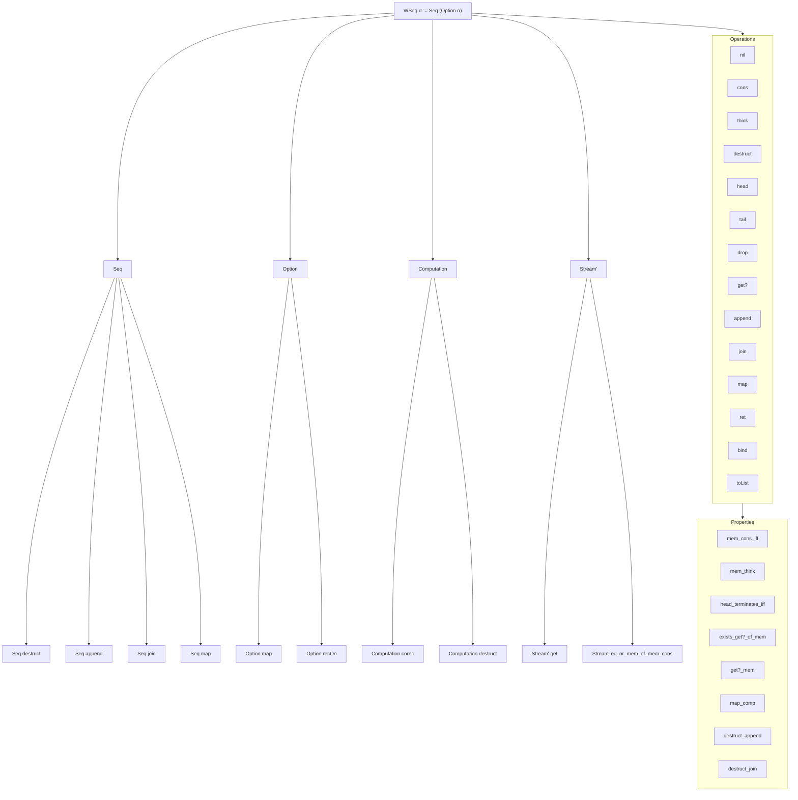

### Technical Brief: `Basic.lean` — Weak Sequences (`WSeq`) in Lean 4

---

#### **1. Key Definitions & Theorems**

| Name | Type / Signature | Purpose |
|------|------------------|---------|
| `WSeq α` | `Type u` | Type of *weak sequences*: possibly infinite, partially defined lists modeled as `Seq (Option α)` |
| `ofSeq`, `ofList`, `ofStream` | `Seq α → WSeq α`, `List α → WSeq α`, `Stream' α → WSeq α` | Embed standard sequences/lists/streams into `WSeq` |
| `nil`, `cons`, `think` | `WSeq α` / `α → WSeq α → WSeq α` / `WSeq α → WSeq α` | Constructors: empty, prepend element, insert “thinking” step (`none`) |
| `destruct` | `WSeq α → Computation (Option (α × WSeq α))` | Core destructor: one-step inspection of a weak sequence |
| `head`, `tail`, `drop`, `get?` | `Computation (Option α)`, `WSeq α`, `ℕ → WSeq α`, `ℕ → Computation (Option α)` | Operations to extract head, tail, drop elements, get nth element (with possible divergence) |
| `append`, `join`, `map`, `ret`, `bind` | Binary op, flatten, map, return, monadic bind | Structural operations; `bind` makes `WSeq` a *non-lawful* monad |
| `Mem s a` | `Prop` | Membership: `a ∈ s` iff `some a ∈ s` as a `Seq (Option α)` |
| `toList` | `WSeq α → Computation (List α)` | Convert finite, terminating weak sequences to `List α` |
| `recOn` | Recursion principle | Induction/recursion over `WSeq` with cases for `nil`, `cons`, `think` |

**Key Theorems:**
- `destruct_nil`, `destruct_cons`, `destruct_think`: Behavior of `destruct` on constructors.
- `head_terminates_iff`: `head s` terminates ⇔ `destruct s` terminates.
- `mem_cons_iff`, `mem_think`: Characterization of membership.
- `exists_get?_of_mem`, `get?_mem`: Equivalence between membership and existence of a position where `get?` succeeds.
- `exists_of_mem_join`, `exists_of_mem_bind`: Decomposition of membership in `join`/`bind`.
- `map_comp`, `map_id`, `map_append`: `map` is a functor.
- `destruct_append`, `destruct_join`, `destruct_map`: Structural decomposition of destructors.

---

#### **2. Naming Conventions**

- **Prefixes:**
  - `of*`: Embedding functions (`ofSeq`, `ofList`, `ofStream`)
  - `*?`: Partial/possibly-divergent operations (`get?`, `head`, `toList`)
  - `*?_terminates`: Termination lemmas (`head_terminates_iff`, `get?_terminates_le`)
  - `*?_of_*`: Derived properties (`head_ofSeq`, `toList_ofList`)
  - `mem_*`: Membership lemmas (`mem_cons_iff`, `mem_think`, `mem_of_mem_dropn`)
  - `destruct_*`: Decomposition lemmas for `destruct`
- **Suffixes:**
  - `_aux`: Auxiliary helper definitions (`tail.aux`, `drop.aux`, `destruct_append.aux`)
  - `_assoc`, `_nil`, `_cons`, `_think`: Associativity, identity, and structural lemmas (`append_assoc`, `nil_append`, `cons_append`, `think_append`)
- **Infixes:**
  - `· <$> ·`: Used for `map` over `Option`/`Seq`
  - `>>=` / `>>=`: Monadic bind (used internally in `flatten`, `tail`, etc.)

---

#### **3. Tactic Stack**

- **Core tactics:** `simp`, `rw`, `induction`, `cases`, `intro`, `exact`, `refine`
- **Automation & simplification:**
  - `simp only [...] at h`: Fine-grained simplification in hypotheses
  - `dsimp`: Delta-reduction for definitions (e.g., `dsimp only [(· <$> ·)]`)
  - `congr_arg`, `congr_fun`: Extensionality for functions/constructors
- **Induction principles:**
  - `WSeq.recOn`, `Seq.recOn`, `Computation.memRecOn`, `mem_rec_on`
- **Bisimulation & equality:**
  - `Seq.eq_of_bisim`, `Computation.eq_of_bisim`: Prove equality via bisimulation
- **Monadic reasoning:**
  - `LawfulMonad.bind_assoc`, `bind_pure'`, `ret_bind`, `pure_bind`
- **Set-theoretic reasoning:**
  - `mem_unique`, `exists_of_mem_bind`, `exists_of_mem_map`

---

#### **4. Proof Logic**

- **Inductive structure:** Proofs often proceed by:
  1. **Structural induction** on `WSeq` using `recOn` or `WSeq.recOn`
  2. **Case analysis** on `destruct s` or `Seq.destruct s`
  3. **Bisimulation arguments** for equality of infinite structures (`Seq.eq_of_bisim`, `Computation.eq_of_bisim`)
  4. **Monadic unfolding** for `flatten`, `tail`, `join`, `bind`
- **Termination reasoning:**
  - Use `Terminates` typeclass and lemmas like `head_terminates_of_get?_terminates`
  - Often reduce to `get?` at position 0 or use monotonicity (`get?_terminates_le`)
- **Membership reasoning:**
  - Leverage `mem_rec_on` for induction on membership
  - Use `exists_get?_of_mem` and `get?_mem` to bridge membership and operational semantics

---

#### **5. Imports & Dependencies**

- **Core imports:**
  - `Mathlib.Data.Seq.Basic`: Defines `Seq`, `Seq.destruct`, `Seq.append`, `Seq.join`, etc.
  - `Mathlib.Util.CompileInductive`: For `@[expose]`, `@[elab_as_elim]`, and inductive type utilities
- **Key dependencies:**
  - `Function`: For `Function.comp`, `id`, etc.
  - `Computation`: Underlying model for partial/possibly infinite computations
  - `Stream'`: For `Stream' α` (infinite streams), used in embeddings
  - `Mathlib.Data.Option.Basic`: Implicit via `Option.map`, `Option.recOn`
  - `Mathlib.Data.List.Basic`: For `List`, `List.reverse`, etc.
  - `Mathlib.Control.Monad.Lawful`: For `LawfulMonad` instances (used in proofs)

---

#### **6. Mermaid Diagrams**

##### **Dependency Graph (Module-Level)**

```mermaid
graph TD
  Basic --> Mathlib.Data.Seq.Basic
  Basic --> Mathlib.Util.CompileInductive
  Basic --> Mathlib.Data.Option.Basic
  Basic --> Mathlib.Data.List.Basic
  Basic --> Mathlib.Control.Monad.Lawful
  Basic --> Mathlib.Data.Stream.Basic  %% via Stream'
  Basic --> Mathlib.Data.Computation  %% via Computation

  Mathlib.Data.Seq.Basic --> Mathlib.Data.Seq1.Basic
  Mathlib.Data.Seq.Basic --> Mathlib.Data.Stream.Basic
```

##### **Overview of `WSeq` Theory**



---

#### **7. Summary**

`Basic.lean` formalizes *weak sequences* (`WSeq`), a model for lazy, possibly non-terminating lists where `none` elements indicate ongoing computation. It provides:
- A rich algebra of operations (`map`, `bind`, `join`, `append`, `drop`, `get?`)
- A non-lawful monad structure (monad laws hold only up to sequence equivalence)
- A bisimulation-based equality theory for infinite structures
- Termination and membership lemmas linking operational semantics (`destruct`, `head`) to logical properties

This module serves as the foundational layer for lazy list reasoning in Lean, especially in contexts involving non-determinism, infinite data, or partial computations (e.g., Haskell-style laziness).
