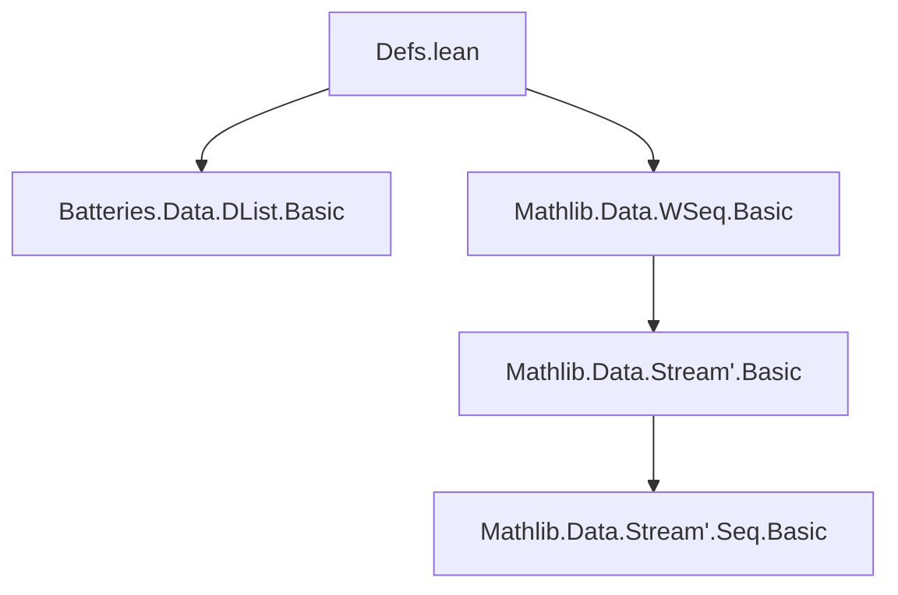
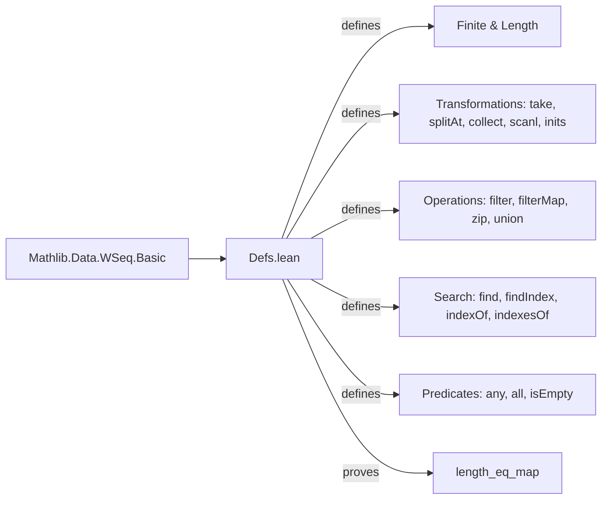

### Technical Brief: `Defs.lean` — Miscellaneous Definitions for Weak Sequences (`WSeq`)

---

#### **1. Key Definitions & Theorems**

| Name | Type | Purpose |
|------|------|---------|
| `length` | `WSeq α → Computation ℕ` | Computes the finite length of a weak sequence (if it terminates). Uses corecursion over `Seq.destruct`. |
| `IsFinite` | `class (s : WSeq α) → Prop` | Predicate asserting that `toList s` terminates (i.e., `s` is finitely generated from `nil`, `cons`, `think`). |
| `get` | `WSeq α → [IsFinite s] → List α` | Extracts the list from a finite weak sequence. |
| `updateNth` | `WSeq α → ℕ → α → WSeq α` | Replaces the *n*-th element (if present) with a new value. Corecursive over `Seq.destruct`. |
| `removeNth` | `WSeq α → ℕ → WSeq α` | Removes the *n*-th element (if present). Similar corecursive structure to `updateNth`. |
| `filterMap` | `(α → Option β) → WSeq α → WSeq β` | Maps a partial function over the sequence, discarding `none` results. |
| `filter` | `(α → Prop) [DecidablePred p] → WSeq α → WSeq α` | Filters elements satisfying a decidable predicate. Defined via `filterMap`. |
| `find` | `(α → Prop) [DecidablePred p] → WSeq α → Computation (Option α)` | Returns the first element satisfying `p`, via `head ∘ filter`. |
| `zipWith` | `(α → β → γ) → WSeq α → WSeq β → WSeq γ` | Zips two sequences with a binary function. |
| `zip` | `WSeq α → WSeq β → WSeq (α × β)` | Special case of `zipWith` using `Prod.mk`. |
| `findIndexes` | `(α → Prop) [DecidablePred p] → WSeq α → WSeq ℕ` | Returns indices of elements satisfying `p`, via zipping with natural numbers. |
| `findIndex` | `(α → Prop) [DecidablePred p] → WSeq α → Computation ℕ` | Returns the index of the first satisfying element (defaults to `0` if none). |
| `indexOf` | `[DecidableEq α] → α → WSeq α → Computation ℕ` | Returns index of first occurrence of `a`. |
| `indexesOf` | `[DecidableEq α] → α → WSeq α → WSeq ℕ` | Returns all indices of occurrences of `a`. |
| `union` | `WSeq α → WSeq α → WSeq α` | Nondeterministic interleaving of two sequences. |
| `isEmpty` | `WSeq α → Computation Bool` | Checks if the sequence is empty via `head`. |
| `compute` | `WSeq α → WSeq α` | Performs one step of weak-sequence computation (e.g., consumes one `think`). |
| `take` | `WSeq α → ℕ → WSeq α` | Takes first `n` elements (if available). |
| `splitAt` | `WSeq α → ℕ → Computation (List α × WSeq α)` | Splits sequence at position `n` into finite prefix and remaining weak sequence. |
| `any` | `WSeq α → (α → Bool) → Computation Bool` | Checks if *any* element satisfies a boolean predicate. |
| `all` | `WSeq α → (α → Bool) → Computation Bool` | Checks if *all* elements satisfy a boolean predicate. |
| `scanl` | `(α → β → α) → α → WSeq β → WSeq α` | Left scan (prefix reductions) over a weak sequence. |
| `inits` | `WSeq α → WSeq (List α)` | Returns all initial segments (as lists) of the sequence. |
| `collect` | `WSeq α → ℕ → List α` | Simulates `n` steps of computation and returns the produced elements (ignores `none`). |
| `length_eq_map` | `∀ s, length s = Computation.map List.length (toList s)` | Theorem: `length s` equals the length of `toList s`. Proven via bisimulation. |

---

#### **2. Naming Conventions**

- **Prefixes**:
  - `is_`: Class predicates (`IsFinite`)
  - `get_`, `updateNth`, `removeNth`, `indexOf`, `indexesOf`: Accessor/modifier naming
  - `find_`, `findIndex_`: Search-related operations
  - `zip_`, `union`: Binary sequence combinators
  - `take`, `splitAt`, `collect`, `scanl`, `inits`: Sequence transformation patterns
  - `any`, `all`: Universal/existential predicates over sequences

- **Suffixes**:
  - `Nth`: Index-based operations (`updateNth`, `removeNth`)
  - `Of`: Collection of occurrences (`indexesOf`)
  - `With`: Binary operations (`zipWith`)
  - `s`: Pluralized forms (`indexesOf`, `inits`)

- **Corecursive patterns**:
  - `corec` used in definitions (`length`, `take`, `union`, etc.)
  - `Seq.destruct` pattern-matching on `WSeq` structure

---

#### **3. Tactic Stack**

- **Core tactics**:
  - `refine`, `intro`, `rcases`, `induction`, `simp`, `simpa`
  - `Computation.eq_of_bisim`: Key for proving equality of computations
  - `rw`, `cases`, `exact`, `apply`

- **Domain-specific automation**:
  - `WSeq.recOn`: Induction principle for weak sequences (used in proofs like `length_eq_map`)
  - `Seq.take`, `Seq.destruct`: Implicit in reasoning about `WSeq` structure

- **No heavy automation** (e.g., `aesop`, `ring`, `linarith`) — proofs are mostly structural and rely on corecursion properties.

---

#### **4. Proof Logic**

- **Inductive/Coinductive Reasoning**:
  - Proofs over `WSeq` use `WSeq.recOn` (induction) or bisimulation (`Computation.eq_of_bisim`) for coinductive equality.
  - Example: `length_eq_map` uses bisimulation to equate two corecursive definitions.

- **Common proof flow**:
  1. Introduce existential witnesses or decompose hypotheses (`rcases`, `cases`)
  2. Induct on `WSeq` using `WSeq.recOn` (cases: `nil`, `cons`, `think`)
  3. Simplify using definitions (`simp`, `simpa`)
  4. For computation equality: apply `Computation.eq_of_bisim` with a relation and verify the bisimulation condition.

- **No classical reasoning or choice** — all definitions and proofs are constructive.

---

#### **5. Imports**

| Module | Purpose |
|--------|---------|
| `Batteries.Data.DList.Basic` | Used in `inits` for efficient list accumulation (`DList` = difference list) |
| `Mathlib.Data.WSeq.Basic` | Core `WSeq` and `Seq` definitions (e.g., `Seq.destruct`, `corec`, `take`) |

> **Note**: This file is *not* required for `Mathlib/Data/Seq/Parallel.lean`, per the docstring.

---

#### **6. Mermaid Diagrams**

##### **Dependency Graph (Module-Level)**



##### **Overview of `WSeq` Theory Module**



##### **Corecursion Structure (Example: `length`)**

```mermaid
graph TD
  S[WSeq α] -->|Seq.destruct| D[Option (α × WSeq α)]
  D -->|none| L[Sum.inl n]
  D -->|some (none, s')| R1[Sum.inr (n, s')]
  D -->|some (some _, s')| R2[Sum.inr (n+1, s')]
  R1 & R2 --> S
```

---

### Summary

This file provides foundational *operational* and *structural* utilities for reasoning about **weak sequences** (`WSeq`), especially in contexts where sequences may be infinite or lazily evaluated. It emphasizes:
- **Corecursive definitions** for sequence transformations,
- **Decidable predicates** for filtering/searching,
- **Computational semantics** via `Computation`,
- **Finite approximations** (`toList`, `get`, `collect`, `take`).

It serves as a companion to `WSeq.Basic`, enabling richer reasoning about weak sequences without requiring full termination.
