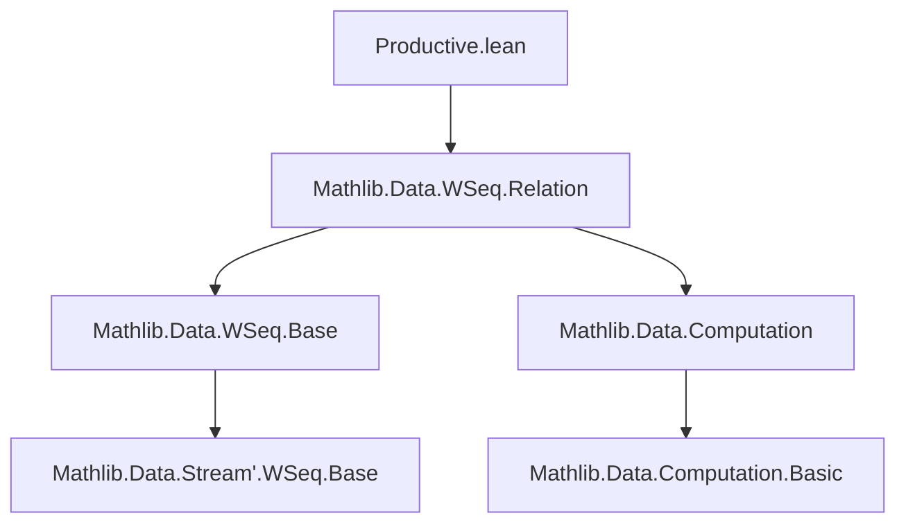

### Technical Brief: `Productive.lean`

---

#### **1. Key Definitions & Theorems**

| Name | Type / Signature | Purpose |
|------|------------------|---------|
| `Productive` | `class Productive (s : WSeq α) : Prop` | Defines that a weak sequence `s` never stalls: for every `n`, the `n`-th element is reachable after finitely many `think`s (i.e., `get? s n` terminates). |
| `productive_iff` | `∀ s, Productive s ↔ ∀ n, (get? s n).Terminates` | Equivalence between the class predicate and its defining property. |
| `get?_terminates` | `∀ s [Productive s] (n), (get? s n).Terminates` | Instance projection of the class property. |
| `head_terminates` | `[Productive s] → (head s).Terminates` | Special case for `n = 0`. |
| `productive_tail` | `[Productive s] → Productive (tail s)` | Closure under `tail`. |
| `productive_dropn` | `[Productive s] → Productive (drop s n)` | Closure under `drop`. |
| `productive_ofSeq` | `Productive (ofSeq s)` | Every regular sequence (as a weak sequence) is productive. |
| `productive_congr` | `s ~ʷ t → Productive s ↔ Productive t` | Productivity is invariant under weak bisimulation `~ʷ`. |
| `toSeq` | `[Productive s] → Seq α` | Constructs a regular sequence from a productive weak sequence by extracting the `n`-th element whenever `get? s n` terminates. |
| `toSeq_ofSeq` | `toSeq (ofSeq s) = s` | `toSeq` recovers the original sequence when applied to `ofSeq`. |

---

#### **2. Naming Conventions**

- **Predicates / Properties**:  
  - `Productive` (class), `productive_*` (lemmas/instances), e.g., `productive_tail`, `productive_dropn`, `productive_ofSeq`.
- **Terminology**:  
  - `get?_terminates`, `head_terminates`: emphasize termination of partial computations.
  - `toSeq`: verb-noun pattern for construction.
- **Proof terms**:  
  - `productive_congr`, `productive_iff`: use `productive_` prefix for properties of the class.

---

#### **3. Tactic Stack**

Frequent tactics used in proofs:
- `rw` (rewrite) — especially with lemmas like `get?_tail`, `get?_add`, `get?_ofSeq`, `get?_congr`.
- `infer_instance` — to discharge `Productive` class constraints.
- `simp only [...]` — for simplifying with definitional equalities and congruences.
- `cases` — on `Computation.get` to analyze the structure of `get? s (n+1)`.
- `have`, `obtain`, `contradiction` — for intermediate reasoning and contradiction steps.
- `apply Subtype.ext; funext` — to prove equality of sequences (as subtype elements).
- `apply get_eq_of_mem` + `mem_unique` — for reasoning about sequence element equality via membership.

---

#### **4. Proof Logic**

- **Class definition**: Productivity is defined via termination of `get? s n` for all `n`.
- **Instances**: Prove closure properties by rewriting `get?` on derived sequences (`tail`, `drop`, `ofSeq`) and applying `infer_instance`.
- **`toSeq` construction**:
  - Uses the assumption `Productive s` to guarantee `(get? s n).Terminates` for all `n`.
  - Constructs a function `ℕ → α` via `(get? s n).get`.
  - Proves tail compatibility (`s.nth (n+1) = s.nth n ++ ...`) by contradiction: assuming non-termination leads to inconsistency via `head_some_of_head_tail_some` and uniqueness of computation mem.
- **`toSeq_ofSeq`**: Directly uses `get?_ofSeq` and `ret_mem` to show equality.

---

#### **5. Imports & Dependencies**

- **Primary import**:  
  ```lean
  Mathlib.Data.WSeq.Relation
  ```
  Provides:
  - `WSeq`, `Seq`, `get?`, `head`, `tail`, `drop`, `ofSeq`, `~ʷ` (weak bisimulation).
  - Key lemmas: `get?_tail`, `get?_add`, `get?_ofSeq`, `get?_congr`, `head_some_of_head_tail_some`, etc.

- **Underlying theory**:  
  - Weak sequences (`WSeq`) model streams with possible internal delays (`think`).
  - `Computation` type (from `Mathlib.Data.Computation`) models partial/possibly non-terminating computations.
  - Termination (`Terminates`) and membership (`mem`) are central to reasoning about `get?`.

---

#### **6. Mermaid Diagrams**

##### **Dependency Graph (Module-Level)**



##### **Overview of Theory Flow**

```mermaid
graph LR
  WSeq[Weak Sequence WSeq α] -->|defines| Productive[Productive s]
  Productive -->|enables| toSeq[toSeq s : Seq α]
  Seq[Regular Sequence Seq α] -->|embeds via| ofSeq[ofSeq s : WSeq α]
  ofSeq -->|is productive| Productive
  Productive -->|closed under| tail & drop
  Productive -->|preserved by| ~ʷ[Weak Bisimulation ~ʷ]
  toSeq .->|left inverse| ofSeq
```

##### **Proof Structure of `toSeq`**

```mermaid
graph TD
  A[Productive s] --> B[∀ n, (get? s n).Terminates]
  B --> C[Define f n := (get? s n).get]
  C --> D[Show f is a valid Seq]
  D --> E[Need: s.nth (n+1) = s.nth n ++ ...]
  E --> F[Assume not → get? s (n+1) diverges]
  F --> G[But get? s (n+1) = some (a, t) by productivity]
  G --> H[Contradiction via head_some_of_head_tail_some]
  D --> I[Conclude: toSeq s = ⟨f, h⟩]
```

---

#### **7. Summary**

This module formalizes the notion of *productivity* for weak sequences — a key concept in coinductive stream processing — ensuring that no infinite delay occurs before producing the next element. It provides foundational closure properties and constructs a bridge between weak sequences (`WSeq`) and regular sequences (`Seq`) via `toSeq`, which is well-defined exactly on productive weak sequences. The proofs rely heavily on properties of the `get?` function and termination reasoning in the `Computation` monad.
