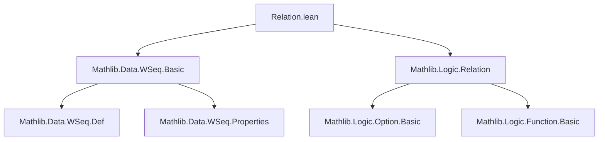

### Technical Brief: `Relation.lean` — Relations and Equivalence on Weak Sequences

---

#### **1. Key Definitions & Theorems**

| Name | Type / Signature | Purpose |
|------|------------------|---------|
| `LiftRelO R C` | `Option (α × WSeq α) → Option (β × WSeq β) → Prop` | Lifts a binary relation `R : α → β → Prop` and a relation `C` on sequences to a relation on *one-step* observations (`Option (α × WSeq α)`), used in coinductive definitions. |
| `BisimO R` | `Option (α × WSeq α) → Option (α × WSeq β) → Prop` | Special case of `LiftRelO` where `R = (· = ·)`; used to define bisimulation for weak sequences. |
| `LiftRel R s t` | `Prop` | Coinductive relation: `s` and `t` are related if their heads are `R`-related and tails are `LiftRel R`-related (modulo `think`/`none` steps). |
| `Equiv s t` | `Prop` | Defined as `LiftRel (· = ·) s t`; denoted `s ~ʷ t`. Represents *behavioral equivalence* of weak sequences (same values, same termination behavior, possibly different `think` overhead). |
| `liftRel_destruct` | `LiftRel R s t → Computation.LiftRel (LiftRelO R (LiftRel R)) (destruct s) (destruct t)` | Connects `LiftRel` to one-step decomposition (`destruct`). |
| `liftRel_destruct_iff` | `LiftRel R s t ↔ Computation.LiftRel (LiftRelO R (LiftRel R)) (destruct s) (destruct t)` | Equivalence version of above — enables coinductive reasoning. |
| `LiftRel.refl`, `symm`, `trans` | `Reflexive R → Reflexive (LiftRel R)` etc. | Show `LiftRel` preserves relational properties (reflexivity, symmetry, transitivity). |
| `LiftRel.equiv` | `Equivalence R → Equivalence (LiftRel R)` | Lifts full equivalence structure. |
| `Equiv.equivalence` | `Equivalence (@Equiv α)` | `~ʷ` is an equivalence relation. |
| `destruct_congr` | `s ~ʷ t → Computation.LiftRel (BisimO (· ~ʷ ·)) (destruct s) (destruct t)` | Bisimulation property of equivalence. |
| `head_congr`, `tail_congr`, `dropn_congr`, `get?_congr`, `mem_congr` | `s ~ʷ t → head s ~ head t`, etc. | Equivalence preserves all observable operations. |
| `Equiv.ext` | `(∀ n, get? s n ~ get? t n) → s ~ʷ t` | Extensionality: pointwise equivalence of all `get?` implies full equivalence. |
| `liftRel_map`, `map_congr` | `LiftRel R s t → LiftRel S (map f1 s) (map f2 t)` | `map` preserves `LiftRel`. |
| `liftRel_append`, `liftRel_join`, `liftRel_bind` | `LiftRel R s1 t1 ∧ LiftRel R s2 t2 → LiftRel R (append s1 s2) (append t1 t2)` etc. | Monadic operations (`append`, `join`, `bind`) preserve `LiftRel`. |
| `flatten_congr`, `bind_congr` | `LiftRel Equiv c1 c2 → flatten c1 ~ʷ flatten c2`, etc. | `flatten` and `bind` preserve equivalence. |
| `join_ret`, `join_map_ret`, `join_append`, `bind_assoc`, `join_join` | Various simplifications | Algebraic laws for `join`, `bind`, `ret`, `map`, `append` up to `~ʷ`. |

---

#### **2. Naming Conventions**

- **Prefixes**:
  - `LiftRelO`: *One-step* lifting (operates on `Option (α × WSeq α)`).
  - `LiftRel`: Full coinductive lifting (on `WSeq`).
  - `BisimO`: Bisimulation at the one-step level.
  - `Equiv`: Behavioral equivalence (special case of `LiftRel` with equality).
- **Suffixes**:
  - `_congr`: Congruence properties (e.g., `head_congr`, `tail_congr`, `dropn_congr`).
  - `_lem`: Internal lemmas (e.g., `liftRel_join.lem`).
  - `_iff`: Biconditional versions (e.g., `liftRel_destruct_iff`).
- ** infix notation**: `~ʷ` for `Equiv`.

---

#### **3. Tactic Stack**

- **Core tactics**:
  - `rcases`, `obtain`, `cases`: For destructuring `Option`, `and`, `exists`, `or`.
  - `rw`, `simp`, `simp only`: Heavy use of simplification, especially with `LiftRelO`, `destruct`, `join`, `bind`.
  - `refine`, `apply`: For constructing proofs with holes.
  - `funext`, `propext`: Extensionality for functions and propositions.
  - `induction ... using ...`: Strong induction (`Nat.strongRecOn`) used in `liftRel_join.lem`.
  - `aesop`: Not present — proofs are highly structured and manual.
  - `ring`: Not used — no arithmetic simplification needed.

---

#### **4. Proof Logic**

- **Coinductive reasoning**:
  - Proofs of `LiftRel R s t` follow the pattern:  
    `⟨C, h1, h2⟩` where `C` is a *bisimulation relation*, `h1 : C s t`, and `h2 : C s t → Computation.LiftRel (LiftRelO R C) (destruct s) (destruct t)`.
  - `liftRel_destruct_iff` is the key bridge: it rewrites `LiftRel` as a `Computation.LiftRel` condition, enabling coinduction via `Computation.liftRel_def`.
- **Inductive steps**:
  - Structural induction on `WSeq` (via `WSeq.recOn`) or `Nat` (e.g., `drop s n`).
  - In `liftRel_join.lem`, *strong induction on computation depth* (`Nat.strongRecOn`) handles the nested `join` structure.
- **Symmetry/Transitivity**:
  - Use `LiftRel.swap` and `LiftRel.swap_lem` to reduce symmetry to swapping arguments.
  - Transitivity constructs a composite relation: `∃ t, LiftRel R s t ∧ LiftRel R t u`.
- **Equivalence proofs**:
  - Leverage `LiftRel.equiv` to lift relational properties to `Equiv`.

---

#### **5. Imports**

- `Mathlib.Data.WSeq.Basic`: Core definitions of `WSeq`, `nil`, `cons`, `think`, `drop`, `get?`, `head`, `tail`, `append`, `join`, `bind`, `flatten`, `map`, `ret`, `destruct`, `Computation`.
- `Mathlib.Logic.Relation`: Basic relational concepts (`Reflexive`, `Symmetric`, `Transitive`, `Equivalence`, `swap`, `LiftRel` on `Option`, etc.).

---

#### **6. Mermaid Diagrams**

##### **Dependency Graph (Module-Level)**



##### **Overview of Theory Flow**

```mermaid
flowchart LR
  subgraph Definitions
    A[LiftRelO] --> B[LiftRel]
    B --> C[Equiv (~ʷ)]
    B --> D[BisimO]
  end

  subgraph Properties
    C --> E[Equivalence]
    B --> F[Reflexivity/Symmetry/Transitivity]
    B --> G[Preservation under ops]
  end

  subgraph Operations
    G --> H[map]
    G --> I[append]
    G --> J[join]
    G --> K[bind]
    G --> L[flatten]
  end

  subgraph Observables
    C --> M[head_congr]
    C --> N[tail_congr]
    C --> O[dropn_congr]
    C --> P[get?_congr]
    C --> Q[mem_congr]
  end

  subgraph Laws
    L --> R[bind_assoc]
    J --> S[join_join]
    J --> T[join_append]
    H --> U[join_map_ret]
  end

  C -->|Extensionality| V[Equiv.ext]
```

##### **Coinductive Structure**

```mermaid
flowchart LR
  A[LiftRel R s t] -->|def| B["∃ C, C s t ∧ C ⇒ Computation.LiftRel (LiftRelO R C) (destruct s) (destruct t)"]
  B --> C[Computation.LiftRel (LiftRelO R (LiftRel R)) (destruct s) (destruct t)]
  C -->|destruct| D[Option (α × WSeq α)]
  D -->|LiftRelO| E["R a b ∧ LiftRel R s' t'"]
```

---

#### **7. Summary**

This file formalizes **behavioral equivalence** of *weak sequences* (`WSeq`), a coinductive type representing potentially infinite, lazy sequences with `none` (computation steps) and `some (a, s)` (output `a` and tail `s`). The key insight is that equivalence ignores internal `think`/`none` steps and only cares about observable values and termination behavior.

- `LiftRel R` is the **coinductive lifting** of a base relation `R`.
- `Equiv` (i.e., `LiftRel (· = ·)`) is the **bisimulation equivalence** for weak sequences.
- The theory proves that `Equiv` is an equivalence relation and that all standard operations (`map`, `append`, `join`, `bind`, `flatten`) are **congruent** w.r.t. `Equiv`.
- A rich set of algebraic laws (e.g., `bind_assoc`, `join_join`) are proven *up to equivalence*, making this a foundational module for reasoning about lazy computations in dependent type theory.

This formalization is essential for verifying programs involving infinite data streams, non-determinism, or probabilistic computation where `WSeq` models `Computation α`.
