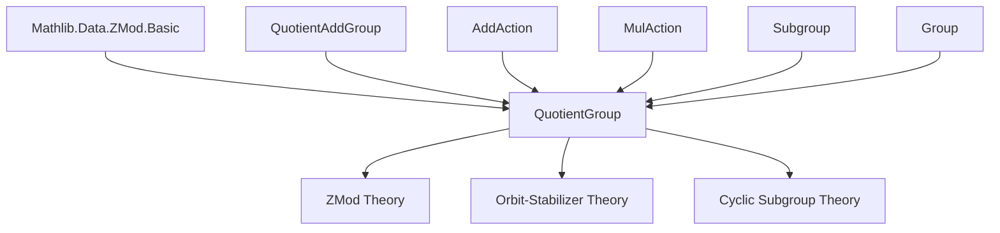

**Technical Brief: `QuotientGroup.lean`**

---

### 1. **Key Definitions & Theorems**

| Name | Type | Purpose |
|------|------|---------|
| `quotientZMultiplesNatEquivZMod` | `ℤ ⧸ AddSubgroup.zmultiples (n : ℤ) ≃+ ZMod n` | Shows $ \mathbb{Z}/n\mathbb{Z} \cong \mathbb{Z}/(n\mathbb{Z}) $ as additive groups, for $ n \in \mathbb{N} $. |
| `quotientZMultiplesEquivZMod` | `ℤ ⧸ AddSubgroup.zmultiples a ≃+ ZMod a.natAbs` | Extends the above to $ a \in \mathbb{Z} $, using `natAbs`. |
| `index_zmultiples` | `(AddSubgroup.zmultiples a).index = a.natAbs` | Computes the index of $ a\mathbb{Z} $ in $ \mathbb{Z} $ as $ |a| $. |
| `zmultiplesQuotientStabilizerEquiv` | `zmultiples a ⧸ stabilizer (zmultiples a) b ≃+ ZMod (minimalPeriod (a +ᵥ ·) b)` | Relates quotient of cyclic subgroup by stabilizer to $ \mathbb{Z}/m\mathbb{Z} $, where $ m $ is minimal period. |
| `zpowersQuotientStabilizerEquiv` | `zpowers a ⧸ stabilizer (zpowers a) b ≃* Multiplicative (ZMod (minimalPeriod (a • ·) b))` | Multiplicative version of above. |
| `orbitZPowersEquiv` | `orbit (zpowers a) b ≃ ZMod (minimalPeriod (a • ·) b)` | Orbit under cyclic action is equinumerous with $ \mathbb{Z}/m\mathbb{Z} $. |
| `orbitZMultiplesEquiv` | `orbit (zmultiples a) b ≃ ZMod (minimalPeriod (a +ᵥ ·) b)` | Additive version of orbit–cycle correspondence. |
| `minimalPeriod_eq_card` | `minimalPeriod (a • ·) b = Fintype.card (orbit (zpowers a) b)` | Minimal period equals orbit size when finite. |
| `Nat.card_zpowers` | `Nat.card (zpowers a) = orderOf a` | Size of cyclic subgroup generated by $ a $ equals its order. |
| `quotientEquivSigmaZMod` | `G ⧸ H ≃ Σ q, ZMod (minimalPeriod (g • ·) q.out)` | Decomposes coset space into orbits of cyclic action, indexed by orbit types. |

---

### 2. **Naming Conventions**

- **Prefixes**:
  - `quotientZMultiples*`: Quotients by cyclic subgroups $ n\mathbb{Z} $ or $ a\mathbb{Z} $.
  - `zmultiples*` / `zpowers*`: Additive/multiplicative cyclic subgroups.
  - `orbit*`: Orbit-related equivalences.
  - `minimalPeriod*`: Minimal period of group actions.
- **Suffixes**:
  - `Equiv`: Equivalence (bijection, often with structure: `≃+`, `≃*`).
  - `symm_apply`: Inverse direction of an equivalence.
  - `apply'`: Variant using integer representatives (e.g., `k : ℤ`) instead of `ZMod`.
- **Structure modifiers**:
  - `Add`/`Mul` prefixes distinguish additive vs multiplicative contexts.
  - `to_additive` attributes for automatic additive translations.

---

### 3. **Tactic Stack**

Frequent tactics used in proofs:

- `rw` / `rwa`: Rewriting using lemmas and attributes.
- `simp_rw`: Simplification with rewrite rules (especially for `cast`, `zsmul`, `vadd`).
- `induction_on`: Structural induction on quotients or integers.
- `exact`, `refine`: Direct proof construction.
- `congr` / `congr'`: Congruence reasoning (e.g., for sigma types).
- `ofBijective`: Constructing equivalences from bijective maps.
- `apply`, `apply_fun`: Function application in goals.
- `cases`: Case analysis on existentials or quotients.
- `ring`, `linarith`: Arithmetic reasoning (implicit in `zsmul_vadd_mod_minimalPeriod` etc.).
- `aesop`: Automated reasoning for simple goals (likely in `minimalPeriod_pos`).

---

### 4. **Proof Logic**

- **Structure**: Most proofs follow a pattern:
  1. Construct a map (often using `ofBijective` or `quotientAddEquivOfEq`).
  2. Prove bijectivity (injectivity via kernel analysis, surjectivity via explicit preimage).
  3. Use `trans` to chain equivalences (e.g., `quotientAddEquivOfEq` + `quotientKerEquivOfRightInverse`).
  4. Simplify using `simp` and `rw` with lemmas like `zsmul_vadd_eq_iff_minimalPeriod_dvd`.
- **Induction**: Used on `Int` or `ZMod` elements (e.g., `induction_on` for `q : ℤ ⧸ H`).
- **Quotient reasoning**: Heavy use of `quotient.sound`, `quotient.lift`, and `quotient.induction_on`.
- **Orbit decomposition**: `quotientEquivSigmaZMod` uses `selfEquivSigmaOrbits` + `sigmaCongrRight`.

---

### 5. **Imports**

- `Mathlib.Data.ZMod.Basic`: Core theory of $ \mathbb{Z}/n\mathbb{Z} $.
- `QuotientAddGroup`: General theory of quotients of additive groups.
- `Set`, `Function`, `AddAction`, `MulAction`, `Subgroup`, `Group`: Foundational algebraic structures.

---

### 6. **Mermaid Diagrams**

#### **Dependency Graph (High-Level)**



#### **Overview of File Structure**

```mermaid
flowchart LR
  Int[Integer quotients] -->|quotientZMultiplesNatEquivZMod| ZMod1[ZMod n]
  Int -->|quotientZMultiplesEquivZMod| ZMod2[ZMod |a|]

  AddAction[Additive Actions] -->|zmultiplesQuotientStabilizerEquiv| Orbit1[Orbit ≃ ZMod m]
  MulAction[Multiplicative Actions] -->|zpowersQuotientStabilizerEquiv| Orbit2[Orbit ≃ ZMod m]

  Orbit1 --> OrbitCard[Orbit size = minimal period]
  Orbit2 --> OrbitCard

  Subgroup[Subgroup Actions] -->|quotientEquivSigmaZMod| SigmaDecomp[Σ ZMod m]

  Group[Group Theory] -->|Nat.card_zpowers| Order[orderOf a = |⟨a⟩|]
```

---

### 7. **Key Mathematical Content Summary**

- **Core equivalence**: $ \mathbb{Z}/n\mathbb{Z} \cong \mathbb{Z}/(n\mathbb{Z}) $, both for $ n \in \mathbb{N} $ and $ n \in \mathbb{Z} $.
- **Orbit–cycle correspondence**: For a group action, the orbit of a point under a cyclic subgroup is in bijection with $ \mathbb{Z}/m\mathbb{Z} $, where $ m $ is the minimal period.
- **Cyclic subgroup size**: $ |\langle a \rangle| = \text{orderOf}(a) $.
- **Quotient decomposition**: Coset space $ G/H $ decomposes into orbits of a cyclic subgroup action, each orbit indexed by a `ZMod` of appropriate size.

--- 

Let me know if you'd like a formalized dependency graph (e.g., in `leanpkg` format) or a proof sketch of a specific theorem.
