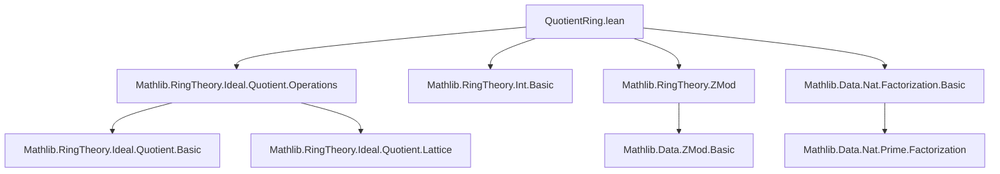

**Technical Brief: `QuotientRing.lean`**

---

### 1. Key Definitions & Theorems

| Name | Type | Purpose |
|------|------|---------|
| `quotientSpanNatEquivZMod` | `ℤ ⧸ Ideal.span {(n : ℤ)} ≃+* ZMod n` | Establishes ring isomorphism between the quotient of `ℤ` by the principal ideal `(n)` and `ZMod n`, for `n : ℕ`. |
| `quotientSpanEquivZMod` | `ℤ ⧸ Ideal.span ({a} : Set ℤ) ≃+* ZMod a.natAbs` | Extends the above to arbitrary `a : ℤ`, using `natAbs` to reduce to the natural case. |
| `quotientSpanNatEquivZMod_comp_Quotient_mk` | `… = Int.castRingHom (ZMod n)` | Describes the composition of the isomorphism with the quotient map: it recovers the canonical map `ℤ → ZMod n`. |
| `quotientSpanNatEquivZMod_comp_castRingHom` | `… = Ideal.Quotient.mk …` | Dual statement: the inverse isomorphism composed with `ℤ → ZMod n` gives the quotient map. |
| `quotientSpanEquivZMod_comp_Quotient_mk` / `castRingHom` | Similar to above, for `a : ℤ`. | |
| `ZMod.prodEquivPi` | `ZMod (∏ i, a i) ≃+* Π i, ZMod (a i)` | Chinese Remainder Theorem (CRT) for finite products: if `a i` are pairwise coprime, then `ZMod` of the product splits as a product of `ZMod`s. |
| `ZMod.equivPi` | `ZMod n ≃+* Π (p : n.primeFactors), ZMod (p ^ (n.factorization p))` | CRT in prime-power decomposition form: `ZMod n` splits over its prime-power components. |

---

### 2. Naming Conventions

- **Prefixes**:
  - `quotientSpan…`: for isomorphisms involving quotient by principal ideals `Ideal.span`.
  - `quotientSpanNatEquivZMod`: natural-number generator case.
  - `quotientSpanEquivZMod`: integer generator case.
- **Suffixes**:
  - `EquivZMod`: indicates equivalence to `ZMod`.
  - `comp_Quotient_mk` / `comp_castRingHom`: describe compositions with canonical maps.
- **Function names**:
  - `prodEquivPi`, `equivPi`: standard pattern for “product ↔ pi” equivalences.
  - `quotEquivOfEq`, `quotientInfRingEquivPiQuotient`: generic quotient ring constructions.

---

### 3. Tactic Stack

- `rfl`: used for definitional equalities (e.g., `rfl` proofs of `comp` lemmas).
- `ext`: extensionality for ring/funcion equality (e.g., `by ext; simp`).
- `simp`: simplification with `@[simp]` lemmas and definitions.
- `trans`: chaining equivalences/isomorphisms.
- `symm`: reversing equivalences.
- `RingEquiv.piCongrRight`: congruence for product ring equivalences.
- `isCoprime_span_singleton_iff`: number-theoretic simplification of coprimality in ideals.

---

### 4. Proof Logic

- **Structure**: Proofs proceed by:
  1. Constructing intermediate ring isomorphisms (e.g., `quotEquivOfEq`, `quotientInfRingEquivPiQuotient`).
  2. Using `trans` to chain them.
  3. Leveraging `quotEquivOfEq` when ideals are equal, and `quotientInfRingEquivPiQuotient` for infima of coprime ideals.
  4. Reducing integer cases to natural ones via `natAbs`.
- **CRT Proof Sketch**:
  - Show pairwise coprimality of `a i` implies coprimality of the corresponding principal ideals.
  - Use `iInf_span_singleton_natCast` to relate infimum of ideals to product ideal.
  - Apply `quotientInfRingEquivPiQuotient` to split the quotient by the infimum into a product of quotients.
  - Conjugate each component with `quotientSpanNatEquivZMod`.

---

### 5. Imports

| Module | Role |
|--------|------|
| `Mathlib.RingTheory.Ideal.Quotient.Operations` | Core quotient ring operations and lemmas (e.g., `quotEquivOfEq`, `quotientInfRingEquivPiQuotient`). |
| `Mathlib.RingTheory.Int.Basic` | Basic facts about `ℤ`, ring homs, and `castRingHom`. |
| `Mathlib.RingTheory.ZMod` | Definition and basic properties of `ZMod n`. |
| `Mathlib.Data.Nat.Factorization.Basic` | Prime factorization, `primeFactors`, `factorization`, `pairwise_coprime_pow_primeFactors_factorization`. |

---

### 6. Mermaid Diagrams

#### Dependency Graph (Module-Level)



#### Overview of Theoretical Flow

```mermaid
flowchart LR
  Int[ℤ] -->|Ideal.span {n}| Q1["ℤ ⧸ (n)"]
  ZMod[ZMod n] -->|cast| Int
  Q1 <-->|quotientSpanNatEquivZMod| ZMod
  
  n_nat["n : ℕ"] -->|cast| n_int["n : ℤ"]
  Q1_int["ℤ ⧸ (a)"] <-->|quotientSpanEquivZMod| ZMod_natAbs["ZMod |a|"]
  
  coprime["Pairwise Coprime"] --> CRT1["CRT: ZMod(∏a i) ≅ Π ZMod(a i)"]
  factorization["n = ∏ p^e"] --> CRT2["ZMod n ≅ Π ZMod(p^e)"]
  
  CRT1 -->|trans| CRT2
```

--- 

This file serves as a bridge between concrete arithmetic (`ZMod n`) and abstract ring theory (quotients by principal ideals), enabling transfer of structure and proofs between the two perspectives.
