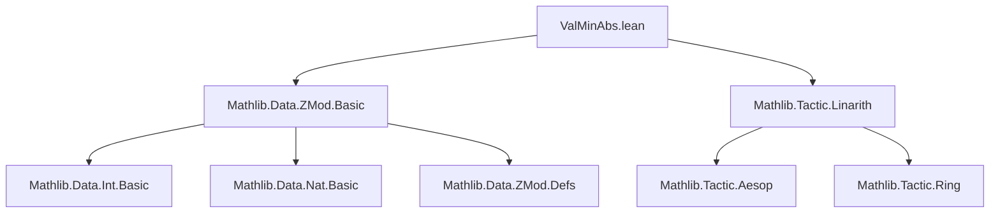

### Technical Brief: `ValMinAbs.lean`

---

#### **1. Key Definitions & Theorems**

| Name | Type / Signature | Purpose |
|------|------------------|---------|
| `valMinAbs` | `∀ {n : ℕ}, ZMod n → ℤ` | Returns the *minimal absolute representative* of a class in `ZMod n`, lying in `(-n/2, n/2]`. |
| `valMinAbs_def_pos` | `∀ {n : ℕ} [NeZero n] (x : ZMod n), valMinAbs x = if x.val ≤ n / 2 then (x.val : ℤ) else x.val - n` | Explicit definition for `n > 0`. |
| `coe_valMinAbs` | `(x.valMinAbs : ZMod n) = x` | Casts `valMinAbs x` back to `ZMod n` and recovers `x`. |
| `injective_valMinAbs` | `(valMinAbs : ZMod n → ℤ).Injective` | `valMinAbs` is injective. |
| `valMinAbs_inj` | `a.valMinAbs = b.valMinAbs ↔ a = b` | Equivalent formulation of injectivity. |
| `valMinAbs_nonneg_iff` | `0 ≤ x.valMinAbs ↔ x.val ≤ n / 2` | Characterizes non-negativity of `valMinAbs`. |
| `valMinAbs_mul_two_eq_iff` | `a.valMinAbs * 2 = n ↔ 2 * a.val = n` | Relates doubling of representatives to the modulus. |
| `valMinAbs_mem_Ioc` | `x.valMinAbs * 2 ∈ Set.Ioc (-n : ℤ) n` | Ensures `2 * valMinAbs x` lies strictly between `-n` and `n`. |
| `valMinAbs_spec` | `x.valMinAbs = y ↔ x = y ∧ y * 2 ∈ Set.Ioc (-n : ℤ) n` | Full characterization of `valMinAbs` as the unique integer in the interval with same class. |
| `natAbs_valMinAbs_le` | `x.valMinAbs.natAbs ≤ n / 2` | Absolute value of `valMinAbs` is at most `n/2`. |
| `eq_neg_of_valMinAbs_eq_neg_valMinAbs` | `a.valMinAbs = -b.valMinAbs → a = -b` | If minimal representatives are negatives, then elements are negatives. |
| `valMinAbs_zero` | `(0 : ZMod n).valMinAbs = 0` | Zero maps to zero. |
| `valMinAbs_eq_zero` | `x.valMinAbs = 0 ↔ x = 0` | Zero iff element is zero. |
| `natCast_natAbs_valMinAbs` | `(a.valMinAbs.natAbs : ZMod n) = if a.val ≤ n / 2 then a else -a` | Natural number absolute value lifts to `a` or `-a`. |
| `valMinAbs_neg_of_ne_half` | `2 * a.val ≠ n → (-a).valMinAbs = -a.valMinAbs` | Negation commutes with `valMinAbs` unless `a.val = n/2`. |
| `natAbs_valMinAbs_neg` | `(-a).valMinAbs.natAbs = a.valMinAbs.natAbs` | Absolute value of `valMinAbs` is symmetric under negation. |
| `natAbs_valMinAbs_eq_natAbs_valMinAbs` | `a.valMinAbs.natAbs = b.valMinAbs.natAbs ↔ a = b ∨ a = -b` | Equality of absolute minimal representatives characterizes up-to-sign equality. |
| `abs_valMinAbs_eq_abs_valMinAbs` | `|a.valMinAbs| = |b.valMinAbs| ↔ a = b ∨ a = -b` | Same as above, using `|·|`. |
| `val_eq_ite_valMinAbs` | `(a.val : ℤ) = a.valMinAbs + if a.val ≤ n / 2 then 0 else n` | Recovers original representative from minimal one. |
| `valMinAbs_natAbs_eq_min` | `a.valMinAbs.natAbs = min a.val (n - a.val)` | Minimal absolute value is the smaller of `a.val` and `n - a.val`. |
| `valMinAbs_natCast_of_le_half`, `valMinAbs_natCast_of_half_lt` | Lemmas for natural number embeddings. | Describe behavior of `valMinAbs` on `↑a : ZMod n`. |
| `valMinAbs_natCast_eq_self` | `(a : ZMod n).valMinAbs = a ↔ a ≤ n / 2` | Embedding of small naturals is fixed by `valMinAbs`. |
| `natAbs_valMinAbs_add_le` | `(a + b).valMinAbs.natAbs ≤ (a.valMinAbs + b.valMinAbs).natAbs` | Subadditivity of `natAbs ∘ valMinAbs`. |

---

#### **2. Naming Conventions**

- **Prefixes**:
  - `valMinAbs_`: Core operations/properties of `valMinAbs`.
  - `natAbs_valMinAbs_`: Properties involving `natAbs ∘ valMinAbs`.
  - `val_eq_ite_valMinAbs`: Describes reconstruction of original `val`.
- **Suffixes**:
  - `_def_pos`, `_def_zero`: Definition special cases.
  - `_iff`: Biconditional characterizations.
  - `_le`, `_lt`, `_eq`: Inequality/equality lemmas.
  - `_neg`, `_zero`: Special values under negation/zero.

---

#### **3. Tactic Stack**

Frequently used tactics:
- `simp` / `simp_rw`: Simplification with lemmas like `valMinAbs_def_pos`, `coe_valMinAbs`.
- `split_ifs`: To handle `if`-expressions in definitions.
- `rw`: Rewriting using key lemmas (e.g., `valMinAbs_spec`, `natCast_zmod_val`).
- `linarith`, `omega`: Linear arithmetic over integers and naturals.
- `grind`: Custom tactic (likely from Mathlib) for grinding through simple goals.
- `exact`, `intro`, `cases`, `rcases`: Basic proof structure.
- `apply`, `nth_rw`: For precise rewriting.
- `norm_cast`: To normalize casts between `ℕ`, `ℤ`, `ZMod n`.

---

#### **4. Proof Logic**

- **Inductive/Case Analysis**: On `n = 0` vs `n > 0`, especially in definitions and lemmas like `valMinAbs_def_zero`, `valMinAbs_def_pos`.
- **Case Splitting on Inequalities**: Many proofs split on `x.val ≤ n / 2` (e.g., `valMinAbs_def_pos`, `valMinAbs_nonneg_iff`).
- **Equivalence via `valMinAbs_spec`**: To prove equality of `valMinAbs x` and `y`, verify both `x = y` and `y * 2 ∈ (-n, n]`.
- **Symmetry via Negation**: Many lemmas handle `(-a)` using `valMinAbs_neg_of_ne_half`, `natAbs_valMinAbs_neg`.
- **Subadditivity via Interval Bounds**: `natAbs_valMinAbs_add_le` uses `valMinAbs_mem_Ioc` and `natAbs_min_of_le_div_two`.
- **Characterization via Uniqueness**: `valMinAbs_spec` is used repeatedly to prove equality by verifying uniqueness in an interval.

---

#### **5. Imports**

- `Mathlib.Data.ZMod.Basic`: Core theory of `ZMod n`.
- `Mathlib.Tactic.Linarith`: For linear integer arithmetic.

---

#### **6. Mermaid Diagrams**

##### **Dependency Graph (Module-Level)**



##### **Overview of Theory Flow**

```mermaid
flowchart LR
  ZMod[n] --> valMinAbs --> ℤ
  valMinAbs --> coe_valMinAbs --> ZMod[n]
  valMinAbs --> valMinAbs_mem_Ioc --> Set.Ioc[-n, n]
  valMinAbs --> valMinAbs_spec --> (x = y ∧ y * 2 ∈ (-n, n])
  valMinAbs --> natAbs_valMinAbs_le --> n / 2
  valMinAbs --> natAbs_valMinAbs_eq_natAbs_valMinAbs --> a = b ∨ a = -b
  valMinAbs --> val_eq_ite_valMinAbs --> a.val = valMinAbs + ite(...)
```

##### **Key Equivalence Classes**

- `valMinAbs` gives a canonical representative in `(-n/2, n/2]`.
- `natAbs ∘ valMinAbs` gives a representative in `[0, n/2]`.
- Equality of `|valMinAbs|` corresponds to equality up to sign in `ZMod n`.

---

#### **7. Summary**

This module formalizes the *minimal absolute representative* function `valMinAbs : ZMod n → ℤ`, which selects the integer in each equivalence class closest to zero. It establishes foundational properties: injectivity, interval containment (`2 * valMinAbs ∈ (-n, n]`), symmetry under negation, and relationships with natural number embeddings. The theory supports reasoning about symmetry, uniqueness, and arithmetic in `ZMod n` via canonical representatives — essential for modular arithmetic proofs where sign and magnitude matter (e.g., in cryptography, number theory, or formal verification of algorithms).
