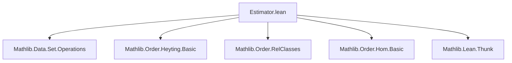

**Technical Brief: `Estimator.lean`**

---

### 1. **Key Definitions & Theorems**

| Name | Type / Signature | Purpose |
|------|------------------|---------|
| `EstimatorData a ε` | `class` | Provides a *bound* function `ε → α` and an `improve : ε → Option ε` for a `Thunk α` value `a`. No correctness guarantees yet. |
| `Estimator a ε` | `class` (deprecated) | Extends `EstimatorData` with correctness: `bound e ≤ a.get`, and `improve e` either returns `none` (optimal) or `some e'` with `bound e < bound e'`. |
| `Estimator.trivial a` | `abbrev` | Trivial estimator: `ε := { b // b = a }`, bound is `val`, `improve` always returns `none`. |
| `Estimator.improveUntilAux` | `def` | Recursive helper to repeatedly improve an estimate until predicate `p` holds on the bound. Uses well-founded recursion on `range (bound a)`. |
| `Estimator.improveUntil` | `def` | Public interface: `improveUntil a p e` returns `.ok e'` if `p (bound a e')`, else `.error (some e)` if improvement was attempted but failed, or `.error none` if no improvement possible. |
| `Estimator.improveUntilAux_spec` / `improveUntil_spec` | `thm` | Correctness: if result is `.ok e'`, then `p (bound a e')`; if `.error _`, then `¬ p a.get`. |
| `Estimator.fst` | `structure` | Wraps an estimator for a pair `(a, b)` to produce one for the first component `a`, using `improveUntil` to find a strictly larger first component. |
| `Estimator.fstInst` | `def` | Constructs an `Estimator` for the first component from an `Estimator` for the pair, assuming `>` is well-founded on lower sets. |

---

### 2. **Naming Conventions**

- **Prefixes**:
  - `bound_`: for projection of lower bounds (`bound`, `bound_le`, `bound a e`).
  - `improve_`: for improvement operations (`improve`, `improveUntil`, `improveUntilAux`).
  - `fst_`, `add_`: for constructions on products and sums.
- **Suffixes**:
  - `_spec`: for correctness/specification theorems.
  - `_Aux`: for internal recursive helpers.
  - `trivial`: for canonical/simple instances.
- **Structure/Class Names**:
  - `EstimatorData`, `Estimator`: core typeclasses.
  - `Estimator.fst`, `Estimator.trivial`: nested definitions.

---

### 3. **Tactic Stack**

Frequent tactics used in proofs and definitions:

- `grind` — for automated simplification + rewriting in `Estimator.add` instance.
- `simp only`, `simp` — for simplifying match expressions and `if ... then ... else`.
- `rw` — rewriting using equalities like `eq_of_le_of_not_lt`.
- `by_cases` — to split on boolean conditions (e.g., `p (bound a e)`).
- `match ... with` — pattern-matching on `Option`, `Except`, and `improve_spec`.
- `termination_by` — for well-founded recursion (on `range (bound a)` or `⟨_, mem_range_self e⟩`).
- `exact`, `intro`, `intro w`, `revert` — standard proof scripting.
- `dsimp` — for definitional simplification in `add` instance proof.

---

### 4. **Proof Logic**

- **Inductive/Recursive Structure**: Proofs and definitions rely heavily on *well-founded recursion* over the range of the bound function (via `WellFoundedGT`).
- **Case Analysis**: Most proofs involve case analysis on `improve e` and `improve_spec e`, using the specification to reason about strict inequality or equality.
- **Logical Flow**:
  1. Unfold definitions (`dsimp`, `simp`).
  2. Extract hypotheses from `improve_spec` for components (e.g., in `add` case).
  3. Use `grind` or `linarith`-style reasoning for order properties.
  4. For `improveUntil`, inductively reason about the recursion: either `p` holds now, or we improve and recurse.
  5. For `fst`, use `improveUntil_spec` to relate failure to `¬ p a.get`, and success to `p (bound a e')`.

---

### 5. **Imports**

| Import | Role |
|--------|------|
| `Mathlib.Data.Set.Operations` | Set operations, especially for `range`. |
| `Mathlib.Order.Heyting.Basic`, `Mathlib.Order.RelClasses`, `Mathlib.Order.Hom.Basic` | Order theory: preorders, partial orders, embeddings, Heyting algebras (for `WellFoundedGT`). |
| `Mathlib.Lean.Thunk` | For `Thunk α`, used to delay evaluation of expensive values. |

---

### 6. **Well-Foundedness & Termination**

- **Key Assumption**: `WellFoundedGT (range (bound a : ε → α))` ensures termination of `improveUntilAux`.
- **Derived Instances**:
  - `WellFoundedGT Unit`
  - `WellFoundedGT (Estimator.trivial a)` via equivalence with `Unit`.
  - `WellFoundedGT (range (bound a))` from `∀ a, WellFoundedGT { x // x ≤ a }` and embedding `range (bound a) ↪o { x // x ≤ a.get }`.

---

### 7. **Mermaid Diagrams**

#### **Dependency Graph (File-Level)**



#### **Conceptual Overview & Theory Flow**

```mermaid
flowchart TD
  A[Thunk α] --> B[EstimatorData a ε]
  B --> C[Estimator a ε]  %% deprecated
  C --> D[improveUntil a p e]
  D --> E[improveUntilAux]
  E --> F[WellFoundedGT (range bound)]
  
  C --> G[Trivial Estimator]
  G --> H[Estimator.trivial a]

  C --> I[Sum Estimator]
  I --> J[Estimator (a + b) (εa × εb)]

  C --> K[Product Projection]
  K --> L[Estimator.fst]
  L --> M[fstInst]
```

#### **Data Flow for `improveUntil`**

```mermaid
flowchart LR
  e:ε --> bound a e --> p? -->|true| .ok e
  e --> improve a e -->|none| .error none
  e --> improve a e -->|some e'| --> improveUntilAux a p e' true
  improveUntilAux --> .ok e' | .error _
```

---

### 8. **Summary**

This file formalizes a *generic refinement mechanism* for computing lower bounds of lazy (`Thunk`) values in a preorder. Though deprecated (as noted in the header), it served as the backend for the now-removed `rw_search` tactic. Its core insight is to separate *data* (`EstimatorData`) from *correctness* (`Estimator`), and to use well-founded recursion to guarantee termination of iterative improvement. The constructions for sums and products show how estimators compose, and the `fst` construction demonstrates nontrivial use of order-theoretic well-foundedness.
