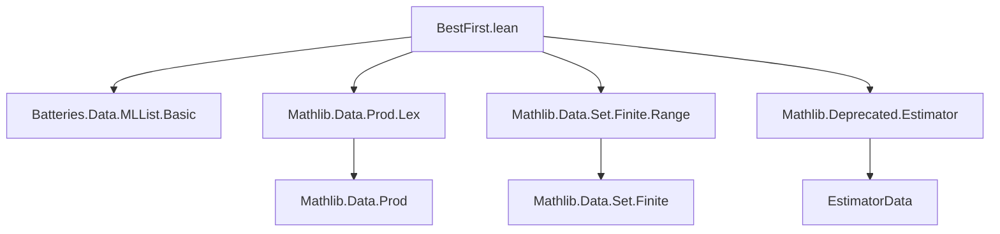

### Technical Brief: `BestFirst.lean`

---

#### **1. Key Definitions & Theorems**

| Name | Type / Signature | Purpose |
|------|------------------|---------|
| `BestFirstNode prio ε` | `structure` | Represents a node in the priority queue: stores `key : α` and an estimator `ε key` for the priority `prio key : Thunk ω`. |
| `BestFirstNode.estimate n` | `def` | Computes the current best lower bound for `prio n.key` using `bound`. |
| `Ord (BestFirstNode prio ε)` | `instance` | Defines lexicographic ordering on nodes: first by `estimate`, then by `key`. |
| `BestFirstQueue prio ε m β maxSize` | `def` | A priority queue implemented as `TreeMap (BestFirstNode prio ε) (MLList m β)`, with optional size bound `maxSize`. |
| `insertAndEject` | `def` | Inserts a new `(node, list)` pair; if queue exceeds `maxSize`, ejects the *largest* estimated node (not necessarily highest actual priority). |
| `ensureFirstIsBest` | `partial def` | Iteratively improves estimates for the front node until it is guaranteed to be minimal (or swapped with second element). |
| `popWithBound` | `partial def` | Pops the head `β` from the lowest-priority `MLList`, returning `(key, estimator, β)` and updated queue. |
| `popWithPriority` | `def` | Same as `popWithBound`, but also returns the *estimated* priority `ω`. |
| `pop` | `def` | Same as `popWithBound`, but omits the estimator. |
| `toMLListWithPriority` / `toMLList` | `partial def` | Converts queue to lazy list of `(α × ω) × β` or `α × β`, respectively. |
| `impl` | `def` | Core iterative best-first search: maintains queue of `MLList`s, expands nodes lazily. |
| `implMaxDepth` | `def` | Wraps `impl` to enforce depth bound via product with `Nat`. |
| `bestFirstSearchCore` | `def` | High-level API: supports `maxDepth`, `maxQueued`, and duplicate removal via `removeDuplicatesBy?`. |
| `bestFirstSearch` | `@[deprecated] def` | Simplified wrapper using `Thunk.pure` and identity estimator; deprecated (no replacement). |

---

#### **2. Naming Conventions**

- **Prefixes**:
  - `BestFirstNode.*`, `BestFirstQueue.*`: Data structure components.
  - `impl*`, `bestFirstSearch*`: Algorithmic functions.
  - `pop*`, `insert*`, `ensure*`: Queue manipulation verbs.
- **Suffixes**:
  - `*WithBound`, `*WithPriority`: Return additional metadata (estimator or priority).
  - `*Core`: Generic version with custom priority/estimator.
- **Type variables**:
  - `prio : α → Thunk ω`: priority function (lazy).
  - `ε : α → Type`: estimator type family.
  - `β`: output element type.
  - `maxSize : Option Nat`: beam width.

---

#### **3. Tactic Stack**

- **Core tactics used**:
  - `match` / `match ←` (for pattern-matching monadic results)
  - `do` / `←` (monadic sequencing)
  - `pure`, `failure`, `guard`, `modify`, `liftM`, `runState'`
  - `simp`, `by simp` (in `instOrderBotEq`)
  - `by aesop` (not present — no heavy automation)
- **No `ring`, `simp`, `linarith`, or `omega`** — this is a data-structure/algorithm file, not arithmetic-heavy.

---

#### **4. Proof Logic**

- **No theorems or proofs** — this is a *purely computational* module.
- Logic is **operational**: correctness is implicit in the design of the priority queue and search loop.
- Key reasoning:
  - **Termination**: Relies on `WellFoundedGT` on `range (bound (prio a))` to ensure estimate improvement halts.
  - **Correctness of ordering**: Uses `Ord` instance on `BestFirstNode` to maintain queue order.
  - **Laziness**: `MLList` ensures children are only computed when needed; `Thunk` delays priority evaluation.

---

#### **5. Imports**

| Import | Purpose |
|--------|---------|
| `Batteries.Data.MLList.Basic` | Lazy lists (`MLList`) for efficient graph traversal. |
| `Mathlib.Data.Prod.Lex` | Lexicographic product `α ×ₗ β` (used in `implMaxDepth`). |
| `Mathlib.Data.Set.Finite.Range` | For `range` and finiteness reasoning (used in `WellFounded` assumption). |
| `Mathlib.Deprecated.Estimator` | `Estimator` typeclass for improving lower bounds on priorities. |

---

#### **6. Mermaid Diagrams**

##### **Dependency Graph (Module-Level)**



##### **Data Structure & Algorithm Overview**

```mermaid
graph TD
  subgraph "Data Structures"
    A[BestFirstNode] --> B[BestFirstQueue]
    B --> C[TreeMap]
    C --> D[MLList m β]
  end

  subgraph "Algorithms"
    B --> E[impl]
    E --> F[implMaxDepth]
    F --> G[bestFirstSearchCore]
    G --> H[bestFirstSearch (deprecated)]
  end

  subgraph "Key Operations"
    B --> I[insertAndEject]
    B --> J[ensureFirstIsBest]
    B --> K[popWithBound]
    B --> L[pop]
  end

  subgraph "Estimation"
    A --> M[Estimator (prio key) (ε key)]
    M --> N[bound : ε key → ω]
    N --> O[WellFoundedGT]
  end
```

##### **Search Flow (High-Level)**

```mermaid
flowchart LR
  Start[Start at node a] --> Init[Initialize queue with (a, f a)]
  Init --> Loop{Queue non-empty?}
  Loop -- Yes --> Pop[Pop lowest-priority β]
  Pop --> Yield[Yield β]
  Yield --> Expand[Compute children f β]
  Expand --> Insert[Insert children into queue]
  Insert --> Loop
  Loop -- No --> End[End]
```

---

#### **7. Notes on Deprecation & Design Intent**

- **Entire file is deprecated** (`@[deprecated]` on `bestFirstSearch`, and comment at top).
- Designed for **meta-programming** (e.g., `rewrite_search`), not for formal verification.
- **Key innovation**: lazy priority estimation via `Estimator` + `WellFoundedGT` to avoid computing expensive priorities (e.g., edit distance) until necessary.
- **Beam search** via `maxQueued` (ejects worst *estimated* nodes).
- **Duplicate avoidance** via `removeDuplicatesBy?` + `TreeSet`.

---

#### **8. Summary**

This file implements a **best-first search algorithm over lazy graphs**, with support for:
- Bounded memory (`maxQueued`)
- Depth limiting (`maxDepth`)
- Duplicate avoidance (`removeDuplicatesBy?`)
- Lazy priority estimation (`Estimator` + `WellFoundedGT`)

It is **not a theorem-proving module**, but a **performance-oriented meta-programming utility**, now deprecated in favor of newer search infrastructure (e.g., `rewrite_search` has been removed).
