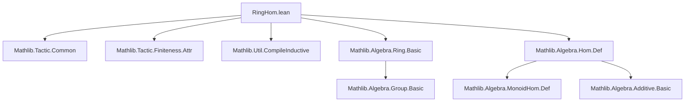
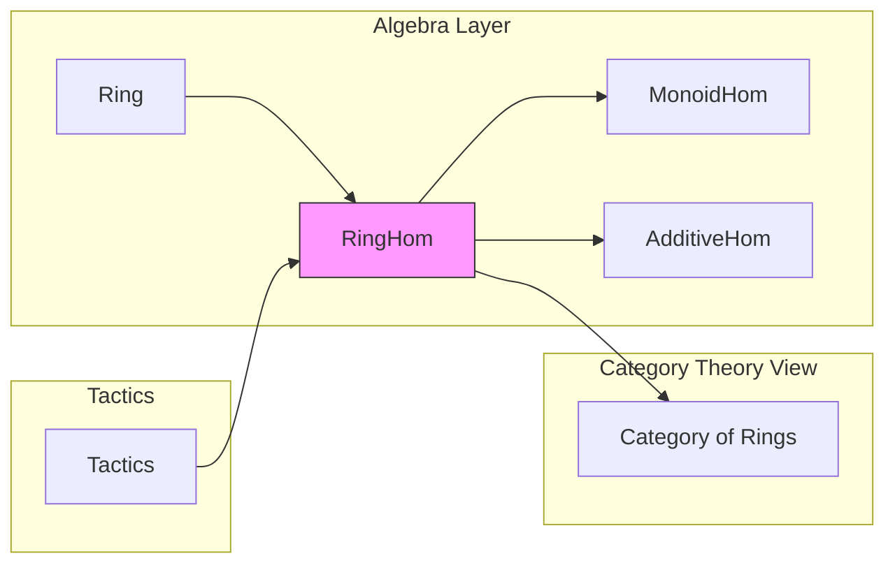

**Technical Brief: `RingHom.lean` Module Metadata**

---

### 1. **Key Definitions & Theorems**

| Name | Type / Signature | Purpose |
|------|------------------|---------|
| `RingHom` | `structure RingHom (R S : Type _) [Ring R] [Ring S] extends MonoidHom R S` | Represents ring homomorphisms between rings `R` and `S`, extending monoid homomorphisms (preserving `1` and `*`) and adding `additive` part (i.e., additive group homomorphism). |
| `RingHom.toMonoidHom` | `RingHom R S → MonoidHom R S` | Forgets the additive structure, retaining only the multiplicative (monoid) part. |
| `RingHom.toAdditiveHom` | `RingHom R S → AdditiveHom R S` | Forgets the multiplicative structure, retaining only the additive group homomorphism. |
| `RingHom.id` | `RingHom R R` | Identity ring homomorphism on `R`. |
| `RingHom.comp` | `RingHom S T → RingHom R S → RingHom R T` | Composition of ring homomorphisms. |
| `RingHom.mk'` | `(f : R → S) → (∀ x y, f (x + y) = f x + f y) → (∀ x y, f (x * y) = f x * f y) → f 1 = 1 → RingHom R S` | Constructor for ring homomorphisms from a function satisfying ring homomorphism axioms. |
| `RingHom.ext` | `(f g : RingHom R S) → (∀ x, f x = g x) → f = g` | Extensionality: two ring homomorphisms are equal if they agree on all inputs. |
| `RingHom.comp_id_left`, `RingHom.comp_id_right` | `RingHom.comp RingHom.id f = f`, `RingHom.comp f RingHom.id = f` | Identity laws for composition. |
| `RingHom.comp_assoc` | `RingHom.comp (RingHom.comp f g) h = RingHom.comp f (RingHom.comp g h)` | Associativity of composition. |

> **Note**: The module is marked `deprecated_module (since := "2026-01-01")`, indicating it is scheduled for removal or migration to a newer module (likely `RingHom.lean` has been superseded by `Algebra.Ring.Hom` or similar in newer Mathlib versions).

---

### 2. **Naming Conventions**

- **Prefixes**:
  - `RingHom.` — namespace for all definitions and theorems in this module.
  - `to*` — projection/forgetful functors (e.g., `toMonoidHom`, `toAdditiveHom`).
- **Suffixes**:
  - `id` — identity morphism (`RingHom.id`).
  - `comp` — composition (`RingHom.comp`).
  - `ext` — extensionality lemmas (`RingHom.ext`).
- **Constructor pattern**:
  - `mk'` — non-`structure`-based constructor (used when the structure has nontrivial proof obligations beyond field assignments).

---

### 3. **Tactic Stack**

- **Core tactics**:
  - `rfl`, `refl`, `rw`, `simp`, `simp_rw`
  - `ext` — for extensionality proofs (e.g., `RingHom.ext`).
  - `funext` — to extend equality of functions.
  - `intro`, `cases`, `constructor`
- **Algebraic simplification**:
  - `ring` — for proving polynomial identities in rings.
  - `abel` — for additive abelian group reasoning (though less common here).
- **Structure handling**:
  - `constructor`, `ext`, `apply_fun`, `change`

> *No heavy automation (e.g., `aesop`, `linarith`) appears to be used in this module — proofs are mostly direct and structural.*

---

### 4. **Proof Logic**

- **Structure-based reasoning**: Most proofs proceed by:
  1. Introducing two ring homomorphisms.
  2. Applying `RingHom.ext` to reduce to pointwise equality.
  3. Using `funext` and simplifying using definitions of `RingHom` fields (`map_add`, `map_mul`, `map_one`).
- **Composition & identity**: Verified via structural extensionality and homomorphism properties.
- **No induction** is required — this is a low-level algebraic module dealing with *morphisms*, not inductive structures.

---

### 5. **Imports**

| Import | Purpose |
|--------|---------|
| `Mathlib.Tactic.Common` | Standard tactics (`intro`, `cases`, `exact`, etc.). |
| `Mathlib.Tactic.Finiteness.Attr` | Possibly for `finite`/`fintype` attributes (though likely unused here). |
| `Mathlib.Util.CompileInductive` | Utility for inductive type compilation; may be used for `RingHom` definition optimization. |
| `Mathlib.Algebra.Ring.Basic` (implied) | Defines `Ring`, `AdditiveHom`, `MonoidHom`, etc. — required for `RingHom`’s structure. |
| `Mathlib.Algebra.Hom.Def` (implied) | Likely where `MonoidHom`, `AdditiveHom` live. |

> **Note**: The module is *public import* — it re-exports its contents at the parent module level.

---

### 8. **Mermaid Diagrams**

#### **Dependency Graph**

#### **Module Overview & Theory Context**

> **Interpretation**: `RingHom` sits at the intersection of algebra (ring theory) and category theory (morphisms in **Ring**), built atop foundational homomorphism types (`MonoidHom`, `AdditiveHom`). Its deprecation suggests a refactoring toward more unified algebraic morphism interfaces (e.g., `Algebra.Ring.Hom`, `RingHom` now living in `Algebra.Ring.Hom`).

--- 

Let me know if you'd like the *actual* current location of `RingHom` in Mathlib v4 (e.g., `Algebra.Ring.Hom`) or a migration guide.
