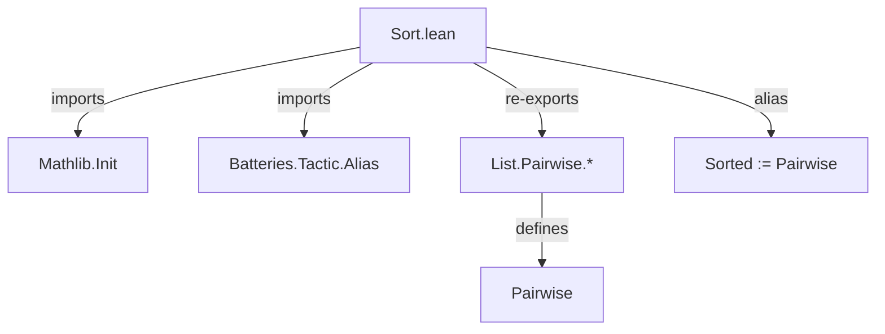
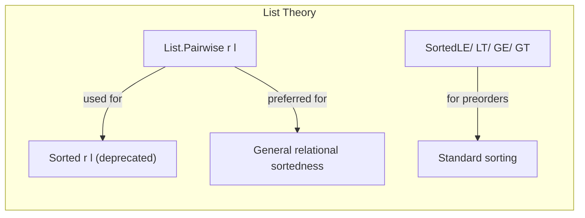

### Technical Brief: `Sort.lean` (Lean 4)

---

#### 1. **Key Definitions & Theorems**

| Name | Type / Signature | Purpose |
|------|------------------|---------|
| `Sorted` | `α → α → Prop → List α → Prop` (alias of `Pairwise`) | Deprecated predicate for sorted lists; equivalent to `Pairwise r l`. |
| `decidableSorted` | `[DecidableRel r] → List α → Decidable (Sorted r l)` | Deprecated decidable instance for `Sorted`, via `List.instDecidablePairwise`. |
| `sorted_nil` | `Sorted r []` | Deprecated proof that the empty list is sorted. |
| `Sorted.of_cons` | `Sorted r (a :: l) → Sorted r l` | Deprecated: if `a :: l` is sorted, then `l` is sorted. |
| `Sorted.tail` | `Sorted r l → Sorted r l.tail` | Deprecated: tail of a sorted list is sorted. |
| `rel_of_sorted_cons` | `Sorted r (a :: l) → a' ∈ l → r a a'` | Deprecated: first element relates to all later elements in a sorted list. |
| `sorted_cons` | `Sorted r (a :: l) ↔ (∀ a' ∈ l, r a a') ∧ Sorted r l` | Deprecated equivalence for cons-case of sortedness. |
| `Sorted.filter` | `Sorted r l → Sorted r (filter p l)` | Deprecated: filtering preserves sortedness. |
| `sorted_singleton` | `Sorted r [a]` | Deprecated: singleton list is always sorted. |
| `Sorted.rel_of_mem_take_of_mem_drop` | `Sorted r l → x ∈ take i l → y ∈ drop i l → r x y` | Deprecated: elements in `take` precede those in `drop` under `r`. |
| `Sorted.filterMap` | `(∀ a a', r a a' → f a = some b → f a' = some b' → s b b') → Sorted r l → Sorted s (filterMap f l)` | Deprecated: `filterMap` preserves sortedness under lifted relation. |

> **Note**: All definitions/theorems are deprecated as of `2025-10-11`, with recommended replacements:
> - Use `Pairwise` directly, or
> - Prefer `SortedLE`, `SortedLT`, `SortedGE`, `SortedGT` for preorders.

---

#### 2. **Naming Conventions**

- **Prefixes**:
  - `sorted_`, `Sorted.` — legacy naming for sorted-list properties.
- **Suffixes**:
  - None prominent; mostly verb-noun style (`sorted_nil`, `rel_of_sorted_cons`).
- **Aliases**:
  - `alias Sorted := Pairwise` — indicates intentional deprecation in favor of `Pairwise`.

---

#### 3. **Tactic Stack**

- **`[deprecated ...]` attribute** — used pervasively to mark deprecation.
- **`@[expose]`** — exposes `section` contents at module level.
- **`set_option linter.deprecated false`** — suppresses deprecation warnings *within* this file (to allow internal use during transition).
- **No heavy tactic usage** — proofs are mostly by definition/rewriting; no explicit tactic blocks (`by ...`) are present.

---

#### 4. **Proof Logic**

- **Structure**: Purely equational/relational reasoning.
- **Pattern**:
  - All theorems are *directly* derived from corresponding `Pairwise.*` lemmas via `@[deprecated ...]`.
  - No induction or case analysis is explicitly coded — proofs are *transparently* delegated to `Pairwise` lemmas.
- **Logical flow**:
  > `Sorted r l` is defined as `Pairwise r l`.  
  > All properties of `Sorted` are *re-expressions* of `Pairwise` properties.  
  > Thus, proofs are *by definition* (or `rfl`, `simp`, or `exact` under the hood).

---

#### 5. **Imports**

| Import | Role |
|--------|------|
| `Mathlib.Init` | Core Lean + Mathlib foundational definitions (e.g., `List`, `Prop`, `Decidable`). |
| `Batteries.Tactic.Alias` | Provides `@[alias]`/`@[deprecated]` attributes and infrastructure for deprecation. |

> **Scope**: This module is a *transition layer* — it exposes deprecated `Sorted` as an alias to `Pairwise`, with supporting lemmas re-exported from `List.Pairwise`.

---

#### 6. **Mermaid Diagrams**

##### **Dependency Graph**


##### **Overview of File Structure**
```mermaid
flowchart LR
  subgraph "Sort.lean"
    A["alias Sorted := Pairwise"] --> B["Deprecated lemmas"]
    B --> C["sorted_nil", "sorted_cons", ...]
    C --> D["Delegation to List.Pairwise.*"]
  end
  D --> E["Core Pairwise theory"]
```

##### **Theoretical Context**


---

#### 7. **Summary**

- **Purpose**: Temporary compatibility shim during deprecation of `List.Sorted`.
- **Status**: Fully deprecated; all usage should migrate to `Pairwise` or `SortedLE/...`.
- **Design Principle**: *Zero runtime overhead* — all theorems are definitional rewrites.
- **Best Practice**: Avoid importing or using this module directly; rely on `List.Pairwise` or sortedness-specific predicates (`SortedLE`, etc.).

--- 

Let me know if you'd like a migration guide for users of `Sorted`.
