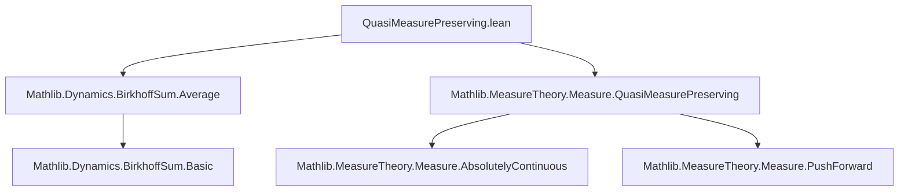

**Technical Brief: QuasiMeasurePreserving.lean**

---

### 1. KEY DEFINITIONS & THEOREMS

| Name | Type / Signature | Purpose |
|------|------------------|---------|
| `QuasiMeasurePreserving` | `f : α → α → QuasiMeasurePreserving f μ ν ↔ ∀ s, MeasurableSet s → μ (f ⁻¹' s) ≤ ν s` | A map `f` is *quasi-measure-preserving* w.r.t. `μ, ν` if preimages of measurable sets have measure ≤ target measure. (Standard in ergodic theory for non-invertible or singular maps.) |
| `birkhoffSum` | `birkhoffSum f φ n x = ∑ i ∈ Finset.range n, φ (f^[i] x)` | The *Birkhoff sum* of observable `φ` along iterates of `f`, up to `n-1`. |
| `birkhoffAverage` | `birkhoffAverage R f φ n x = (n : R)⁻¹ • ∑ i ∈ Finset.range n, φ (f^[i] x)` | The *Birkhoff average*, scaled by `n⁻¹` in a semiring `R` acting on `M`. |
| `birkhoffSum_ae_eq_of_ae_eq` | `(hf : QuasiMeasurePreserving f μ μ) → φ =ᵐ[μ] ψ → n → birkhoffSum f φ n =ᵐ[μ] birkhoffSum f ψ n` | If `φ` and `ψ` agree μ-a.e., then their Birkhoff sums agree μ-a.e., assuming `f` is quasi-measure-preserving (so iterates preserve measurability and null sets). |
| `birkhoffAverage_ae_eq_of_ae_eq` | Same premises as above, plus `[DivisionSemiring R] [Module R M]` → `birkhoffAverage R f φ n =ᵐ[μ] birkhoffAverage R f ψ n` | Extends the previous result to Birkhoff averages via scalar multiplication by `n⁻¹`. |

---

### 2. NAMING CONVENTIONS

- **Prefixes**:
  - `birkhoff*`: for Birkhoff sum/average constructions.
  - `ae_*`: for almost-everywhere statements (`=ᵐ[μ]`).
- **Suffixes**:
  - `_of_ae_eq`: indicates the theorem takes an `=ᵐ[μ]` hypothesis and concludes an `=ᵐ[μ]` conclusion.
- **Variable naming**:
  - `f`: dynamics/map.
  - `μ`: reference measure.
  - `φ, ψ`: observables (functions into additive monoid `M`).
  - `n`: natural number index for sum/average.
  - `R`: scalar semiring for averaging.

---

### 3. TACTIC STACK

- `apply Eventually.mono _ ...`: to reduce a.e. equality via monotonicity of `Eventually`.
- `Finset.sum_congr rfl`: congruence for finite sums (structure-level equality).
- `ae_all_iff.mpr`: converts universal quantification over points (modulo null sets) to `∀ᶠ` filter language.
- `exact (hf.iterate i).ae (hφ.mono ...)`: uses that quasi-measure-preserving maps pull back null sets into null sets under iteration.
- `EventuallyEq.const_smul ...`: preserves a.e. equality under scalar multiplication (here by `n⁻¹`).

No heavy automation (e.g., `aesop`, `ring`, `simp_rw`) is used—proofs are mostly *direct* and *constructive*.

---

### 4. PROOF LOGIC

- **Core idea**: Use that `QuasiMeasurePreserving f μ μ` implies `f^[i]` is also quasi-measure-preserving (via `hf.iterate i`), hence pulls back μ-null sets to μ-null sets.
- For `birkhoffSum_ae_eq_of_ae_eq`:
  1. Reduce to showing pointwise equality on a full-measure set.
  2. Use `ae_all_iff` to work with `∀ i`, `φ (f^[i] x) = ψ (f^[i] x)` μ-a.e.
  3. Apply `hf.iterate i` to push forward the a.e. equality along `f^[i]`.
  4. Sum over `i < n` using finite sum congruence.
- For `birkhoffAverage_ae_eq_of_ae_eq`:
  1. Apply previous theorem to get equality of sums.
  2. Use stability of `=ᵐ[μ]` under scalar multiplication (`const_smul`) with `n⁻¹`.

Induction is *not* used—proofs are direct and rely on filter-theoretic properties of `=ᵐ[μ]`.

---

### 5. IMPORTS & DEPENDENCIES

| Import | Role |
|--------|------|
| `Mathlib.Dynamics.BirkhoffSum.Average` | Defines `birkhoffSum`, `birkhoffAverage`, and basic properties. |
| `Mathlib.MeasureTheory.Measure.QuasiMeasurePreserving` | Defines `QuasiMeasurePreserving`, its basic lemmas (e.g., `iterate`, `ae` behavior). |

**Key underlying theories**:
- Measure theory (null sets, measurable functions, pushforward).
- Filter theory (`Eventually`, `=ᵐ[μ]`, `ae`).
- Additive combinatorics (finite sums over `Finset.range n`).
- Semiring/module theory (for averaging scalars).

---

### 6. MERMAID DIAGRAMS

#### Dependency Graph (Module-Level)



#### Theoretical Flow (Within This File)

```mermaid
flowchart LR
  HF[QuasiMeasurePreserving f μ μ] --> ITR[Iterates f^[i] are QMP]
  Hφ[φ =ᵐ[μ] ψ] --> PULL[Pullback: φ ∘ f^[i] =ᵐ[μ] ψ ∘ f^[i]]
  ITR --> PULL
  PULL --> SUM[∑ φ ∘ f^[i] =ᵐ[μ] ∑ ψ ∘ f^[i]]
  SUM --> AVG[n⁻¹ • sum =ᵐ[μ] n⁻¹ • sum]
  AVG --> THM2[birkhoffAverage_ae_eq_of_ae_eq]
  SUM --> THM1[birkhoffSum_ae_eq_of_ae_eq]
```

---

### 7. SUMMARY

This module establishes *robustness* of Birkhoff sums and averages under μ-a.e. equivalence of observables, in the setting where the dynamics `f` is only *quasi*-measure-preserving (i.e., may contract measure). The key insight is that quasi-measure-preservation is preserved under iteration and suffices to ensure null sets are pulled back to null sets—enabling the transfer of a.e. properties through the sum/average construction.

No additional structure (e.g., finiteness of `μ`, invertibility of `f`) is required—making the results widely applicable in non-invertible or infinite-measure dynamics.
