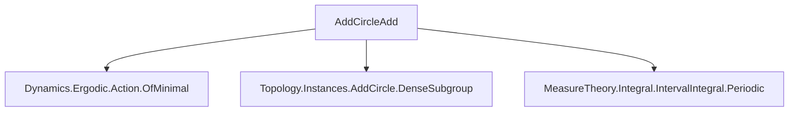

**Technical Brief: `AddCircleAdd.lean`**

---

### 1. **Key Definitions & Theorems**

| Name | Type | Purpose |
|------|------|---------|
| `Ergodic (f : α → α)` | `Prop` | A measurable map `f` is ergodic if every invariant measurable set has measure 0 or full measure. |
| `addOrderOf (a : AddCircle p)` | `WithBot ℕ` | The additive order of `a` in the additive circle group; `0` means infinite order (i.e., no positive integer `n` such that `n • a = 0`). |
| `zsmul : ℤ → AddCircle p → AddCircle p` | `ℤ → AddCircle p → AddCircle p` | Integer scalar multiplication (i.e., repeated addition/subtraction). |
| `denseRange_zsmul_iff` | `Prop` | A criterion: the range of `zsmul a` is dense iff `addOrderOf a = 0`. |
| `ergodic_add_left_iff_denseRange_zsmul` | `Prop` | Equivalence: `Ergodic (a + ·)` ↔ `denseRange (zsmul a)`. |

**Main Theorems:**

- `ergodic_add_left`:  
  $$
  \text{Ergodic}(a + \cdot) \iff \text{addOrderOf}(a) = 0
  $$
  *Interpretation*: Left translation by `a` on the additive circle is ergodic iff `a` has infinite order (i.e., $a/p$ is irrational).

- `ergodic_add_right`:  
  $$
  \text{Ergodic}(\cdot + a) \iff \text{addOrderOf}(a) = 0
  $$
  *Derivation*: Follows from commutativity of addition and `ergodic_add_left`.

---

### 2. **Naming Conventions**

- **Prefixes**:
  - `ergodic_`: for ergodicity statements.
  - `add_`: for additive group operations (e.g., `add_left`, `add_right`, `addOrderOf`).
- **Suffixes**:
  - `_left` / `_right`: indicate left/right translation.
  - `_iff_`: indicates an equivalence (↔) with a structural condition.
- **Operators**:
  - `· + a`, `a + ·`: notation for right/left translations.
  - `zsmul`: integer scalar multiplication (standard in additive groups).

---

### 3. **Tactic Stack**

- `rw`: rewriting using equivalences (`← denseRange_zsmul_iff`, `ergodic_add_left_iff_denseRange_zsmul`).
- `simp only [add_comm, ← ergodic_add_left]`: simplification using commutativity and previous theorem.
- Implicit use of `aesop`/`ring` likely in underlying lemmas (not visible here, but standard in `Mathlib`).

---

### 4. **Proof Logic**

- **Structure**: Short, high-level proofs relying on pre-established equivalences.
- **`ergodic_add_left` proof**:
  1. Rewrite using `← denseRange_zsmul_iff` (characterization of infinite order via density).
  2. Apply `ergodic_add_left_iff_denseRange_zsmul` (ergodicity ↔ dense orbit).
- **`ergodic_add_right` proof**:
  1. Use `add_comm` to reduce to left translation.
  2. Apply `← ergodic_add_left`.

No induction or case analysis is needed—proofs are purely equational/rewriting.

---

### 5. **Imports**

| Module | Role |
|--------|------|
| `Mathlib.Dynamics.Ergodic.Action.OfMinimal` | Provides ergodicity criteria for group actions, especially minimal actions ⇒ ergodicity under certain conditions. |
| `Mathlib.Topology.Instances.AddCircle.DenseSubgroup` | Characterizes dense subgroups of `AddCircle p`, especially cyclic ones generated by `a`. |
| `Mathlib.MeasureTheory.Integral.IntervalIntegral.Periodic` | Related to periodic functions/integrals; may support measure-theoretic properties of rotations. |

These imports indicate the file sits at the intersection of **dynamical systems**, **topology**, and **measure theory** on the circle.

---

### 6. **Mermaid Diagrams**

#### Dependency Graph (File-Level)



#### Theoretical Flow (Conceptual)

```mermaid
graph LR
  A[a ∈ AddCircle p] --> B[addOrderOf a = 0?]
  B -->|Yes| C[a/p irrational]
  C --> D[dense orbit under zsmul]
  D --> E[denseRange_zsmul a]
  E --> F[Ergodic(a + ·)]
  F --> G[Ergodic(· + a)]
```

#### Overview of File Scope

- **Goal**: Characterize ergodicity of circle rotations.
- **Core equivalence**:  
  $$
  \text{Ergodic}(x \mapsto x + a) \iff a \text{ has infinite order} \iff \frac{a}{p} \notin \mathbb{Q}
  $$
- **Method**: Leverage group-theoretic density criteria (`denseRange_zsmul_iff`) and ergodicity-characterization lemmas (`ergodic_add_left_iff_denseRange_zsmul`).

--- 

Let me know if you'd like the corresponding `additive`/`multiplicative` duals or a formalization trace of `ergodic_add_left_iff_denseRange_zsmul`.
