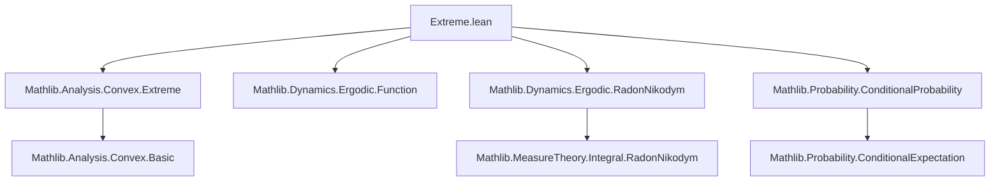
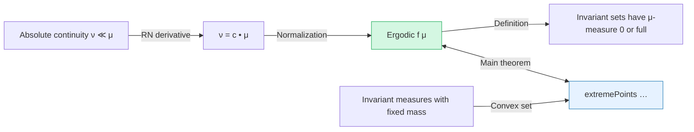
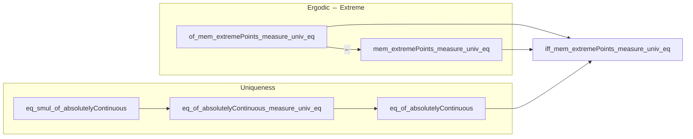

**Technical Brief: `Extreme.lean` — Ergodic Measures as Extreme Points**

---

### 1. **Key Definitions & Theorems**

| Name | Type / Signature | Purpose |
|------|------------------|---------|
| `Ergodic f μ` | Predicate (`f : X → X`, `μ : Measure X`) | `μ` is *ergodic* for `f`: every `f`-invariant measurable set has measure 0 or full measure. |
| `MeasurePreserving f ν ν` | Predicate | `f` preserves measure `ν`. |
| `extremePoints ℝ≥0∞ S` | Set | The set of *extreme points* of convex set `S` over the semiring `ℝ≥0∞`. |
| `of_mem_extremePoints_measure_univ_eq` | `μ ∈ extremePoints … → Ergodic f μ` | Shows that an extreme point of invariant measures with fixed total mass is ergodic. |
| `of_mem_extremePoints` | `μ ∈ extremePoints … → Ergodic f μ` | Special case for probability measures (total mass = 1). |
| `eq_smul_of_absolutelyContinuous` | `Ergodic f μ → ν ≪ μ → ∃ c, ν = c • μ` | Any invariant measure absolutely continuous w.r.t. an ergodic one is a scalar multiple. |
| `eq_of_absolutelyContinuous_measure_univ_eq` | Same as above + equal total mass ⇒ `ν = μ` | Uniqueness up to normalization. |
| `eq_of_absolutelyContinuous` | Probability version of above | If both are probability measures, then `ν = μ`. |
| `mem_extremePoints_measure_univ_eq` | `Ergodic f μ → μ ∈ extremePoints …` | Ergodic ⇒ extreme point (converse direction). |
| `mem_extremePoints` | Probability version of above | Ergodic probability measure is an extreme point in the set of invariant probability measures. |
| `iff_mem_extremePoints_measure_univ_eq` | `Ergodic f μ ↔ μ ∈ extremePoints …` | Full equivalence for finite measures with fixed total mass. |
| `iff_mem_extremePoints` | Probability version of above | Full equivalence for probability measures. |

---

### 2. **Naming Conventions**

- **Predicates**: `Ergodic`, `MeasurePreserving`, `IsProbabilityMeasure`, `IsFiniteMeasure`, `absolutelyContinuous` (`≪`)
- **Theorems**:
  - `of_*`: direction *from* extreme point ⇒ ergodic.
  - `mem_*`: direction *from* ergodic ⇒ extreme point.
  - `eq_*`: uniqueness results under absolute continuity.
  - `iff_*`: full equivalence.
- **Variables**:
  - `μ`, `ν`: measures
  - `f`: self-map
  - `c`: scalar in `ℝ≥0∞`
  - `S`: set of invariant measures

---

### 3. **Tactic Stack**

Frequently used tactics:
- `rw`, `simp`, `convert`, `ext`, `rfl`
- `rcases`, `obtain`, `by_contra`
- `apply`, `refine`, `intro`, `intro h`, `rintro`
- `have`, `set`, `calc`
- `rwa`, `simpa`, `convert`, `exact`
- `lintegral_congr_ae`, `ae_iff`, `restrict_le_self`, `smul_measure`, `cond_isProbabilityMeasure`

No heavy automation (e.g., `aesop`, `linarith`, `ring`) — proofs are mostly manual measure-theoretic reasoning.

---

### 4. **Proof Logic**

**General proof strategy**:

1. **From extreme point ⇒ ergodic** (`of_*`):
   - Assume `μ` is an extreme point of invariant measures with fixed total mass.
   - Suppose `s` is invariant (`f⁻¹' s = s`) and `0 < μ s < μ univ`.
   - Construct two distinct invariant measures in the set (via conditional measures or scaling), contradicting extremality.
   - Key tool: `c • μ[|s]` and `c • μ[|sᶜ]` are invariant and sum to `μ`, violating extremality.

2. **From ergodic ⇒ extreme point** (`mem_*`):
   - Assume `μ` is ergodic.
   - Suppose `μ = a • ν₁ + b • ν₂` with `ν₁`, `ν₂` invariant and same total mass.
   - Show `ν₁ = ν₂ = μ` using:
     - Absolute continuity (`ν₁ ≪ μ`, since `μ = a ν₁ + …`)
     - `eq_of_absolutelyContinuous_measure_univ_eq`
   - Crucially uses that ergodic measures are *indecomposable*.

3. **Uniqueness under absolute continuity** (`eq_*`):
   - Use Radon–Nikodym derivative.
   - Ergodicity ⇒ RN derivative is a.e. constant.
   - Then use normalization (total mass) to conclude equality.

---

### 5. **Imports & Dependencies**

**Core imports**:
- `Mathlib.Analysis.Convex.Extreme`: defines `extremePoints`, convex combinations in cones.
- `Mathlib.Dynamics.Ergodic.Function`: basic ergodic theory (not directly used here, but context).
- `Mathlib.Dynamics.Ergodic.RadonNikodym`: RN derivative properties for invariant measures.
- `Mathlib.Probability.ConditionalProbability`: conditional measure `μ[|s]`, `cond_isProbabilityMeasure`.

**Key structures used**:
- Measurable spaces, measures, `MeasurePreserving`, absolute continuity (`≪`), RN derivative.
- Convex geometry over `ℝ≥0∞` (non-negative extended reals as a semiring).
- Probability theory: `IsProbabilityMeasure`, `cond`, `smul_measure`.

---

### 6. **Mermaid Diagrams**

#### **Dependency Graph (File-Level)**

#### **Conceptual Overview of Theory Flow**

#### **Proof Structure (High-Level)**

---

### 7. **Summary**

This file establishes a foundational correspondence in ergodic theory:  
**ergodic measures are precisely the extreme points of the convex set of invariant measures with fixed total mass**.  
It leverages measure-theoretic tools (Radon–Nikodym, conditional expectation) and convex geometry over `ℝ≥0∞`.  
The equivalence is proved in full generality for finite measures, and specialized to probability measures.  
The structure is clean and modular, with clear separation of the two directions and supporting uniqueness lemmas.

--- 

Let me know if you'd like a formalized dependency graph (e.g., `leanproject graph`) or a tactic-level trace of a key proof.
