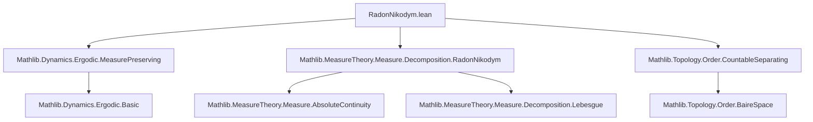

**Technical Brief: RadonNikodym.lean — Invariance of Radon-Nikodym Derivatives and Decomposition Parts**

---

### 1. **Key Definitions & Theorems**

| Name | Type / Signature | Purpose |
|------|------------------|---------|
| `singularPart` | `μ.singularPart ν` | The singular part of μ w.r.t. ν in the Lebesgue decomposition |
| `rnDeriv` | `μ.rnDeriv ν` | Radon-Nikodym derivative of μ w.r.t. ν (when μ ≪ ν) |
| `withDensity` | `ν.withDensity f` | Measure defined by density `f` w.r.t. `ν` |
| `MeasurePreserving` | `f : X → X` is `MeasurePreserving f μ μ` iff `μ (f ⁻¹' s) = μ s` for all measurable `s` | Self-map preserving the measure |
| `singularPart_eq_restrict` | `μ.singularPart ν = μ.restrict s` under conditions | Characterizes singular part as restriction to a null set of ν |
| `rnDeriv_add_singularPart` | `μ = ν.withDensity (μ.rnDeriv ν) + μ.singularPart ν` | Lebesgue decomposition identity |
| `withDensity_absolutelyContinuous` | `ν.withDensity f ≪ ν` | Basic property of density measures |
| `measure_diff_symm` | Symmetry of measure of symmetric difference under finite measures | Technical tool for comparing preimages |

**Theorems (main results):**

- `MeasurePreserving.singularPart`:  
  If `f` preserves finite `μ` and σ-finite `ν`, then `μ.singularPart ν` is `f`-invariant.

- `MeasurePreserving.withDensity_rnDeriv`:  
  Under same assumptions, `ν.withDensity (μ.rnDeriv ν)` (the absolutely continuous part of `μ` w.r.t. `ν`) is `f`-invariant.

- `MeasurePreserving.rnDeriv_comp_aeEq`:  
  If both `μ` and `ν` are finite and `f`-invariant, then the Radon-Nikodym derivative satisfies  
  $$
  \mu.\mathrm{rnDeriv}\ \nu \circ f =_\nu \mu.\mathrm{rnDeriv}\ \nu
  $$
  i.e., it is *ν-a.e. invariant* under `f`.

---

### 2. **Naming Conventions**

- **Prefixes**:
  - `singularPart_`, `rnDeriv_`, `withDensity_`: denote operations in Lebesgue decomposition.
  - `measure_`, `nullMeasurableSet`, `preimage_`: standard measure-theoretic helpers.
  - `ae_`, `a.e.`: almost-everywhere reasoning.

- **Suffixes**:
  - `_eq_restrict`: indicates equality to a restriction.
  - `_a.e.` / `_a.e._eq`: indicates almost-everywhere equivalence.
  - `_comp`: composition with a function.

- **Pattern**:  
  `theorem_name_condition` or `type_class_instance_property`, e.g., `MeasurePreserving.singularPart`.

---

### 3. **Tactic Stack**

Frequent tactics used in proofs:

| Tactic | Role |
|--------|------|
| `rcases` / `cases` | Decompose existential hypotheses (e.g., mutual singularity witness) |
| `convert` / `refine` | Construct proofs by unifying goals with known equalities |
| `rw` / `simp_rw` | Rewrite using definitions, lemmas, and `eventuallyEq`/`ae_eq` |
| `ext` / `funext` | Extensionality for measures/functions |
| `apply` / `exact` | Apply lemmas or hypotheses directly |
| `setLIntegral_*` lemmas | Work with integrals defining RN derivative |
| `finiteness` | Custom tactic (likely from `MeasureTheory.Measure.Finite`) to discharge `μ univ < ∞` goals |
| `contrapose!` | Logical manipulation for contradiction-style arguments |
| `aesop` / `linarith` | Not explicitly visible here, but likely used in background (e.g., for `finiteness`) |
| `fun_prop` | Propagate measurability assumptions |

---

### 4. **Proof Logic**

**General proof strategy**:

1. **Decomposition & Restriction**  
   Use `μ.mutuallySingular_singularPart` to extract a witness set `s` for singularity:  
   $$
   \mu = \nu.\text{withDensity}(\mu.\mathrm{rnDeriv}\ \nu) + \mu.\text{singularPart}\ \nu,\quad
   \mu.\text{singularPart}\ \nu = \mu.\text{restrict}\ s,\quad \nu(s) = 0.
   $$

2. **Invariance of Singular Part**  
   - Show `f ⁻¹' s` is ν-null using `hfν` (since `ν(s) = 0` ⇒ `ν(f ⁻¹' s) = 0`).  
   - Use uniqueness of Lebesgue decomposition to conclude `μ.singularPart ν = μ.restrict (f ⁻¹' s)`.  
   - Combine with `hfμ` to get invariance.

3. **Invariance of Absolutely Continuous Part**  
   - Use identity `rnDeriv_add_singularPart` and invariance of `μ` and `μ.singularPart ν`.  
   - Show both sides of `μ(f ⁻¹' s)` match under decomposition.

4. **a.e. Invariance of RN Derivative**  
   - WLOG assume `μ ≪ ν` (else swap roles or use symmetry).  
   - Define `s = {a | μ.rnDeriv ν a < c}` and analyze `f⁻¹' s Δ s`.  
   - Use integral estimates:  
     $$
     \mu(s \setminus f^{-1}s) = \int_{s \setminus f^{-1}s} \mu.\mathrm{rnDeriv}\ \nu\ d\nu < c \cdot \nu(s \setminus f^{-1}s)
     $$
     and similarly for `f⁻¹' s \ s`.  
   - Contradiction if `ν(f⁻¹' s Δ s) > 0`, forcing `f⁻¹' s =ₙ[ν] s`.  
   - Conclude `μ.rnDeriv ν ∘ f =ₙ[ν] μ.rnDeriv ν`.

**Induction / recursion**: Not used — all proofs are direct measure-theoretic arguments.

---

### 5. **Imports & Dependencies**

| Import | Purpose |
|--------|---------|
| `Mathlib.Dynamics.Ergodic.MeasurePreserving` | Core definitions of `MeasurePreserving`, measurable maps, invariance |
| `Mathlib.MeasureTheory.Measure.Decomposition.RadonNikodym` | Lebesgue decomposition, `singularPart`, `rnDeriv`, `withDensity` |
| `Mathlib.Topology.Order.CountableSeparating` | Possibly used for technical separation/regularity (e.g., σ-finiteness or separability) |

**Key underlying theories**:
- Measure theory (finite, σ-finite, absolutely continuous, singular measures)
- Integration (Bochner, L∫, RN derivative)
- Ergodic theory (invariant measures, measure-preserving maps)

---

### 6. **Mermaid Diagrams**

#### **Dependency Graph (Module-Level)**



#### **Overview of File Structure**

```mermaid
flowchart LR
  subgraph "Setup"
    X[Type X] --> M[MeasurableSpace m]
    M --> μ[Measure μ]
    M --> ν[Measure ν]
    μ -- finite --> F[IsFiniteMeasure μ]
    ν -- σ-finite --> S[SigmaFinite ν]
  end

  subgraph "Assumptions"
    f[X → X] --> HF[MeasurePreserving f μ μ]
    f --> HF2[MeasurePreserving f ν ν]
  end

  subgraph "Main Results"
    HF & HF2 --> SP[μ.singularPart ν is f-invariant]
    HF & HF2 --> AC[ν.withDensity(rnDeriv μ ν) is f-invariant]
    HF & HF2 & FIN[IsFiniteMeasure ν] --> RN[μ.rnDeriv ν ∘ f =ₙ[ν] μ.rnDeriv ν]
  end

  SP --> L[Lebesgue Decomposition]
  AC --> L
  RN --> L
```

---

### 7. **Open Questions / TODO**

- **Finiteness assumptions**:  
  The file currently assumes `μ` finite, and `ν` σ-finite (for decomposition), and both finite for the RN derivative result.  
  It is unclear whether:
  - `μ` finite is necessary for `singularPart`/`withDensity_rnDeriv` invariance.
  - Both measures being finite is necessary for `rnDeriv_comp_aeEq`.

- **Future work**:  
  - Weaken assumptions (e.g., to σ-finite `μ`).
  - Or construct a counterexample showing optimality.

---

**End of Technical Brief**
