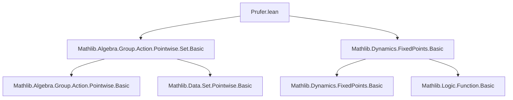

**Technical Brief: `Prufer.lean`**

---

### 1. KEY DEFINITIONS & THEOREMS

- **`zpowGroupHom`**  
  *Type:* `ℤ → G → G`, the group homomorphism sending `n` to the map `x ↦ x ^ n`.  
  *Purpose:* Encodes integer exponentiation as a group endomorphism (for additive: `n • x`).

- **`smul_eq_self_of_preimage_zpow_eq_self`**  
  *Type:*  
  ```lean
  {G : Type*} [CommGroup G] → {n : ℤ} → {s : Set G} →
    (zpowGroupHom n ⁻¹' s = s) →
    {g : G} → {j : ℕ} → g ^ n ^ j = 1 → g • s = s
  ```  
  *Purpose:* Shows that if a set `s` is invariant under preimage of `x ↦ x^n`, then it is invariant under the pointwise action of any element `g` whose `n^j`-th power is trivial — i.e., elements of the *`n`-Prüfer subgroup* (multiplicative case).  
  *Additive variant:* `smul_eq_self_of_preimage_zsmul_eq_self` (via `to_additive`), where `n • x` replaces `x ^ n`, and `(n^j) • g = 0`.

- **`IsFixedPt.preimage_iterate`**  
  *Type:* `IsFixedPt (f^[j]) s → f^[j] ⁻¹' s = s`  
  *Purpose:* Used to rewrite invariance under `j`-fold iterate of a map as equality of preimage and set.

---

### 2. NAMING CONVENTIONS

- **Prefixes:**
  - `smul_`: for additive group actions (`•`).
  - `zpow_`: for multiplicative integer exponentiation (`^`).
  - `preimage_`: for invariance under preimage of a map.
  - `iterate_`: for repeated application of a function.

- **Suffixes:**
  - `_eq_self`: indicates invariance (`g • s = s`, `f ⁻¹' s = s`).
  - `_subset_smul_set`: for subset relations under action.

- **Structure:**  
  `smul_eq_self_of_preimage_zpow_eq_self` =  
  `[action]_[property]_[condition]_[hypothesis]`

---

### 3. TACTIC STACK

- **Core tactics:**  
  `rw`, `refine`, `conv_lhs`, `simpa`, `rfl`, `rintro`, `change`, `rwa`, `replace`.

- **Domain-specific automation:**  
  - `IsFixedPt.preimage_iterate` used as a rewrite rule.
  - `smul_set_subset_smul_set_iff` for translating subset relations under action.
  - `inv_zpow`, `inv_one`, `one_mul` for group identities.

- **No heavy automation (e.g., `aesop`, `ring`, `simp` alone)** — proof is mostly manual group-theoretic manipulation.

---

### 4. PROOF LOGIC

1. **Goal reduction:**  
   Show `g • s = s` by proving inclusion both ways.

2. **Main lemma (subgoal):**  
   Prove `∀ g', g'^{n^j} = 1 → g' • s ⊆ s`.  
   - Use hypothesis `hs : (x ↦ x^n)⁻¹' s = s` to deduce invariance under `j`-fold iterate:  
     `zpowGroupHom n^[j] ⁻¹' s = s` via `IsFixedPt.preimage_iterate`.
   - For `y ∈ s`, show `g' * y ∈ s` by computing:  
     $$
     (zpow\_GroupHom\ n)^{[j]}(g' * y) = (zpow\_GroupHom\ n)^{[j]}(g') \cdot (zpow\_GroupHom\ n)^{[j]}(y)
     $$
     and using `hg' : (zpowGroupHom n)^[j] g' = 1`, `y ∈ s`.

3. **Symmetry via inversion:**  
   To get reverse inclusion, use `smul_inv_smul g s` and note `g⁻¹^{n^j} = 1` follows from `g^{n^j} = 1`.

4. **Structure:**  
   *Induction-free.* Relies on algebraic properties of group homomorphisms, preimages, and fixed points.

---

### 5. IMPORTS

- `Mathlib.Algebra.Group.Action.Pointwise.Set.Basic`  
  → Provides `Pointwise.smul`, `smul_set_subset_smul_set_iff`, `smul_inv_smul`, etc.

- `Mathlib.Dynamics.FixedPoints.Basic`  
  → Provides `IsFixedPt`, `preimage_iterate`, used to relate invariance under iterate to fixed-point condition.

---

### 6. THEORY CONTEXT & DEPENDENCIES

- **Mathematical domain:**  
  Group theory, dynamical systems (fixed points), and module theory (via additive version).

- **Key concepts:**
  - Prüfer $p$-group (as torsion subgroup of circle group under $x \mapsto x^p$).
  - Pointwise group action on subsets.
  - Iterated preimage invariance ⇒ invariance under torsion subgroup.

- **Related theory:**
  - Prüfer groups appear in classification of divisible abelian groups.
  - Related to `Mathlib.GroupTheory.PrimePGroup`, `Mathlib.GroupTheory.Torsion`, `Mathlib.Analysis.Circle.PrimitiveRoots`.

---

### 7. MERMAID DIAGRAMS

#### Dependency Graph (File-Level)



#### Overview of Theorem Flow

```mermaid
flowchart LR
  HS[hs : (x ↦ x^n)⁻¹' s = s] --> FIX[IsFixedPt.preimage_iterate hs j]
  FIX --> SUB[Show g' • s ⊆ s]
  HG[g'^{n^j} = 1] --> FIX2[(zpowGroupHom n)^[j] g' = 1]
  FIX2 --> SUB
  SUB --> INCL1[g' • s ⊆ s]
  INCL1 --> INV[Use g⁻¹ to get reverse inclusion]
  INV --> EQ[g • s = s]
```

---

### 8. SUMMARY

This file formalizes a structural property of sets invariant under a power map: such sets are automatically invariant under the *torsion subgroup* generated by elements of $n$-power torsion. The proof is constructive and leverages the group homomorphism structure of exponentiation, fixed-point dynamics, and pointwise actions. It sets the stage for deeper study of Prüfer subgroups in abelian topological groups (e.g., `Circle`, `AddCircle`).
