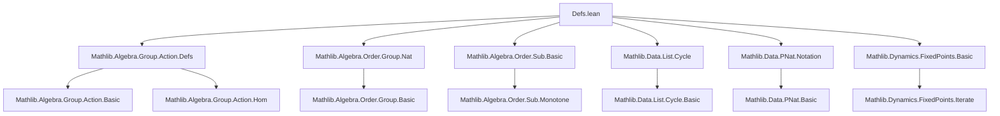

### Technical Brief: Periodic Points in Lean 4 (Mathlib)

---

#### **1. Key Definitions & Theorems**

| Name | Type / Signature | Purpose |
|------|------------------|---------|
| `IsPeriodicPt f n x` | `f : α → α`, `n : ℕ`, `x : α` → `Prop` | `x` is a periodic point of `f` of period `n`, i.e., `f^[n] x = x`. No minimality required. |
| `ptsOfPeriod f n` | `Set α` | Set of all points with period dividing `n` (not necessarily minimal). |
| `periodicPts f` | `Set α` | Set of all points with *some* positive period. |
| `minimalPeriod f x` | `ℕ` | Minimal positive period of `x` under `f`, or `0` if not periodic. |
| `periodicOrbit f x` | `Cycle α` | Cycle of iterates of `x` under `f`, length = `minimalPeriod f x`. Empty if not periodic. |
| `MulAction.period g x` | `ℕ` | Minimal `n > 0` such that `g ^ n • x = x`, else `0`. Equivalent to `minimalPeriod (g • ·) x`. |
| `isPeriodicPt_iff_minimalPeriod_dvd` | `IsPeriodicPt f n x ↔ minimalPeriod f x ∣ n` | Core characterization: `x` has period `n` iff minimal period divides `n`. |
| `bijOn_ptsOfPeriod` | `0 < n → BijOn f (ptsOfPeriod f n)` | `f` is a bijection on points of *any fixed positive period*. |
| `iterate_injOn_Iio_minimalPeriod` | Injectivity of `f^[·] x` on `{n < minimalPeriod f x}` | Ensures orbit points are distinct up to minimal period. |
| `minimalPeriod_iterate_eq_div_gcd` | `n ≠ 0 ⇒ minimalPeriod f^[n] x = minimalPeriod f x / gcd(minimalPeriod f x, n)` | Minimal period of iterate `f^[n]`. |
| `pow_smul_eq_iff_period_dvd` | `m ^ n • a = a ↔ period m a ∣ n` | Action-theoretic version of the divisibility criterion. |

---

#### **2. Naming Conventions**

- **Predicates**: `isFixedPt`, `isPeriodicPt`, `isPeriodicPt_zero`, `is_periodic_id`, `minimalPeriod_pos_iff_mem_periodicPts`
- **Set constructors**: `ptsOfPeriod`, `periodicPts`, `periodicOrbit`
- **Action-specific**: `MulAction.period`, `AddAction.period` (via `to_additive`)
- **Operations on proofs**: `hx.apply`, `hx.add`, `hx.mul_const`, `hx.iterate`, `hx.map`, `hx.comp`, `hx.trans_dvd`
- **Simp lemmas**: `iterate_minimalPeriod`, `iterate_add_minimalPeriod_eq`, `iterate_mod_minimalPeriod_eq`, `mem_ptsOfPeriod`, `mem_periodicPts`, `periodicOrbit_length`, `pow_period_smul`, `pow_smul_eq_iff_period_dvd`

Prefixes/suffixes:
- `is_` for predicates (`isFixedPt`, `isPeriodicPt`)
- `_of_` for implications (`minimalPeriod_pos_of_mem_periodicPts`, `eq_of_apply_eq`)
- `_iff_` for equivalences (`isPeriodicPt_iff_minimalPeriod_dvd`, `periodicOrbit_eq_nil_iff_not_periodic_pt`)
- `_apply_`, `_iterate_`, `_mod_`, `_gcd_`, `_lcm_`, `_dvd_` for structural operations

---

#### **3. Tactic Stack**

Frequent tactics used:
- `rw` / `rwa` — rewriting definitions and hypotheses
- `simp` / `simp only` / `simp_rw` — simplifying using `@[simp]` lemmas
- `exact`, `apply`, `convert` — proof construction
- `rcases`, `rintro`, `cases'` — destructuring existential/universal hypotheses
- `conv` — equational reasoning (especially `conv_rhs => rw [...]`)
- `aesop` / `linarith` / `lia` — arithmetic reasoning (e.g., `Nat` inequalities)
- `ext`, `funext` — extensionality for sets/functions
- `intro`, `intro!`, `refine` — proof structure
- `nontriviality`, `by_contra!` — auxiliary reasoning
- `induction` (via `Nat.gcd.induction`) — structural induction on naturals

---

#### **4. Proof Logic**

**Typical proof patterns**:
- **Induction on `n` or `m.gcd n`**: e.g., `minimalPeriod_gcd`, `minimalPeriod_iterate_eq_div_gcd_aux`
- **Divisibility reasoning**: Use `dvd_antisymm`, `Nat.dvd_iff_mod_eq_zero`, `mod_lt`, `mod_add_div`
- **Injectivity via minimal period**: `iterate_injOn_Iio_minimalPeriod`, `eq_of_apply_eq_same`, `eq_of_apply_eq`
- **Orbit structure**: `nodup_periodicOrbit`, `mem_periodicOrbit_iff`, `periodicOrbit_chain`
- **Action theory**: Translate `MulAction.period` to `minimalPeriod`, then reuse lemmas (e.g., `pow_smul_eq_iff_period_dvd`)
- **Case split on `0 < n`**: Many results require positivity (e.g., `bijOn_ptsOfPeriod`, `eq_of_apply_eq_same`)
- **Classical choice**: `Nat.find_spec`, `Nat.find_min'` for minimal period properties

**Common proof skeleton**:
```lean
-- Prove P(n) for all n where P(n) := IsPeriodicPt f n x → Q(n)
intro h
rw [isPeriodicPt_iff_minimalPeriod_dvd] at h
rcases h with ⟨k, hk⟩
-- reduce to divisibility, use minimalPeriod_dvd, gcd/lcm lemmas, etc.
```

---

#### **5. Imports & Dependencies**

**Core imports**:
- `Mathlib.Algebra.Group.Action.Defs` — group actions, `MulAction`, `smul`, `zpow`
- `Mathlib.Algebra.Order.Group.Nat` — ordered groups with `ℕ`-action
- `Mathlib.Algebra.Order.Sub.Basic` — subtraction on ordered additive groups
- `Mathlib.Data.List.Cycle` — cyclic lists (`Cycle α`)
- `Mathlib.Data.PNat.Notation` — positive naturals (`ℕ+`)
- `Mathlib.Dynamics.FixedPoints.Basic` — fixed points, iterates, `iterate`, `IsFixedPt`

**Key underlying theories**:
- Iterated function application (`iterate`)
- Fixed points (`IsFixedPt`)
- Semiconjugacy (`Semiconj`)
- Commutativity (`Commute`)
- Group actions (`MulAction`, `AddAction`)
- Order-theoretic arithmetic (`Nat` divisibility, gcd, lcm, mod)

---

#### **6. Mermaid Diagrams**

##### **Dependency Graph (Module-Level)**



##### **Conceptual Overview (Theory Flow)**

```mermaid
flowchart LR
  subgraph Foundations
    FP[Fixed Points] --> IP[IsPeriodicPt]
    IP --> POP[ptsOfPeriod f n]
    POP --> PP[periodicPts f]
  end

  subgraph Minimal Period
    PP --> MP[minimalPeriod f x]
    MP --> Dvd[Divisibility Criterion]
    Dvd --> Iter[Iterate Properties]
  end

  subgraph Orbit
    MP --> Orbit[periodicOrbit f x]
    Orbit --> Chain[Chain Condition]
    Orbit --> Nodup[Nodup]
  end

  subgraph Actions
    MulAction[MulAction G α] --> PA[period g x]
    PA --> Smul[smul iteration]
    Smul --> ZPow[zpow mod period]
  end

  FP -->|iterate| IP
  IP -->|closure under ops| Dvd
  MP -->|injectivity| Iter
  Orbit -->|length = MP| MP
  PA -->|def| MP
```

##### **File Internal Structure**

```mermaid
flowchart TB
  Start[Defs.lean] --> Defs[Definitions]
  Defs --> IsPeriodicPt[IsPeriodicPt]
  Defs --> ptsOfPeriod[ptsOfPeriod]
  Defs --> periodicPts[periodicPts]
  Defs --> minimalPeriod[minimalPeriod]
  Defs --> periodicOrbit[periodicOrbit]
  Defs --> MulAction.period[period]

  IsPeriodicPt --> Ops[Operations on proofs]
  Ops --> Add[add, sub, mul_const]
  Ops --> Map[map, iterate, comp]
  Ops --> Dvd[trans_dvd, mod, gcd]

  minimalPeriod --> Thms[Main Theorems]
  Thms --> DvdChar[isPeriodicPt ↔ minimalPeriod ∣ n]
  Thms --> Bij[BijOn f on ptsOfPeriod]
  Thms --> OrbitChar[mem periodicOrbit ↔ ∃ n, f^[n] x = y]

  MulAction.period --> ActionThms[Action Theorems]
  ActionThms --> SmulEq[pow_smul = a ↔ period ∣ n]
  ActionThms --> Mod[mod period simplifications]
```

---

#### **7. Summary**

This module formalizes the theory of **periodic points** in a general setting (endomorphisms on types), with a focus on:
- **Algebraic structure** of periods (gcd, lcm, divisibility)
- **Orbit geometry** (cycles, injectivity, nodup)
- **Action theory** (multiplicative/additive group actions)

It leverages:
- `minimalPeriod` as the central invariant
- `periodicOrbit` as the canonical cycle representation
- `ptsOfPeriod` and `periodicPts` for set-theoretic reasoning

The formalization is highly structured, with a rich set of “dot-notation” proof operations (`hx.add`, `hx.map`, etc.), and extensive use of `simp`-friendly equivalences (`isPeriodicPt_iff_minimalPeriod_dvd`, `pow_smul_eq_iff_period_dvd`) to support automation.

The `MulAction.period` definition bridges abstract dynamics with group theory, enabling modular reuse of results across additive/multiplicative contexts.
