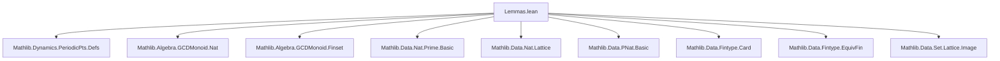

**Technical Brief: `Lemmas.lean` — Extra Lemmas about Periodic Points**

---

### 1. KEY DEFINITIONS & THEOREMS

| Name | Type / Signature | Purpose |
|------|------------------|---------|
| `ptsOfPeriod f n` | `Set α` | Set of points with *exact* period `n` under `f`. |
| `periodicPts f` | `Set α` | Union over all `n : ℕ+` of `ptsOfPeriod f n`; i.e., all periodic points. |
| `minimalPeriod f x` | `ℕ` | Least positive `n` such that `IsPeriodicPt f n x`, or `0` if none. |
| `IsPeriodicPt f n x` | `Prop` | `f^[n] x = x`. |
| `IsFixedPt f x` | `Prop` | `f x = x` (i.e., `IsPeriodicPt f 1 x`). |
| `directed_ptsOfPeriod_pnat` | `Directed (· ⊆ ·) fun n : ℕ+ => ptsOfPeriod f n` | Shows inclusion-directedness of periodic point sets indexed by positive naturals. |
| `bijOn_periodicPts` | `BijOn f (periodicPts f) (periodicPts f)` | `f` restricts to a bijection on its periodic points. |
| `minimalPeriod_eq_prime_iff` | `minimalPeriod f x = p ↔ IsPeriodicPt f p x ∧ ¬IsFixedPt f x` | Characterizes when minimal period is a prime. |
| `minimalPeriod_eq_prime_pow` | `minimalPeriod f x = p ^ (k + 1)` under conditions | Identifies minimal period as a prime power when only one higher power is periodic. |
| `Commute.minimalPeriod_of_comp_dvd_mul` | `minimalPeriod (f ∘ g) x ∣ minimalPeriod f x * minimalPeriod g x` | Bounds minimal period of composition by product. |
| `Commute.minimalPeriod_of_comp_eq_mul_of_coprime` | Equality when minimal periods are coprime | Refines above to equality under coprimality. |
| `minimalPeriod_le_card` | `minimalPeriod f x ≤ card α` | Minimal period bounded by cardinality in finite types. |
| `isPeriodicPt_factorial_card_of_mem_periodicPts` | `IsPeriodicPt f (card α)! x` | Every periodic point has period dividing `(card α)!`. |
| `mem_periodicPts_iff_isPeriodicPt_factorial_card` | `x ∈ periodicPts f ↔ IsPeriodicPt f (card α)! x` | Full characterization of periodic points via factorial. |
| `Injective.mem_periodicPts` | `Injective f → x ∈ periodicPts f` | In finite types, injective endomaps are pointwise periodic. |
| `injective_iff_periodicPts_eq_univ` | `Injective f ↔ periodicPts f = univ` | Equivalence between injectivity and all points being periodic. |
| `injective_iff_iterate_factorial_card_eq_id` | `Injective f ↔ f^[(card α)!] = id` | Iteration by factorial gives identity iff injective (hence bijective). |
| `minimalPeriod_prodMap` | `minimalPeriod (Prod.map f g) x = lcm (minimalPeriod f x.1) (minimalPeriod g x.2)` | Minimal period of product map is lcm of components. |
| `minimalPeriod_piMap` | `minimalPeriod (Pi.map f) x = sInf { n > 0 | ∀ i, minimalPeriod (f i) (x i) ∣ n }` | Generalized LCM over product types. |
| `minimalPeriod_piMap_fintype` | `minimalPeriod (Pi.map f) x = Finset.univ.lcm (fun i => minimalPeriod (f i) (x i))` | Finite product version: lcm over finite index set. |

---

### 2. NAMING CONVENTIONS

- **Prefixes**:
  - `minimalPeriod_`: properties of `minimalPeriod`.
  - `isPeriodicPt_`: properties of `IsPeriodicPt`.
  - `bijOn_`, `Injective_`, `mem_periodicPts_`: set-theoretic or membership properties.
  - `directed_`, `periodicPts_`: structural properties of periodic point sets.

- **Suffixes**:
  - `_iff`: biconditional characterizations.
  - `_eq_prime`, `_eq_prime_pow`: special cases for prime / prime power periods.
  - `_dvd`, `_mul`, `_lcm`: divisibility / multiplication / lcm relations.
  - `_of_`: implication direction or construction source (e.g., `of_mem_periodicPts`, `of_coprime`).
  - `_fintype`, `_finite`: finite-type-specific variants.

- **Other patterns**:
  - `Commute.*`: lemmas assuming `Commute f g`.
  - `Prod.*`, `Pi.*`: product / dependent product variants.

---

### 3. TACTIC STACK

Frequent tactics used in proofs:

- `rw`, `simp`, `simp_rw`: rewriting and simplification using definitions and lemmas.
- `exact`, `refine`, `apply`: constructing proofs via known lemmas.
- `dsimp`, `grind`: deep simplification and automated solving (likely custom).
- `intro`, `cases`, `rcases`: structural decomposition.
- `lt_or_gt_of_ne`, `lia`: arithmetic reasoning (linear integer arithmetic).
- `eq_of_forall_dvd`: proving equality of naturals via mutual divisibility.
- `dvd_antisymm`, `antisymm`: proving equality via divisibility bounds.
- `by_cases`, `by_contra`, `contrapose!`: classical reasoning.
- `convert`, `congr'`: congruence-based equality proofs.
- `Finset.univ.lcm`, `Finset.prod`, `Finset.sum`: finite summation/product over index sets.

---

### 4. PROOF LOGIC

**Typical proof structure**:

1. **Reduction to `IsPeriodicPt` and `minimalPeriod` definitions**  
   Many proofs start by unfolding `minimalPeriod`, `periodicPts`, or `IsPeriodicPt`, often using `minimalPeriod_eq_sInf_n_pos_IsPeriodicPt`.

2. **Use of `isPeriodicPt_iff_minimalPeriod_dvd`**  
   Central equivalence: `IsPeriodicPt f n x ↔ minimalPeriod f x ∣ n`. Used to translate between periodicity and divisibility.

3. **Divisibility reasoning**  
   - To prove `a = b`, show `a ∣ b` and `b ∣ a` (`eq_of_forall_dvd`, `antisymm`).
   - To prove `a ∣ b`, use `dvd_trans`, `Nat.lcm_dvd_iff`, `dvd_mul_left/right`, etc.

4. **Induction / case analysis on primes / powers**  
   E.g., `minimalPeriod_eq_prime_iff` uses `dvd_prime`, `minimalPeriod_eq_prime_pow` uses `eq_prime_pow_of_dvd_least_prime_pow`.

5. **Finite-type arguments**  
   - Use `minimalPeriod_le_card` + `factorial_pos` + `dvd_factorial`.
   - `injective_iff_periodicPts_eq_univ` uses `periodicPts_subset_range` and finite/injective/surjective equivalences.

6. **Product/dependent product structure**  
   - `minimalPeriod_prodMap` and `minimalPeriod_piMap` reduce to lcm/lattice-theoretic sInf via `isPeriodicPt_iff_minimalPeriod_dvd`.

---

### 5. IMPORTS (PRIMARY DEPENDENCIES)

| Module | Role |
|--------|------|
| `Mathlib.Algebra.GCDMonoid.Finset` | LCM over finite sets (`Finset.lcm`), GCD monoid structure. |
| `Mathlib.Algebra.GCDMonoid.Nat` | `Nat` as GCD monoid, `lcm`, `gcd`, `Coprime`. |
| `Mathlib.Data.Fintype.Card` | Cardinality of finite types (`card α`). |
| `Mathlib.Data.Fintype.EquivFin` | Equivalence `α ≃ Fin (card α)` for finite types. |
| `Mathlib.Data.Nat.Lattice` | `ℕ` as lattice (with `lcm`, `gcd`). |
| `Mathlib.Data.Nat.Prime.Basic` | Prime numbers, `Fact p.Prime`, `Nat.dvd_prime`. |
| `Mathlib.Data.PNat.Basic` | Positive naturals (`ℕ+`), used for indexing exact periods. |
| `Mathlib.Data.Set.Lattice.Image` | Set lattice operations, images, unions. |
| `Mathlib.Dynamics.PeriodicPts.Defs` | Core definitions: `ptsOfPeriod`, `periodicPts`, `minimalPeriod`, `IsPeriodicPt`. |

---

### 6. MERMAID DIAGRAMS

#### Dependency Graph (Module-Level)



#### Overview of Theory Flow

```mermaid
flowchart LR
  subgraph CoreDefs
    D1[IsPeriodicPt f n x]
    D2[ptsOfPeriod f n]
    D3[periodicPts f]
    D4[minimalPeriod f x]
  end

  subgraph StructuralProps
    S1[directed_ptsOfPeriod_pnat]
    S2[bijOn_periodicPts]
  end

  subgraph Prime/PowerProps
    P1[minimalPeriod_eq_prime_iff]
    P2[minimalPeriod_eq_prime_pow]
  end

  subgraph CompositionProps
    C1[Commute.minimalPeriod_of_comp_dvd_mul]
    C2[Commute.minimalPeriod_of_comp_eq_mul_of_coprime]
  end

  subgraph FiniteTypeProps
    F1[minimalPeriod_le_card]
    F2[isPeriodicPt_factorial_card_of_mem_periodicPts]
    F3[injectivity ↔ periodicPts = univ]
    F4[f^[(card α)!] = id ↔ Injective f]
  end

  subgraph ProductProps
    R1[minimalPeriod_prodMap]
    R2[minimalPeriod_piMap]
  end

  D1 --> S1
  D2 --> S1
  D3 --> S2
  D4 --> P1
  D4 --> P2
  D4 --> C1
  D4 --> C2
  D4 --> F1
  D1 --> F2
  D3 --> F3
  D1 --> F4
  D4 --> R1
  D4 --> R2
```

---

### 7. DOMAIN & APPLICATION CONTEXT

- **Domain**: Formalized discrete dynamical systems on finite/infinite types.
- **Key Concepts**: Periodic points, minimal periods, injectivity/surjectivity in finite types, product/dependent product dynamics.
- **Applications**:
  - Analysis of iteration behavior (e.g., in combinatorics, automata theory).
  - Group actions (via bijections), permutation cycles.
  - LCM-based period composition (e.g., in cryptographic primitives, cellular automata).
  - Formal verification of periodic behavior in programs or protocols.

--- 

*End of Technical Brief.*
