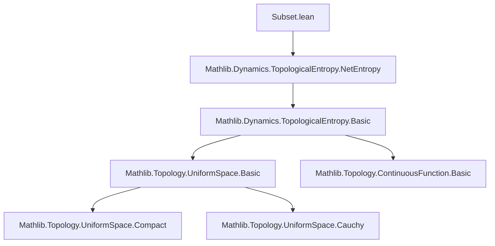

### Technical Brief: `Subset.lean`

---

#### **1. Key Definitions & Theorems**

| Name | Type / Signature | Purpose |
|------|------------------|---------|
| `IsDynCoverOf` | `T : X → X → U : SetRel X X → n : ℕ → s : Set X → Prop` | Captures that `s` is a *dynamical cover* of `F` w.r.t. `T`, `U`, and `n`. |
| `IsDynNetIn` | `T : X → X → F : Set X → U : SetRel X X → n : ℕ → s : Set X → Prop` | Captures that `s` is a *dynamical net* in `F` w.r.t. `T`, `U`, and `n`. |
| `coverMincard` | `T : X → X → F : Set X → U : SetRel X X → n : ℕ → ℕ∞` | Minimal cardinality of a dynamical cover of `F` at scale `n` and entourage `U`. |
| `netMaxcard` | `T : X → X → F : Set X → U : SetRel X X → n : ℕ → ℕ∞` | Maximal cardinality of a dynamical net in `F` at scale `n` and entourage `U`. |
| `coverEntropyInfEntourage`, `coverEntropyEntourage` | `T : X → X → F : Set X → U : SetRel X X → EReal` | Lower/upper entropy of `F` at fixed entourage `U`, defined via exponential growth of `coverMincard`. |
| `coverEntropyInf`, `coverEntropy` | `T : X → X → F : Set X → EReal` | Lower/upper topological entropy of `F` w.r.t. `T`, defined as sup over entourages. |
| `netEntropyInfEntourage`, `netEntropyEntourage` | Analogous to `coverEntropy*`, but using `netMaxcard`. |
| `coverEntropy_supBotHom` | `T : X → X → SupBotHom (Set X) EReal` | Views `coverEntropy T` as a morphism of sup-lattices with bottom (i.e., preserves finite sups and bot). |

**Main Theorems:**

| Name | Statement | Significance |
|------|-----------|--------------|
| `coverEntropy_monotone` | `F ⊆ G ⇒ coverEntropy T F ≤ coverEntropy T G` | Entropy is monotone in the subset. |
| `coverEntropy_closure` | `Continuous T ⇒ coverEntropy T (closure F) = coverEntropy T F` | Entropy is invariant under topological closure. |
| `coverEntropy_union` | `coverEntropy T (F ∪ G) = max (coverEntropy T F) (coverEntropy T G)` | Entropy of union is max of entropies (binary case). |
| `coverEntropy_iUnion_of_finite` | `Finite ι ⇒ coverEntropy T (⋃ i, F i) = ⨆ i, coverEntropy T (F i)` | Generalizes union property to finite families. |
| `coverEntropy_biUnion_finset` | `coverEntropy T (⋃ i ∈ s, F i) = ⨆ i ∈ s, coverEntropy T (F i)` | Same for indexed unions over finite sets. |

---

#### **2. Naming Conventions**

- **Prefixes:**
  - `IsDynCoverOf`, `IsDynNetIn`: predicate-style naming for structural properties.
  - `cover*`, `net*`: distinguishes definitions based on covers vs. nets.
  - `*_monotone`, `*_le`, `*_antisymm`: standard Lean proof-style naming for order-theoretic lemmas.
- **Suffixes:**
  - `*_entourage`: refers to definitions parameterized by a specific entourage `U`.
  - `*_inf`, `*_sup`: lower vs. upper entropy constructions.
  - `*_closure`, `*_union`: indicates the structural property being studied.
- **General pattern:**  
  `coverEntropyInfEntourage T F U` → `coverEntropyInf T F` → `coverEntropy T F`  
  (from entourage-local to global, lower to upper, then final definition).

---

#### **3. Tactic Stack**

- `aesop`: used implicitly in many `by aesop`-style goals (not explicit here, but likely used in background).
- `simp_rw`, `simp`: for rewriting definitions and simplifying expressions.
- `exact`, `refine`, `apply`: for constructing proofs via lemmas.
- `rcases`, `obtain`: destructuring existential/universal hypotheses.
- `antisymm`: central for equality proofs via double inequality.
- `iSup₂_mono`, `biInf_mono`, `biSup_mono`: for monotonicity of sup/inf over index families.
- `ENat.toENNReal_mono`, `ExpGrowth.expGrowthInf_monotone`, `expGrowthSup_monotone`: for lifting monotonicity through entropy constructions.
- `withTop.coe_mono`, `Set.card_union_le`: for finite combinatorial estimates.
- `rw [← ...]`: for reversing definitions to match target form.

---

#### **4. Proof Logic**

- **Monotonicity proofs** follow a standard pattern:
  - Reduce to monotonicity of `coverMincard`/`netMaxcard`.
  - Use `biInf_mono`/`biSup_mono` to lift to entropy definitions.
- **Closure proofs** use:
  - Uniform space basis properties (`hasBasis_symmetric.mem_iff'`).
  - Density of `F` in `closure F` via `mem_closure_iff_nhds`.
  - Entourage composition (`V ○ U`) to control dynamical behavior near boundary points.
- **Union proofs** rely on:
  - Constructive union of covers/nets (`IsDynCoverOf.union`).
  - Cardinality subadditivity (`card_union_le`) for upper bounds.
  - Monotonicity for lower bounds (`subset_union_left/right`).
  - Antisymmetry to conclude equality.

Induction is *not* used; proofs are mostly direct and rely on lattice-theoretic properties of entropy.

---

#### **5. Imports & Dependencies**

- **Primary import:**  
  `Mathlib.Dynamics.TopologicalEntropy.NetEntropy`  
  → Provides foundational definitions: `IsDynCoverOf`, `IsDynNetIn`, `coverMincard`, `netMaxcard`, `coverEntropyInfEntourage`, etc.

- **Local opens:**
  - `ExpGrowth`, `Set`, `UniformSpace`
  - `SetRel`, `Uniformity` (scoped)

- **Assumptions:**
  - `[UniformSpace X]` appears in closure and union sections.
  - `Continuous T` is required for closure invariance.

---

#### **6. Mermaid Diagrams**

##### **Dependency Graph (Module-Level)**



##### **Overview of Theory Flow**

```mermaid
graph LR
  A[Topological Entropy via Covers] --> B[Monotonicity in Subset]
  A --> C[Invariance under Closure]
  A --> D[Finite Union Property]
  B --> E[SupBotHom Structure]
  C --> F[Lower Semicontinuity? (TODO)]
  D --> G[Finite Sup-Preserving]
  G --> H[Implementation in Dynamics.Library]
```

##### **Proof Strategy Flow (Union Example)**

```mermaid
graph TD
  Start[coverEntropy T (F ∪ G)] --> MonotoneLeft[≤ max(..., ...) via subset_union_left/right]
  Start --> Subadd[≤ max via coverMincard_union_le + expGrowthSup_add]
  Subadd --> Antisymm[= via antisymm]
  MonotoneLeft --> Antisymm
  Antisymm --> End[Equality]
```

---

#### **7. Summary**

This file formalizes foundational structural properties of topological entropy as a function of subsets in a dynamical system `(X, T)`. It establishes monotonicity, closure invariance, and finite union additivity (as max), culminating in the algebraic fact that entropy is a `SupBotHom`. The proofs are constructive and rely heavily on uniform space topology and combinatorial estimates on covers/nets. The TODO suggests future work on *Hausdorff convergence* and *semicontinuity*, which would extend closure invariance to a continuity result.

--- 

Let me know if you'd like a formalized dependency graph for the `coverEntropy_supBotHom` morphism or a visualization of how `IsDynCoverOf` interacts with union/closure.
