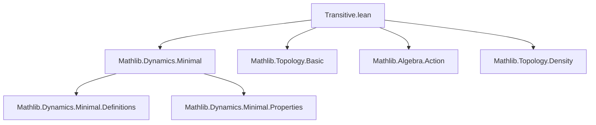

**Technical Brief: `Transitive.lean` — Topologically Transitive Monoid Actions**

---

### 1. **Key Definitions & Theorems**

| Name | Type | Purpose |
|------|------|---------|
| `AddAction.IsTopologicallyTransitive` | `Prop` | Defines additive topological transitivity: for any nonempty open `U, V`, ∃ `m : M` s.t. `(m +ᵥ U) ∩ V ≠ ∅`. |
| `MulAction.IsTopologicallyTransitive` | `Prop` | Multiplicative version: for any nonempty open `U, V`, ∃ `m : M` s.t. `(m • U) ∩ V ≠ ∅`. |
| `MulAction.isTopologicallyTransitive_iff` | `↔` | Equivalence between the class definition and its explicit predicate form. |
| `MulAction.isTopologicallyTransitive_iff_dense_iUnion` | `↔` | Characterizes transitivity via density of `⋃ m, m • U` for nonempty open `U`. |
| `MulAction.isTopologicallyTransitive_iff_dense_iUnion_preimage` | `↔` | Characterizes transitivity via density of `⋃ m, (m • ·)⁻¹' U`. |
| `IsOpen.dense_iUnion_smul` | `Dense (⋃ m, m • U)` | Consequence: under transitivity, orbit union of a nonempty open set is dense. |
| `IsOpen.dense_iUnion_preimage_smul` | `Dense (⋃ m, (m • ·)⁻¹' U)` | Dual version using preimages. |
| `IsOpen.dense_of_preimage_smul_invariant` | `Dense U` | If `U` is open, nonempty, and invariant under all preimages `(m • ·)⁻¹' U ⊆ U`, then `U` is dense. |
| `MulAction.isTopologicallyTransitive_iff_dense_of_preimage_invariant` | `↔` | Under `ContinuousConstSMul`, transitivity ⇔ all nonempty open `U` invariant under preimages are dense. |
| `MulAction.isTopologicallyTransitive_of_isMinimal` | `IsTopologicallyTransitive M α` | Minimal actions are topologically transitive. |

---

### 2. **Naming Conventions**

- **Prefixes**:
  - `isTopologicallyTransitive`: predicate naming for the property.
  - `dense_`: used for theorems asserting density of unions or images.
  - `preimage_`: used when preimages `(m • ·)⁻¹' U` are central.
  - `smul` / `vadd`: distinguishes multiplicative vs additive actions.

- **Suffixes**:
  - `_iff`: characterizations as biconditionals.
  - `_invariant`: for statements involving invariance under preimages.
  - `_preimage`: for preimage-based versions.

- **Class names**:
  - `MulAction.IsTopologicallyTransitive`, `AddAction.IsTopologicallyTransitive`: class-based definitions.

---

### 3. **Tactic Stack**

Frequently used tactics in proofs:

- `simp only [...]`: heavy use of `simp` with explicit lemmas (e.g., `dense_iff_inter_open`, `inter_iUnion`, `nonempty_iUnion`, `image_inter_nonempty_iff`, `preimage_iUnion`, `smul_smul`, `one_smul`).
- `exact`: for direct application of hypotheses or constructed terms.
- `refine`: to construct proofs with holes (e.g., `refine (isTopologicallyTransitive_iff_dense_iUnion_preimage M).mpr ?_`).
- `simpa only [...]`: simplification with `only` and discharge of goals via `simpa`.
- `mono`: monotonicity of `Dense` under superset inclusion.
- `intro`, `intro h`, `intros`: standard for introducing hypotheses.
- `cases`, `constructor`: for splitting biconditionals or inductive structures.

No heavy automation like `aesop` or `linarith`; proofs are mostly structural and rely on topology + algebraic simplifications.

---

### 4. **Proof Logic**

- **Structure**: Most proofs follow a *characterization-first* pattern:
  1. Use `isTopologicallyTransitive_iff` to reduce to the defining condition.
  2. Apply known topological equivalences (e.g., `dense_iff_inter_open`).
  3. Manipulate unions and intersections using set-theoretic lemmas (`inter_iUnion`, `nonempty_iUnion`, `preimage_iUnion`, etc.).
  4. For “only if” directions: apply the defining condition to open sets derived from the hypothesis.
  5. For “if” directions: construct the required `m` using the density assumption and openness.

- **Induction**: Not used directly; instead, proofs rely on:
  - Universal quantification over open sets.
  - Existential witnesses built from algebraic structure (e.g., `1`, `c * b`).
  - Monoid action properties (`smul_smul`, `one_smul`).

- **Key logical flow**:
  - `dense U ↔ ∀ V open nonempty, U ∩ V ≠ ∅`
  - `⋃ m, m • U` dense ⇔ for all nonempty open `V`, ∃ `m`, `(m • U) ∩ V ≠ ∅`
  - Invariance under preimages + density ⇒ full density of `U`.

---

### 5. **Imports**

- `Mathlib.Dynamics.Minimal`: Provides `IsMinimal`, used in `isTopologicallyTransitive_of_isMinimal`.
- `Pointwise` (scoped): Enables notation like `m • U`, `m +ᵥ U`, preimages, unions.

No other explicit imports; relies on standard `Mathlib.Topology`, `Mathlib.Algebra.Action`, and `Mathlib.Dynamics` infrastructure.

---

### 6. **Mermaid Diagrams**

#### **Dependency Graph (Module-Level)**



#### **Overview of Theory Flow**

```mermaid
graph LR
  A[Monoid Action] --> B[Topological Space]
  B --> C[Open Sets U, V]
  C --> D[Existence of m s.t. (m•U) ∩ V ≠ ∅]
  D --> E[IsTopologicallyTransitive M α]
  E --> F[Density of ⋃ m, m•U]
  E --> G[Density of ⋃ m, (m•·)⁻¹'U]
  G --> H[Invariant open sets ⇒ dense]
  H --> I[ContinuousConstSMul ⇒ equivalence]
  J[IsMinimal M α] --> E
```

#### **Proof Strategy Flow (Example: `dense_iUnion_smul`)**

```mermaid
graph TD
  A[Assume IsTopologicallyTransitive] --> B[Apply isTopologicallyTransitive_iff_dense_iUnion]
  B --> C[Given U open, nonempty]
  C --> D[Use hUo, hUne to get Dense (⋃ m, m•U)]
  D --> E[Conclude via mp]
```

---

### 7. **Summary**

This module formalizes *topological transitivity* for monoid actions, providing multiple equivalent characterizations (via intersections, unions of images, unions of preimages), and connects it to minimality and invariance properties. The formalization is clean, modular, and leverages Lean’s typeclass inference and `to_additive` infrastructure for additive/multiplicative duality. It serves as foundational material for further dynamics in topological spaces.
