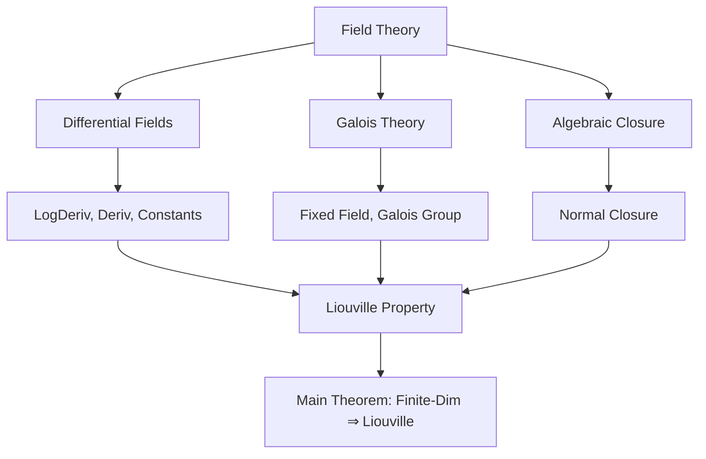
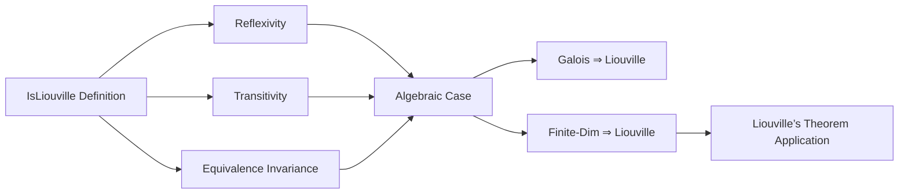

### Technical Brief: `Liouville.lean`

---

#### **1. Key Definitions & Theorems**

| Name | Type | Purpose |
|------|------|---------|
| `IsLiouville` | `class Prop` | Defines when a differential field extension $K/F$ satisfies the *Liouville property*: if an element $a \in F$ can be expressed as $a = v' + \sum c_i \cdot \log\mathrm{Deriv}(u_i)$ with $v, c_i, u_i \in K$ and $c_i$ constant, then it can also be expressed with all components in $F$. |
| `isLiouville_of_finiteDimensional` | `instance` | Proves that **every finite-dimensional field extension** $K/F$ (with $\mathrm{char}(F) = 0$) is Liouville. This is the main theorem of the file. |
| `IsLiouville.rfl` | `instance` | Reflexivity: $F/F$ is always Liouville. |
| `IsLiouville.trans` | `lemma` | Transitivity: if $K/F$ and $A/K$ are Liouville, then $A/F$ is Liouville (under mild compatibility conditions). |
| `IsLiouville.equiv` | `lemma` | Invariance under $F$-algebra isomorphism (requires algebraicity for derivative compatibility). |
| `isLiouville_of_finiteDimensional_galois` | `local instance` | Special case: finite-dimensional **Galois** extensions are Liouville. |
| `isLiouville_of_finiteDimensional` | `instance` | General case: all finite-dimensional extensions are Liouville (via normal closure). |

---

#### **2. Naming Conventions**

- **Prefixes**:
  - `isLiouville_`: for lemmas/instances about the `IsLiouville` predicate.
  - `logDeriv_`: for lemmas about the logarithmic derivative.
  - `deriv_`, `algEquiv_`, `map_`, `fixedField_`: standard differential/Galois-theoretic lemmas.

- **Suffixes**:
  - `_rfl`, `_trans`, `_equiv`: indicate structural properties (reflexivity, transitivity, equivalence invariance).
  - `_galois`, `_finiteDimensional`: indicate the class of extensions being handled.

- **Variables**:
  - `ι`, `c`, `u`, `v`, `a`: standard in the definition of the Liouville condition.
  - `x`, `e`: often range over automorphisms or index sets.

---

#### **3. Tactic Stack**

| Tactic | Frequency | Role |
|--------|-----------|------|
| `simp` / `simp_rw` | Very High | Simplify sums, products, algebra maps, logDeriv, deriv, fixed field conditions. |
| `conv` | Medium | Structural rewriting (e.g., expanding `logDeriv_prod`). |
| `rw` | High | Rewrite using lemmas like `logDeriv_algebraMap`, `deriv_algebraMap`, `algEquiv_deriv'`. |
| `apply_fun` | Medium | Push forward equations along algebra maps (e.g., injectivity arguments). |
| `choose` | Medium | Extract witnesses from existential quantifiers (e.g., elements in $F$ from fixed field). |
| `field_simp`, `push_cast`, `norm_cast` | Medium | Handle division, natural number scalars, and coercion between fields. |
| `rcongr`, `congr` | Low | Congruence reasoning for sums/products over finite types. |
| `cases`, `by_cases` | Low | Branch on zero/nonzero (e.g., `by_cases h : u i = 0`). |
| `exact`, `intro`, `apply` | High | Basic proof structure. |

---

#### **4. Proof Logic**

The proof proceeds in stages:

1. **Base case: Galois extensions**  
   - Use Galois symmetry: average over the Galois group to symmetrize $u_i$ and $v$.
   - Construct $u_0(i) = \prod_{e \in \mathrm{Gal}(K/F)} e(u(i))$, $v_0 = \frac{1}{|G|} \sum_{e \in G} e(v)$, $c_0(i) = c(i)/|G|$.
   - Show these lie in $F$ via the fixed field = $F$ (Galois correspondence).
   - Verify the Liouville identity using properties of `logDeriv` over products and sums.

2. **General finite-dimensional case**  
   - Embed $K$ into an algebraic closure $\overline{F}$.
   - Let $K'$ be the image; take its **normal closure** $K''$ over $F$.
   - Use the Galois case on $K''/F$ (since it’s Galois and finite-dimensional).
   - Transfer back to $K$ via an $F$-algebra isomorphism $K \simeq_F B$, where $B$ is an intermediate field of $K''/F$, using `IsLiouville.equiv`.

3. **辅助 lemmas**  
   - `trans`: uses `IsLiouville` twice (first in $K/A$, then in $F/K$).
   - `equiv`: pulls back the representation via inverse isomorphism; uses algebraicity to ensure derivative commutes.

---

#### **5. Imports & Dependencies**

| Module | Role |
|--------|------|
| `Mathlib.Algebra.Algebra.Field` | Field extensions, algebra structure. |
| `Mathlib.Algebra.BigOperators.Field` | Sums/products over finite types in fields. |
| `Mathlib.FieldTheory.Differential.Basic` | Differential fields, derivations, logDeriv, constants. |
| `Mathlib.FieldTheory.Galois.Basic` | Galois groups, fixed fields, Galois correspondence. |
| `Mathlib.FieldTheory.IsAlgClosed.AlgebraicClosure` | Algebraic closures, embeddings, normal closures. |

---

#### **6. Mermaid Diagrams**

##### **Dependency Graph (Core Theories)**

##### **File Overview**

---

#### **7. Summary**

This file formalizes a generalization of **Liouville’s theorem on elementary antiderivatives**, casting it in the language of *differential field extensions*. The key insight is that the classical condition — that an integral expressible via logs and exponentials must already be expressible over the base field — is captured by the `IsLiouville` predicate. The main result shows that **all finite-dimensional extensions over characteristic-zero fields are Liouville**, using Galois symmetrization and normal closures as central tools.

This sets the stage for formalizing the full Liouville criterion for elementary integrability (e.g., in future work on Risch algorithm formalization).
