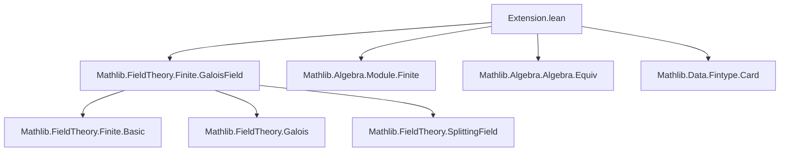

**Technical Brief: `Extension.lean` — Extensions of Finite Fields in Lean 4**

---

### 1. **Key Definitions & Theorems**

| Name | Type / Signature | Purpose |
|------|------------------|---------|
| `Extension k p n` | `Type` | Non-canonically chosen field extension of `k` of degree `n > 0`, constructed via `GaloisField`. |
| `finrank_zmod_extension` | `Module.finrank (ZMod p) (Extension k p n) = Module.finrank (ZMod p) k * n` | Relates the `𝔽ₚ`-dimension of the extension to base field and degree. |
| `nonempty_algHom_extension` | `Nonempty (k →ₐ[ZMod p] Extension k p n)` | Guarantees existence of an algebra map from `k` to its extension over `𝔽ₚ`. |
| `Extension.frob` | `Gal(Extension k p n / k)` | Frobenius automorphism $x \mapsto x^{|k|}$, generating the Galois group. |
| `Extension.frob_apply` | `frob k p n x = x ^ Nat.card k` | Explicit action of Frobenius on elements. |
| `Extension.exists_frob_pow_eq` | `∃ i < n, frob^i = g` | Frobenius generates the Galois group cyclically. |
| `algEquivExtension l h` | `l ≃ₐ[k] Extension k p n` | Any degree-`n` extension `l/k` is `k`-algebra isomorphic to the canonical `Extension`. |
| `natCard_extension` | `Nat.card (Extension k p n) = Nat.card k ^ n` | Cardinality of extension field. |
| `finrank_extension` | `Module.finrank k (Extension k p n) = n` | Degree of extension over base field. |
| `IsSplittingField` instance | `IsSplittingField k (Extension k p n) (X ^ |k|^n - X)` | Extension is splitting field of $X^{q^n} - X$ over $k = \mathbb{F}_q$. |
| `IsGalois`, `IsCyclic` instances | `IsGalois k (Extension k p n)`, `IsCyclic Gal(...)` | Extension is Galois with cyclic Galois group. |
| `natCard_algEquiv_extension`, `card_algEquiv_extension` | `|Gal| = n` | Size of Galois group equals extension degree. |

---

### 2. **Naming Conventions**

- **Prefixes**:
  - `Extension.`: for definitions/lemmas about the extension object.
  - `frob`: for Frobenius-related constructions (`Extension.frob`, `frob_apply`).
  - `algEquiv`: for algebra isomorphisms (`algEquivExtension`).
- **Suffixes**:
  - `_extension`: to refer to properties of `Extension k p n`.
  - `_zmod`: when reasoning over `ZMod p` (i.e., $𝔽ₚ$).
- **Variables**:
  - `k`: base finite field.
  - `p`: characteristic prime.
  - `n`: extension degree (> 0).
  - `l`: arbitrary extension field in `algEquivExtension`.

---

### 3. **Tactic Stack**

| Tactic | Usage Frequency | Role |
|--------|-----------------|------|
| `convert` | High | To align goals via definitional equalities (e.g., `finrank_zmod_extension`). |
| `rw` / `simp only` | Very High | Rewriting using lemmas like `natCard_extension`, `finrank_extension`. |
| `subsingleton` | Medium | To resolve uniqueness of algebra maps from `ZMod p`. |
| `rwa` | Medium | Rewriting with assumptions (e.g., in `exists_frob_pow_eq`). |
| `exact` / `refine` | High | For constructing isomorphisms and algebra maps. |
| `ext` | Medium | Extensionality for functions (e.g., proving Frobenius equality). |
| `have` / `obtain` | High | Introducing intermediate facts (e.g., finiteness, splitting field). |
| `inferInstance` | Medium | To discharge typeclass goals like `IsGalois`, `IsCyclic`. |

---

### 4. **Proof Logic**

- **Construction Phase**:
  - Define `Extension` as `GaloisField p (finrank * n)`, ensuring it inherits field, finite, and algebra structures.
  - Use `ZMod.algebra` to relate base field `k` to `𝔽ₚ`.
  - Prove key structural lemmas (`finrank_zmod_extension`, `natCard_extension`, `finrank_extension`) via arithmetic of dimensions and cardinalities.

- **Galois Theory Phase**:
  - Show `Extension` is a splitting field of $X^{q^n} - X$, hence Galois.
  - Use properties of Frobenius (`frobeniusAlgEquivOfAlgebraic`, `bijective_frobeniusAlgEquivOfAlgebraic_pow`) to prove:
    - Frobenius generates the Galois group.
    - Galois group is cyclic of order $n$.

- **Classification Phase**:
  - For any other extension `l/k` of degree `n`, show it is also a splitting field of same polynomial.
  - Use uniqueness of splitting fields up to `k`-algebra isomorphism (`IsSplittingField.algEquiv`) to get `algEquivExtension`.

---

### 5. **Imports & Dependencies**

| Module | Role |
|--------|------|
| `Mathlib.FieldTheory.Finite.GaloisField` | Core: defines `GaloisField p n`, its properties (splitting field, Frobenius, Galois group). |
| `Mathlib.FieldTheory.Finite` (implied via `GaloisField`) | Finite field basics: `frobenius`, `isSplittingField_sub`, `natCard_eq_pow_finrank`. |
| `Mathlib.Algebra.Module.Finite` | For `Module.Finite`, `Module.finite_of_finite`, etc. |
| `Mathlib.Algebra.Algebra.Equiv` | For `algEquiv`, `toAlgebra`, `IsScalarTower`. |
| `Mathlib.Data.Fintype.Card` | For `Fintype.card_eq_nat_card`, `Fintype.ofFinite`. |

---

### 6. **Mermaid Diagrams**

#### **Dependency Graph (Module-Level)**



#### **Overview of Theory Flow**

```mermaid
flowchart LR
  subgraph Construction
    K[Finite Field k] -->|char p, dim over 𝔽ₚ| L[Extension k p n := GaloisField p (dim·n)]
  end

  subgraph Structure
    L -->|splitting field of X^|k|^n - X| M[IsSplittingField]
    L -->|Frobenius x ↦ x^|k|| N[Gal = ⟨Frob⟩ ≅ ℤ/nℤ]
  end

  subgraph Classification
    O[Any l/k, [l:k]=n] -->|same splitting polynomial| P[IsSplittingField]
    P -->|uniqueness| Q[algEquivExtension : l ≃ₐ[k] Extension]
  end

  Construction --> Structure --> Classification
```

---

### 7. **Summary**

This module formalizes the classical theory of finite field extensions in Lean 4:
- Constructs a canonical-up-to-isomorphism degree-$n$ extension of any finite field $k$.
- Proves it is Galois with cyclic Galois group generated by Frobenius.
- Shows *any* degree-$n$ extension is isomorphic to it.

The development is highly structured, leveraging `GaloisField` as a black-box with strong algebraic properties, and uses standard tactics for field and module arithmetic. The naming and structure follow Lean’s `Mathlib` conventions, with clear separation of construction, structure, and classification phases.

--- 

*Prepared for Domain-Specific AI Agent training.*
