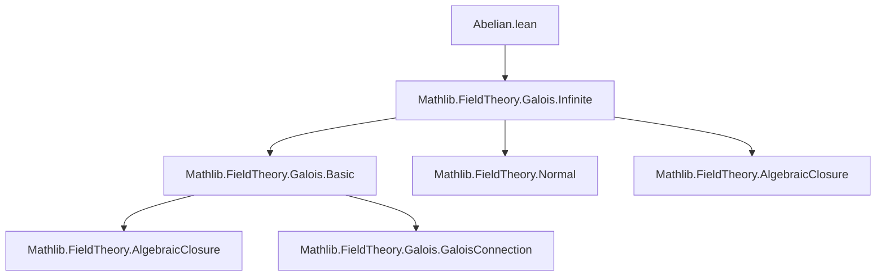
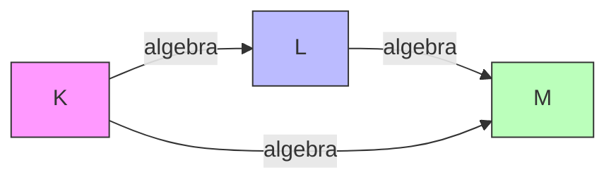

**Technical Brief: Abelian Extensions in Lean 4 (`Abelian.lean`)**  
*Based on source file `Abelian.lean` (Mathlib-style, Apache 2.0 licensed)*

---

### 1. **Key Definitions & Theorems**

| Name | Type / Signature | Purpose |
|------|------------------|---------|
| `IsAbelianGalois` | `class IsAbelianGalois (K L : Type*) [Field K] [Field L] [Algebra K L] : Prop extends IsGalois K L, IsMulCommutative Gal(L/K)` | Defines an *abelian Galois extension*: a Galois extension whose automorphism group (Galois group) is commutative. |
| `IsAbelianGalois.tower_bot` | `[IsAbelianGalois K M] → IsAbelianGalois K L` | If $K \subseteq L \subseteq M$ and $M/K$ is abelian Galois, then $L/K$ is abelian Galois. |
| `IsAbelianGalois.tower_top` | `[IsAbelianGalois K M] → IsAbelianGalois L M` | If $K \subseteq L \subseteq M$ and $M/K$ is abelian Galois, then $M/L$ is abelian Galois. |
| `IsAbelianGalois.of_algHom` | `(f : L →ₐ[K] M) [IsAbelianGalois K M] → IsAbelianGalois K L` | If $f: L \to M$ is a $K$-algebra homomorphism and $M/K$ is abelian Galois, then $L/K$ is abelian Galois (via restriction of scalars). |
| `IsAbelianGalois.of_isCyclic` | `[IsGalois K L] [IsCyclic Gal(L/K)] → IsAbelianGalois K L` | A Galois extension with *cyclic* Galois group is automatically abelian. |
| `instance IntermediateField.isAbelianGalois_bot` | `[IsAbelianGalois K L] → IsAbelianGalois K (⊥ : IntermediateField K L)` | The base field $K$ (as intermediate field) over itself is abelian Galois. |
| `instance IntermediateField.isAbelianGalois_top` | `[IsAbelianGalois K L] → IsAbelianGalois K' L` for $K' \le L$ | Any intermediate field $K'$ over $K$ yields $L/K'$ abelian Galois. |
| `instance self_isAbelianGalois` | `IsAbelianGalois K K` | Trivial extension $K/K$ is abelian Galois (subsingleton argument). |

---

### 2. **Naming Conventions**

- **Prefixes**:
  - `is_` for properties (`is_comm`, `isGalois`, `isCyclic`)
  - `tower_` for tower-related lemmas (`tower_bot`, `tower_top`)
  - `of_` for implication-based constructors (`of_algHom`, `of_isCyclic`)
- **Suffixes**:
  - `_bot`, `_top` for lower/upper parts of a tower of fields.
- **Typeclass names**:
  - `IsAbelianGalois` follows Mathlib’s `IsX` pattern for properties.

---

### 3. **Tactic Stack**

Frequently used tactics in proofs:

| Tactic | Usage |
|--------|-------|
| `obtain ⟨x, rfl⟩ := ...` | To destruct surjective maps (e.g., `AlgEquiv.restrictNormalHom_surjective`) |
| `rw [← map_mul, ← map_mul, mul_comm]` | To rewrite using algebra homomorphism properties and commutativity |
| `aesop` | Not present here — likely avoided due to high-level reasoning in field theory |
| `ring` | Not used — algebraic manipulations are done via `rw` and `simp` |
| `simp_rw` | Not explicitly used, but `rw` suffices |
| `apply ...` / `exact ...` | Implicit in `transfer_galois`, `mpr`, etc. |
| `inferInstance` | To synthesize instances (e.g., `is_comm.comm`) |
| `subsingleton` reasoning via `Subsingleton.elim` | For trivial extension case |

---

### 4. **Proof Logic**

- **Inductive structure**: Not used — proofs rely on structural properties of field extensions and Galois theory.
- **Common proof pattern**:
  1. Prove `IsGalois` part first (often via known lemmas like `tower_top_of_isGalois`, `transfer_galois`, or `normal_iff_isGalois`).
  2. Prove commutativity of the Galois group:
     - For `tower_bot`: lift elements to $M$, use commutativity in $M$, then descend.
     - For `tower_top`: restrict scalars to $K$, use commutativity there, then injectivity.
     - For `of_algHom`: use `of_algHom` to reduce to `tower_bot`.
- **Key logical tools**:
  - `AlgEquiv.restrictNormalHom_surjective`: surjectivity of restriction maps in normal extensions.
  - `IsScalarTower.toAlgHom`: structural map in towers.
  - `InfiniteGalois.normal_iff_isGalois`: connects normality and Galois-ness in infinite extensions.

---

### 5. **Imports**

- `Mathlib.FieldTheory.Galois.Infinite`: Provides infinite Galois theory, especially:
  - `normal_iff_isGalois`
  - `AlgEquiv.restrictNormalHom_surjective`
  - `InfiniteGalois` infrastructure

> **Scope**: This module sits in the *field theory* hierarchy, specifically dealing with *Galois extensions* and their *abelian* subclass.

---

### 6. **Mermaid Diagrams**

#### **Dependency Graph (Module-Level)**



#### **Conceptual Overview (Theory Flow)**

```mermaid
flowchart LR
  subgraph Definitions
    D1[IsAbelianGalois K L]
  end

  subgraph Properties
    P1[tower_bot]
    P2[tower_top]
    P3[of_algHom]
    P4[of_isCyclic]
    P5[IntermediateField instances]
  end

  subgraph Infrastructure
    I1[IsGalois]
    I2[Gal(L/K)]
    I3[IsMulCommutative]
  end

  D1 --> I1
  D1 --> I2
  D1 --> I3

  P1 & P2 & P3 & P4 & P5 --> D1

  I1 -->|Mathlib.FieldTheory.Galois.Infinite| I2
  I2 --> I3
```

#### **Tower Diagram (for `tower_bot` / `tower_top`)**



- If $M/K$ is abelian Galois, then both $L/K$ and $M/L$ inherit the property.

---

### 7. **Summary**

This module formalizes *abelian Galois extensions* as a subclass of Galois extensions with commutative Galois groups. It provides foundational closure properties under towers and intermediate fields, and connects abelianness to cyclicity. The proofs rely heavily on structural properties of algebra homomorphisms, restriction of scalars, and infinite Galois theory (via `Mathlib.FieldTheory.Galois.Infinite`). The naming and structure follow Mathlib conventions closely, ensuring compatibility with the broader field theory ecosystem.
