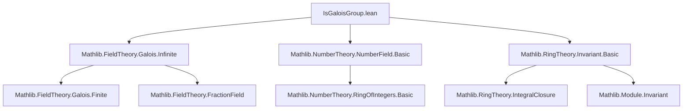
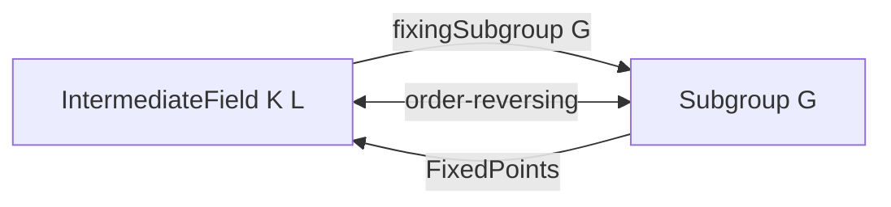

Here is a structured technical brief extracted from `IsGaloisGroup.lean`, focusing on formal metadata for building a domain-specific AI agent in the Lean 4 ecosystem.

---

### **1. Key Definitions & Theorems**

| Name | Type / Signature | Purpose |
|------|------------------|---------|
| `IsGaloisGroup` | `class IsGaloisGroup (G A B : Type*) [...]` | Predicate asserting that a group `G` acts *faithfully* on a ring extension `B/A` with fixed ring `A`. Generalizes Galois groups to possibly non-algebraic ring extensions. |
| `IsGaloisGroup.to_isFractionRing` | `[Finite G] → IsGaloisGroup G A B → IsGaloisGroup G K L` | Lifts `IsGaloisGroup` from rings to their fraction fields. |
| `IsGaloisGroup.of_isFractionRing` | `[IsIntegrallyClosed A] → Algebra.IsIntegral A B → IsGaloisGroup G K L → IsGaloisGroup G A B` | Descends `IsGaloisGroup` from fraction fields to rings under integrality and integrally closed assumptions. |
| `IsGaloisGroup.iff_isFractionRing` | `[Finite G] → [IsIntegrallyClosed A] → (IsGaloisGroup G A B ↔ Algebra.IsIntegral A B ∧ IsGaloisGroup G K L)` | Equivalence characterizing `IsGaloisGroup` for rings in terms of integrality and Galoisness of fraction fields. |
| `FractionRing.mulSemiringAction_of_isGaloisGroup` | `[IsDomain A] → [IsDomain B] → [IsTorsionFree A B] → IsGaloisGroup G A B → MulSemiringAction G (FractionRing B)` | Constructs induced action of `G` on fraction fields under domain + torsion-free assumptions. |
| `IsGaloisGroup.toFractionRing` | `[IsDomain A] → [IsDomain B] → [IsTorsionFree A B] → [Finite G] → IsGaloisGroup G A B → IsGaloisGroup G (FractionRing A) (FractionRing B)` | Extends `IsGaloisGroup` to fraction fields using the induced action. |
| `IsGaloisGroup.card_eq_finrank` | `IsGaloisGroup G K L → Nat.card G = Module.finrank K L` | Relates group order to field extension degree (finite or infinite case handled). |
| `IsGaloisGroup.isGalois` | `[Finite G] → IsGaloisGroup G K L → IsGalois K L` | Shows that finite `IsGaloisGroup` implies classical Galois extension. |
| `IsGaloisGroup.of_isGalois` | `IsGalois K L → IsGaloisGroup Gal(L/K) K L` | Classical Galois group is a `IsGaloisGroup`. |
| `IsGaloisGroup.mulEquivAlgEquiv` | `[Finite G] → IsGaloisGroup G K L → G ≃* Gal(L/K)` | Isomorphism between `G` and the full automorphism group when `G` is finite Galois. |
| `IsGaloisGroup.intermediateFieldEquivSubgroup` | `[Finite G] → IntermediateField K L ≃o (Subgroup G)ᵒᵈ` | Galois correspondence: intermediate fields ↔ subgroups (order-reversing). |
| `IsGaloisGroup.fixingSubgroup_fixedPoints` / `fixedPoints_fixingSubgroup` | `[Finite G]` | Mutual inverses of the Galois correspondence. |

---

### **2. Naming Conventions**

- **Prefixes**:
  - `isInvariant`, `commutes`, `faithful`: field names in `IsGaloisGroup` class.
  - `isGalois`, `isIntegral`, `isIntegrallyClosed`, `isFractionRing`, `isDomain`, `isTorsionFree`: standard algebraic properties.
  - `mulEquiv`, `algEquiv`, `subgroup`, `intermediateField`: structural morphism/structure names.
- **Suffixes**:
  - `_of_`, `_to_`: direction of implication/construction (e.g., `of_isFractionRing`, `to_isFractionRing`).
  - `_equiv_`, `_congr`: equivalence/congruence constructions.
  - `_fixingSubgroup`, `_fixedPoints`: Galois correspondence maps.
- **Pattern**:
  - `IsGaloisGroup.[property]` for class fields.
  - `IsGaloisGroup.[theorem]` for results about the predicate.
  - `intermediateFieldEquivSubgroup`, `fixingSubgroup`, `fixedPoints`: standard Galois correspondence terminology.

---

### **3. Tactic Stack**

Frequently used tactics in proofs:

| Tactic | Usage |
|--------|-------|
| `simp_rw` | Rewriting with definitional equalities (e.g., algebra maps, fraction field operations). |
| `simp` | Simplifying algebraic expressions, especially involving `algebraMap`, `smul`, `div`, `mul`. |
| `obtain ⟨x, hx⟩` / `rcases` | Extracting witnesses from surjectivity or existential hypotheses. |
| `convert` / `congr` | Matching goals up to definitional equality (e.g., fraction field maps). |
| `ext` | Extensionality for subgroups, intermediate fields, functions. |
| `rw [← ...]` | Rewriting using scalar tower or algebra map identities. |
| `have := ...; replace ...` | Intermediate lemma extraction and strengthening. |
| `exact` / `apply` | Direct proof steps, especially after `obtain`. |
| `aesop` | Not used heavily—proofs are mostly algebraic and manual. |
| `ring` | Rare; mostly `simp` handles ring equalities. |

---

### **4. Proof Logic**

- **Inductive/structural style**: Proofs are mostly *constructive* and *algebraic*, leveraging:
  - Surjectivity of fraction field division (`IsFractionRing.div_surjective`)
  - Injectivity of algebra maps (e.g., `IsFractionRing.injective`)
  - Integrality and integrally closed properties (`isIntegral`, `IsIntegrallyClosedIn.isIntegral_iff`)
  - Faithfulness of action (`eq_of_smul_eq_smul`)
- **Common flow**:
  1. Reduce to fraction field case via `to_isFractionRing` or `of_isFractionRing`.
  2. Use `obtain` to lift elements from fraction fields to denominators.
  3. Apply algebraic identities (`smul_div₀'`, `map_mul`, `hc` lemmas).
  4. Use `isInvariant` to descend invariants to base ring.
  5. For Galois correspondence: use `intermediateFieldEquivSubgroup`, often via `mulEquivAlgEquiv` to relate to `Gal(L/K)`.
- **Key lemmas reused**:
  - `hc`: compatibility of algebra maps across scalar towers.
  - `isIntegral_algebraMap_iff`, `IsIntegrallyClosedIn.isIntegral_iff`.
  - `FixedPoints.finrank_eq_card`, `Nat.card_eq_fintype_card`.

---

### **5. Imports & Dependencies**

| Module | Purpose |
|--------|---------|
| `Mathlib.FieldTheory.Galois.Infinite` | Infinite Galois theory, `IsGalois`, `Gal(L/K)`, `FixedPoints`, `fixingSubgroup`. |
| `Mathlib.NumberTheory.NumberField.Basic` | Number fields, rings of integers `𝓞 K`, `ℤ`, `ℚ`. |
| `Mathlib.RingTheory.Invariant.Basic` | Invariant theory, `IsInvariant`, `SMulCommClass`, `FixedPoints.subfield`. |

Additional implicit dependencies:
- `Mathlib.FieldTheory.FractionField`
- `Mathlib.RingTheory.IntegralClosure`
- `Mathlib.Module.FiniteDimensional`
- `Mathlib.Group.Action.Faithful`
- `Mathlib.Algebra.Algebra.IsScalarTower`

---

### **6. Mermaid Diagrams**

#### **Dependency Graph (Top-Level Imports)**



#### **Overview of Theory Flow**

```mermaid
graph LR
  A[Ring Extension B/A] -->|IsGaloisGroup G A B| B[Fraction Fields L/K]
  B -->|IsGaloisGroup G K L| C[Classical Galois Theory]
  C --> D[Gal(L/K) ≅ G]
  C --> E[Galois Correspondence]
  A -->|Integrally Closed + Integral| C
  A -->|Torsion-free + Domain| B
  D --> E
```

#### **Galois Correspondence Core**



---

### **7. Summary for AI Agent Design**

- **Domain**: Algebraic number theory and Galois theory, especially ring-theoretic generalizations of Galois groups.
- **Key abstractions**: `IsGaloisGroup`, `IntermediateField`, `Subgroup`, `FractionRing`, `𝓞 K`.
- **Proof patterns**: Use of fraction field surjectivity, integrality descent, faithfulness for equality, and Galois correspondence via `intermediateFieldEquivSubgroup`.
- **Automation opportunities**:
  - `IsGaloisGroup` → `IsGalois` / `Gal(L/K)` conversions.
  - Automatic lifting/descending across fraction fields when integrality and integrally closed are present.
  - Galois correspondence automation: `fixingSubgroup_fixedPoints`, `fixedPoints_fixingSubgroup`.
- **Terminology caution**: `IsGaloisGroup` is *not* étale; it is a *faithful invariant action* predicate, not a geometric one.

--- 

Let me know if you'd like a formal ontology mapping or a tactic recommendation engine for this theory.
