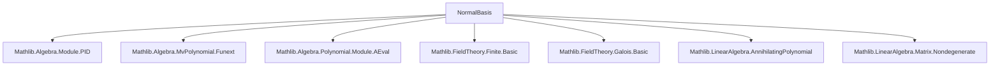

### Technical Brief: `NormalBasis.lean`

---

#### **1. Key Definitions & Theorems**

| Name | Type / Signature | Purpose |
|------|------------------|---------|
| `exists_linearIndependent_algEquiv_apply_of_finite` | `[Finite L] → ∃ x : L, LinearIndependent K (σ ↦ σ x)` | Constructs a Galois-orbit-linearly-independent element in finite extensions. |
| `exists_linearIndependent_algEquiv_apply_of_infinite` | `[Infinite K] → ∃ x : L, LinearIndependent K (σ ↦ σ x)` | Constructs such an element in infinite base fields using MvPolynomial determinant trick. |
| `exists_linearIndependent_algEquiv_apply` | `∃ x : L, LinearIndependent K (σ ↦ σ x)` | Unified existence result covering both finite/infinite cases. |
| `normalBasis` | `Module.Basis Gal(L/K) K L` | A basis of $L$ over $K$ indexed by $\mathrm{Gal}(L/K)$, where each basis vector is the Galois conjugate of a fixed element. |
| `normalBasis_apply` | `normalBasis e = e (normalBasis 1)` | Describes how the basis transforms under the Galois group: orbit structure. |

---

#### **2. Naming Conventions**

- **Predicates on structures**: `is_`-style is *not* used here; instead, properties are encoded via typeclass assumptions (`[IsGalois K L]`, `[Finite L]`, etc.).
- **Existential lemmas**: `exists_*_apply` — e.g., `exists_linearIndependent_algEquiv_apply`.
- **Matrix constructions**: `M` used for generic matrix; `MvPolynomial` variables named `X k`.
- **Basis-related**: `basisOfLinearIndependentOfCardEqFinrank`, `normalBasis`, `powerBasis`.
- **Annihilator/aeval**: `annihilator`, `ker_liftQ`, `AEval'`, `minpoly_frobeniusAlgHom`.
- **Linear algebra**: `linearIndependent`, `span_minpoly_eq_annihilator`, `finCongr`, `Equiv.ofBijective`.

---

#### **3. Tactic Stack**

Frequently used tactics in this file:

| Tactic | Role |
|--------|------|
| `obtain` / `rcases` | Extracting witnesses from existential statements. |
| `rw` / `simp_rw` | Rewriting using equalities, especially with `AlgEquiv`, `basis`, `AEval'`. |
| `convert` | Matching goals up to definitional equality (e.g., linear independence via equivalence). |
| `ext` / `funext` | Extensionality for functions/arrays. |
| `simp` / `simp_rw` | Simplifying with `AlgEquiv`, `LinearMap`, `Module` lemmas. |
| `exact` / `refine` | Finishing proofs or filling holes with structured terms. |
| `by_contra!` | Contradiction proofs (in infinite case). |
| `congr` | Congruence reasoning for matrix determinants, evaluations. |
| `ring` / `aesop` | Not heavily used here; more algebraic rewriting via `simp`. |
| `convert` + `congr` | For determinant preservation under ring homs. |

---

#### **4. Proof Logic**

The proof proceeds in two main branches:

1. **Finite Base Field Case** (`[Finite L]`):
   - Use structure of $K[X]$-modules: $L$ becomes a finitely generated module over PID $K[X]$ via Frobenius action.
   - Apply `exists_ker_toSpanSingleton_eq_annihilator` to get $x$ with annihilator = minimal polynomial of Frobenius.
   - Show that $\{ \mathrm{Fr}^i(x) \}_{i < [L:K]}$ is linearly independent via:
     - Identification of annihilator ideal with $(X^{[L:K]} - 1)$,
     - Use of `powerBasis` from `AdjoinRoot` and mapping through `AEval'`.

2. **Infinite Base Field Case** (`[Infinite K]`):
   - Fix a basis $e : \mathrm{Fin}\,n \to L$, construct matrix $M_{i,j} = \sum_k i^{-1}j(e_k) X_k$ over $L$-valued multivariate polynomials.
   - Use Lemma 3.4 (implicit in `hq`) to find evaluation $c$ where $\det M(c) = 1$.
   - Show $\det M \ne 0$, then use infiniteness of $K$ to find $b : \mathrm{Gal}(L/K) \to K$ with $\det M(b) \ne 0$.
   - Define $x = \sum_k b_k e_k$, and prove linear independence of $\{ \sigma(x) \}_\sigma$ via nondegeneracy of determinant.

Finally, unify both cases via `finite_or_infinite K`.

The main theorem `normalBasis` constructs the desired basis using:
- `exists_linearIndependent_algEquiv_apply` to get a linearly independent orbit,
- `basisOfLinearIndependentOfCardEqFinrank` to upgrade it to a basis (since $|\mathrm{Gal}(L/K)| = [L:K]$ in Galois extensions).

---

#### **5. Imports & Dependencies**

| Module | Purpose |
|--------|---------|
| `Mathlib.Algebra.Module.PID` | Structure theory of modules over PID (annihilators, cyclic submodules). |
| `Mathlib.Algebra.MvPolynomial.Funext` | Functional extensionality for multivariate polynomials. |
| `Mathlib.Algebra.Polynomial.Module.AEval` | Action of polynomials on modules via evaluation (`AEval'`). |
| `Mathlib.FieldTheory.Finite.Basic` | Finite fields, Frobenius automorphism. |
| `Mathlib.FieldTheory.Galois.Basic` | Galois groups, automorphisms, `IsGalois`. |
| `Mathlib.LinearAlgebra.AnnihilatingPolynomial` | Annihilating polynomials of linear maps. |
| `Mathlib.LinearAlgebra.Matrix.Nondegenerate` | Nondegenerate bilinear forms, determinant criteria. |

---

#### **6. Mermaid Diagrams**

##### **Dependency Graph (Top-Level Imports)**



##### **Theoretical Flow Overview**

```mermaid
graph LR
  A[Finite or Infinite K] -->|Finite| B[PID Module Theory]
  A -->|Infinite| C[MvPolynomial Determinant Trick]
  B --> D[Annihilator = (X^n - 1)]
  D --> E[Power Basis → Linear Independence]
  C --> F[Construct Matrix M]
  F --> G[det M ≠ 0]
  G --> H[Evaluate over K]
  H --> I[Linear Independence of Galois Orbit]
  E & I --> J[exists_linearIndependent_algEquiv_apply]
  J --> K[normalBasis := basisOfLinearIndependentOfCardEqFinrank]
```

##### **Module Structure Overview**

```mermaid
graph LR
  K[Field K] -->|Algebra| L[Field L]
  L -->|Galois Group| G[Gal(L/K)]
  G -->|Action| L
  L -->|K[X]-module| Frobenius[Frobenius endomorphism]
  Frobenius -->|AEval'| L
  L -->|Basis| NormalBasis[Normal Basis]
```

---

#### **7. Theory Context**

This file formalizes the **Normal Basis Theorem**, a cornerstone of Galois theory:

> *If $L/K$ is a finite Galois extension, then there exists an element $x \in L$ such that $\{ \sigma(x) \mid \sigma \in \mathrm{Gal}(L/K) \}$ is a $K$-basis of $L$.*

The proof is inspired by Keith Conrad’s *Linear Independence of Characters*, and combines:
- **Module-theoretic techniques** (PID structure, annihilators) for finite fields,
- **Determinantal methods** over multivariate polynomial rings for infinite fields.

It serves as a foundational result for:
- Artin’s theorem on linear independence of characters,
- Galois module structure,
- Constructive Galois theory (e.g., normal basis generators in finite fields).

--- 

Let me know if you'd like a formalized summary in Lean docstring format or a proof sketch in natural language.
