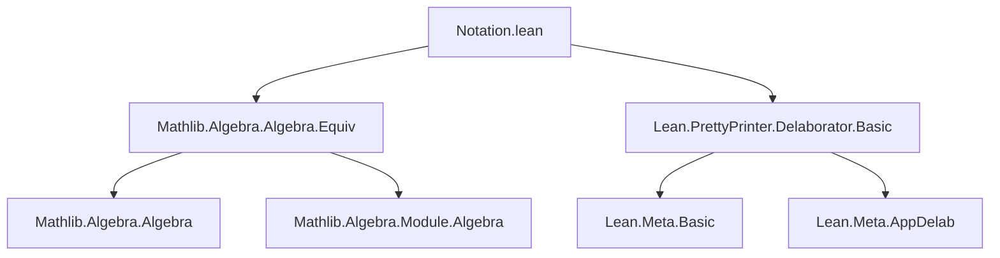

**Technical Brief: `Notation.lean`**

---

### 1. **Key Definitions & Theorems**

| Name | Type / Syntax | Purpose |
|------|---------------|---------|
| `Gal(L / K)` | `macro "Gal(" L:term:100 "/" K:term ")" : term => `($L ≃ₐ[$K] $L)` | Introduces *notation* for the Galois group as the type of $K$-algebra automorphisms of $L$, i.e., $L ≃ₐ[K] L$. |
| `delabGal` | `@[app_delab AlgEquiv] meta def delabGal : Delab` | Delaborator (pretty-printer) that rewrites expressions of type `L ≃ₐ[K] L` (with `L`, `K` fields and `L = B` syntactically) as `Gal(L/K)`. |

> **Note**: No theorems are proven here—this is purely a *notation and pretty-printing* module.

---

### 2. **Naming Conventions**

- **Prefix**: `delab` — standard Lean convention for delaborators (`delabGal`, `delab_*`).
- **Macro name**: `Gal(...)` — descriptive, matches mathematical notation.
- **Instance checks**: `Field` — uses `Field` typeclass to restrict usage to field extensions.
- **Precedence**: `100` — chosen to avoid conflict with division `/` (precedence 70).

---

### 3. **Tactic Stack**

- **Meta-level tactics used**:
  - `whenNotPPOption getPPExplicit`
  - `whenPPOption getPPNotation`
  - `Meta.withLocalInstances`
  - `guard`
  - `isAppOfArity`
  - `getAppFn'.constLevels!`
  - `getAppArgs`
  - `synthInstance?`
  - `withNaryArg`
  - `failure` (as a monadic fallback)

- **No proof tactics** (`simp`, `rw`, `induction`, etc.) — this is a *syntax/pretty-printing* file.

---

### 4. **Proof Logic**

- **Not applicable** — no proofs, only syntactic delaboration logic.
- **Delaboration logic flow**:
  1. Check pretty-printing options (`getPPNotation`, `getPPExplicit`).
  2. Ensure expression is an `AlgEquiv` application with 8 arguments.
  3. Extract type parameters: `R` (base ring), `A`, `B` (domains).
  4. Verify `A == B` *syntactically* (not just definitional equality).
  5. Synthesize field instances for `R` and `A`.
  6. Pretty-print as `Gal(L/K)` using delaborated subterms.

---

### 5. **Imports**

| Import | Purpose |
|--------|---------|
| `Mathlib.Algebra.Algebra.Equiv` | Provides `AlgEquiv` and notation `≃ₐ[K]`. |
| `Lean.PrettyPrinter.Delaborator.Basic` | Provides delaboration infrastructure (`Delab`, `app_delab`, `Meta.delab*`, etc.). |

---

### 8. **Dependency & Theory Overview**

#### **Mermaid Diagrams**

##### **Dependency Graph**


##### **Theory Overview**
```mermaid
flowchart LR
  subgraph "Notation Layer"
    GalNotation[Gal(L/K) macro]
    delabGal[delabGal pretty-printer]
  end

  subgraph "Underlying Mathlib"
    AlgEquiv[AlgEquiv L[K] L]
    Field[Field typeclass]
  end

  GalNotation --> AlgEquiv
  delabGal --> AlgEquiv
  delabGal --> Field
```

#### **Summary**
- This module defines a *user-facing notation* for Galois groups in field extensions.
- It leverages Lean’s macro and delaborator systems to map `L ≃ₐ[K] L` to `Gal(L/K)` *only* when `L` and `K` are fields.
- It enforces syntactic equality of domain/codomain (`A == B`) and field instances via `synthInstance?`.
- Designed for *readability* and *mathematical convention*, not for logical content.

--- 

✅ **End of Technical Brief**
