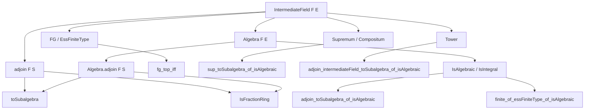
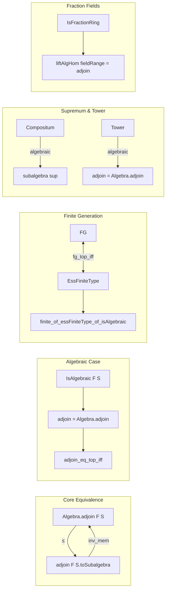

### Technical Brief: `Algebra.lean` — Adjoining Elements to Fields

---

#### **1. Key Definitions & Theorems**

| Name | Type / Signature | Purpose |
|------|------------------|---------|
| `algebra_adjoin_le_adjoin` | `Algebra.adjoin F S ≤ (adjoin F S).toSubalgebra` | Shows that the subalgebra generated by `S` embeds into the intermediate field generated by `S`. |
| `adjoin_eq_algebra_adjoin` | `(adjoin F S).toSubalgebra = Algebra.adjoin F S` (under `inv_mem`) | Equates intermediate field and subalgebra generation when the subalgebra is closed under inverses. |
| `eq_adjoin_of_eq_algebra_adjoin` | `K = adjoin F S` if `K.toSubalgebra = Algebra.adjoin F S` | Allows identifying an intermediate field with `adjoin F S` via its underlying subalgebra. |
| `fg_top_iff` | `(⊤ : IntermediateField F E).FG ↔ Algebra.EssFiniteType F E` | Connects finite generation of the full field as an intermediate field with essential finite type of the algebra. |
| `fg_top` | `[Algebra.EssFiniteType F E] → (⊤ : IntermediateField F E).FG` | Immediate corollary of `fg_top_iff`. |
| `essFiniteType_iff` | `Algebra.EssFiniteType F K ↔ K.FG` | Equivalence between essential finite type and finite generation for intermediate fields. |
| `adjoin_toSubalgebra_of_isAlgebraic` | `(∀ x ∈ S, IsAlgebraic F x) → (adjoin F S).toSubalgebra = Algebra.adjoin F S` | When `S` is algebraic, `adjoin` and `Algebra.adjoin` coincide. |
| `adjoin_simple_toSubalgebra_of_isAlgebraic` | `IsAlgebraic F α → F⟮α⟯.toSubalgebra = Algebra.adjoin F {α}` | Special case for simple extensions. |
| `adjoin_eq_top_iff_of_isAlgebraic` | `(∀ x ∈ S, IsAlgebraic F x) → adjoin F S = ⊤ ↔ Algebra.adjoin F S = ⊤` | When `S` is algebraic, `adjoin F S = E` iff `Algebra.adjoin F S = E`. |
| `finite_of_essFiniteType_of_isAlgebraic` | `[EssFiniteType F E] → [IsAlgebraic F E] → Module.Finite F E` | Proves finite-dimensionality under essential finite type + algebraicity. |
| `sup_toSubalgebra_of_isAlgebraic` | `(E1 ⊔ E2).toSubalgebra = E1.toSubalgebra ⊔ E2.toSubalgebra` (if one extension is algebraic) | Compositum of fields equals compositum of subalgebras under algebraicity. |
| `adjoin_intermediateField_toSubalgebra_of_isAlgebraic` | `(adjoin E (L : Set K)).toSubalgebra = Algebra.adjoin E (L : Set K)` (tower + algebraic) | Generalizes equality of `adjoin` and `Algebra.adjoin` to towers. |
| `algHom_fieldRange_eq_of_comp_eq` | `f.fieldRange = adjoin F g.range` (under lift condition) | Image of lifted algebra homomorphism equals intermediate field generated by image of base map. |

---

#### **2. Naming Conventions**

- **Prefixes**:
  - `adjoin_`: Relates to `IntermediateField.adjoin`.
  - `algebra_adjoin_`: Relates to `Algebra.adjoin`.
  - `fg_`: Pertains to finite generation (`FG`).
  - `essFiniteType_`: Pertains to `Algebra.EssFiniteType`.
  - `isAlgebraic_`, `isIntegral_`: Pertains to algebraic/integral elements.
  - `sup_`: Pertains to supremum (compositum) of intermediate fields.

- **Suffixes**:
  - `_toSubalgebra`: Converts intermediate field to subalgebra.
  - `_of_isAlgebraic[_left/right]`: Conditions under which algebraicity ensures equality.
  - `_iff`: Biconditional statements.
  - `_eq_top`: Statements about equality with top element `⊤`.

- **Scoped instances**:
  - `scoped instance : Algebra (Algebra.adjoin F S) (adjoin F S) := ...`
  - `scoped instance : IsFractionRing (Algebra.adjoin F S) (adjoin F S) := ...`

---

#### **3. Tactic Stack**

Frequently used tactics in proofs:

| Tactic | Usage |
|--------|-------|
| `simp_rw` | Rewriting with simplification (e.g., `simp_rw [AlgHom.fieldRange_toSubfield]`). |
| `rw` | Standard rewriting (e.g., `rw [← h]`, `rw [hs]`). |
| `apply_fun` | Applying a function to both sides of an equality (e.g., `apply_fun Subalgebra.restrictScalars K at this`). |
| `convert` | Flexible equality proof (e.g., `convert ringHom_fieldRange_eq_of_comp_eq h using 2`). |
| `exact`, `refine`, `assumption` | Proof completion. |
| `aesop` / `tauto` / `linarith` | Not heavily used here; mostly algebraic reasoning. |
| `cases`, `induction` | For structural induction (e.g., `induction_on_adjoin_fg`). |
| `dsimp`, `simp` | Simplification of definitions (e.g., `dsimp only [← E'.coe_type_toSubalgebra]`). |
| `ext` | Extensionality for functions/sets. |
| `have`, `suffices` | Intermediate lemma introduction. |

---

#### **4. Proof Logic**

- **Inductive structure**: Many proofs use induction on finite generation (`induction_on_adjoin_fg`), leveraging Noetherian assumptions.
- **Equality via antisymmetry**: For subalgebra/intermediate field equality, often `le_antisymm` is used after proving both directions via `adjoin_le_iff`.
- **Localization & fraction fields**: Key for proving `IsFractionRing` instances and relating `Algebra.adjoin` to `adjoin`.
- **Algebraicity as a bridge**: Most central lemmas require algebraicity to ensure inverses lie in the generated subalgebra, enabling `adjoin_eq_algebra_adjoin`.
- **Tower arguments**: For composita and towers, often reduce to known cases via `restrictScalars` and `AlgEquiv`.

---

#### **5. Imports**

| Module | Purpose |
|--------|---------|
| `Mathlib.FieldTheory.Finiteness` | Concepts like `FG`, `EssFiniteType`, `finiteDimensional`. |
| `Mathlib.FieldTheory.IntermediateField.Adjoin.Defs` | Definitions of `IntermediateField.adjoin`. |
| `Mathlib.FieldTheory.IntermediateField.Algebraic` | Algebraic elements and extensions in intermediate fields. |
| `Mathlib.RingTheory.Adjoin.Singleton` | Simple adjoin (`F⟮α⟯`) and related lemmas. |
| `Mathlib.RingTheory.EssentialFiniteness` | `EssFiniteType`, finite generation up to localization. |

---

#### **6. Mermaid Diagrams**

##### **Dependency Graph (High-Level)**

##### **Overview of File Structure**

---

#### **7. Theory Context**

This file bridges two constructions:
- **Intermediate field generation** (`adjoin F S`), which produces the smallest *field* containing `F` and `S`.
- **Algebra generation** (`Algebra.adjoin F S`), which produces the smallest *subalgebra* containing `F` and `S`.

The key insight is that when elements of `S` are algebraic over `F`, the generated subalgebra is already a field (closed under inverses), so the two constructions coincide. This is formalized in `adjoin_toSubalgebra_of_isAlgebraic`.

The file also connects finite generation (`FG`) and essential finite type (`EssFiniteType`) via localization, and shows how algebraicity ensures finite-dimensionality (`Module.Finite`).

---

#### **8. Notable Lemmas & Aliases**

| Lemma | Alias / Deprecation |
|-------|---------------------|
| `adjoin_algebraic_toSubalgebra` | Deprecated alias for `adjoin_toSubalgebra_of_isAlgebraic` |
| `adjoin_simple_toSubalgebra_of_integral` | Deprecated alias for `adjoin_simple_toSubalgebra_of_isAlgebraic` |
| `finite_of_fg_of_isAlgebraic` | Deprecated alias for `finite_of_essFiniteType_of_isAlgebraic` |
| `adjoin_toSubalgebra_of_isAlgebraic_left/right` | Deprecated aliases for tower versions |
| `Algebra.adjoin_eq_top_of_primitive_element` | Alias for `adjoin_simple_eq_top_iff_of_isAlgebraic` |
| `Algebra.adjoin_eq_top_of_intermediateField` | Alias for `adjoin_eq_top_iff_of_isAlgebraic` |

---

Let me know if you'd like a **dependency graph of definitions** or a **proof dependency DAG** for a specific theorem.
