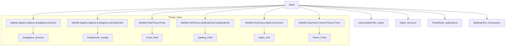
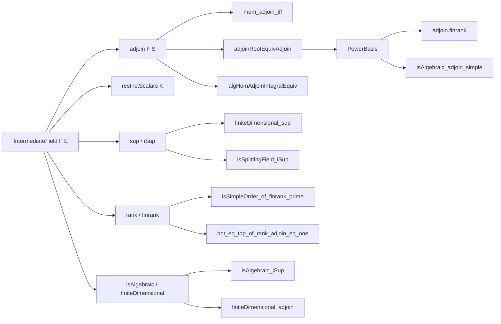

### Technical Brief: `Basic.lean` — Adjoining Elements to Fields

---

#### **1. Key Definitions & Theorems**

| Name | Type / Signature | Purpose |
|------|------------------|---------|
| `IntermediateField` | `Type u → Type v → Type w → Type v` | Type of intermediate fields between base field `F` and extension `E`. |
| `adjoin F S` | `Set E → IntermediateField F E` | Smallest intermediate field containing `F` and set `S ⊆ E`. |
| `restrictScalars K` | `IntermediateField L E → IntermediateField K E` | Restricts scalars along `K → L`. |
| `FG` | `IntermediateField F E → Prop` | Predicate for finitely generated intermediate fields. |
| `isSplittingField` | `Polynomial F → IntermediateField F E → Prop` | `p.IsSplittingField K E` means `p` splits completely in `E` over `K`. |
| `minpoly F x` | `x : E → Polynomial F` | Minimal polynomial of `x` over `F`. |
| `powerBasis` | `IsIntegral K x → PowerBasis K K⟮x⟯` | Constructs a power basis for `K(x)` when `x` is integral. |
| `adjoinRootEquivAdjoin` | `IsIntegral F α → AdjoinRoot (minpoly F α) ≃ₐ[F] F⟮α⟯` | Algebra isomorphism between `AdjoinRoot` and simple extension. |
| `algHomAdjoinIntegralEquiv` | `IsIntegral F α → (F⟮α⟯ →ₐ[F] K) ≃ {x // x ∈ (minpoly F α).aroots K}` | Bijection between algebra homs and roots of minimal polynomial. |
| `rank_eq_one_iff`, `finrank_eq_one_iff` | `Module.rank F K = 1 ↔ K = ⊥` | Characterizes trivial extensions via rank. |
| `isSimpleOrder_of_finrank_prime` | `Nat.Prime (finrank F E) → IsSimpleOrder (IntermediateField F E)` | If extension degree is prime, lattice of intermediate fields is simple (only ⊥ and ⊤). |
| `adjoin_finset_isCompactElement`, `adjoin_finite_isCompactElement` | `IsCompactElement (adjoin F S)` | Adjoining finite sets yields compact elements in the lattice. |
| `isAlgebraic_iSup`, `finiteDimensional_adjoin` | `∀ i, Algebra.IsAlgebraic K (t i) → Algebra.IsAlgebraic K (⨆ i, t i)` | Compositum of algebraic extensions is algebraic; finite adjoin of algebraic elements is finite. |
| `adjoin_root_eq_top` | `K⟮AdjoinRoot.root p⟯ = ⊤` | Simple extension by a root of irreducible polynomial is full extension. |
| `adjoin_minpoly_coeff_of_exists_primitive_element` | `adjoin F ((minpoly K α).coeffs) = K` | Primitive element theorem corollary: intermediate field generated by coefficients of minpoly. |

---

#### **2. Naming Conventions**

- **Prefixes**:
  - `adjoin_`: operations involving `adjoin F S`.
  - `rank_`, `finrank_`: module/rank-related properties.
  - `isAlgebraic_`, `isIntegral_`, `isSplittingField_`: algebraic properties.
  - `finiteDimensional_`, `FG_`: finiteness conditions.
  - `adjoinRoot_`, `powerBasis_`: constructions using `AdjoinRoot`.
  - `algHom_`: algebra homomorphism-related lemmas.

- **Suffixes**:
  - `_iff`: characterizations via equivalence.
  - `_le`, `_dvd`, `_eq`: inequality/divisibility/equality lemmas.
  - `_of_`: conditional versions (e.g., `of_isAlgebraic`, `of_finite`).
  - `_sup`, `_iSup`: for suprema/composita.
  - `_simple`, `_finset`, `_finite`: variants for specific input types.

---

#### **3. Tactic Stack**

Frequently used tactics in proofs:

| Tactic | Usage |
|--------|-------|
| `rw` / `simp_rw` | Rewriting using definitions, especially `mem_adjoin_iff`, `adjoin_le_iff`, `sup_toSubalgebra_of_*`. |
| `exact`, `refine`, `apply` | Direct proof steps, especially with `aeval`, `minpoly`, and `adjoinRoot`. |
| `have`, `suffices`, `convert` | Intermediate claims and simplifications (e.g., `have h : ...`, `suffices ... from this`). |
| `cases`, `obtain`, `rintro` | Decomposing existential/universal hypotheses. |
| `ext` | Extensionality for sets/fields. |
| `congr` | Congruence for equality of structures. |
| `linarith` | Linear arithmetic for `finrank` inequalities. |
| `simp only [...]` | Targeted simplification with `simp` lemmas (e.g., `adjoin.powerBasis_gen`, `minpoly_gen`). |
| `apply_fun`, `conv` | Advanced rewriting (e.g., `conv in aeval α => rw [...]`). |
| `induction` | Structural induction (e.g., on `Finset`, `Nat`). |
| `aesop` / `tauto` | Rare; mostly manual reasoning. |

---

#### **4. Proof Logic**

- **Inductive/structural reasoning** on:
  - `Finset`, `Fin`, `IntermediateField` lattice structure.
  - `IsIntegral`, `IsAlgebraic`, `FiniteDimensional` assumptions.
- **Lattice-theoretic arguments**:
  - Use of `le_antisymm`, `iSup_le`, `le_iSup`, `sup_toSubalgebra_*`.
  - Compact generation via `adjoin_simple_isCompactElement`.
- **Module-theoretic reasoning**:
  - Rank/finiteness via `rank_eq_rank_subalgebra`, `finrank_mul_finrank`.
  - Power basis computations (`PowerBasis.finrank`, `basis_eq_pow`).
- **Polynomial arguments**:
  - Minimal polynomial properties: `minpoly.aeval`, `minpoly.dvd`, `minpoly.eq_of_irreducible`.
  - Splitting fields via `isSplittingField_iff`, `rootSet_prod`.
- **Isomorphism-based reasoning**:
  - `AlgEquiv.ofBijective`, `adjoinRootEquivAdjoin`, `algHomAdjoinIntegralEquiv`.
  - Transport of structure via `equivOfEq`, `reindex`, `map`.

---

#### **5. Imports**

| Module | Purpose |
|--------|---------|
| `Mathlib.Algebra.Algebra.Subalgebra.Directed` | Directed suprema of subalgebras. |
| `Mathlib.Algebra.Algebra.Subalgebra.IsSimpleOrder` | Simple order structure on subalgebras. |
| `Mathlib.FieldTheory.Fixed` | Fixed fields under group actions. |
| `Mathlib.FieldTheory.SplittingField.IsSplittingField` | Splitting field theory. |
| `Mathlib.RingTheory.Adjoin.Dimension` | Dimension theory for adjoined fields. |
| `Mathlib.RingTheory.TensorProduct.Finite` | Tensor product and finite dimensionality. |

---

#### **6. Mermaid Diagrams**

##### **Dependency Graph (Top-Level)**

##### **Overview of `Basic.lean`**

---

#### **7. Theory Scope**

This module formalizes foundational results about **intermediate fields** and **adjoining elements** in field extensions. It bridges:

- **Lattice theory** (compact generation, simplicity, rank constraints),
- **Module theory** (rank, finite dimensionality, power bases),
- **Polynomial theory** (minimal polynomials, splitting fields, irreducibility criteria),
- **Galois-theoretic constructions** (algebra homs ↔ roots, primitive element theorem).

It serves as a **core reference** for more advanced field theory (e.g., Galois correspondence, separability, transcendence bases), especially in the context of **finite and algebraic extensions**.

--- 

Let me know if you'd like a formal dependency graph (e.g., `.lean` file-level), or a proof outline for a specific theorem.
