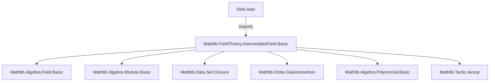

### Technical Brief: `Defs.lean` — Adjoining Elements to Fields in Lean 4

---

#### **1. Key Definitions & Theorems**

| Name | Type / Signature | Purpose |
|------|------------------|---------|
| `adjoin F S` | `IntermediateField F E` | Constructs the smallest intermediate field containing `F` and `S ⊆ E`. |
| `mem_adjoin_iff_div` | `x ∈ adjoin F S ↔ ∃ r s ∈ Algebra.adjoin F S, x = r / s` | Characterizes membership in `adjoin` as ratios of elements from the *ring* adjoin. |
| `adjoin_le_iff` | `adjoin F S ≤ T ↔ S ⊆ T` | Universal property of `adjoin`: it's left adjoint to coercion. |
| `gc` | `GaloisConnection (adjoin F) (↑)` | Shows `adjoin` and coercion form a Galois connection. |
| `gi` | `GaloisInsertion ...` | Lifts the Galois connection to a Galois insertion, enabling lattice structure transfer. |
| `botEquiv` | `(⊥ : IntermediateField F E) ≃ₐ[F] F` | Isomorphism between the minimal intermediate field and the base field. |
| `topEquiv` | `(⊤ : IntermediateField F E) ≃ₐ[F] E` | Isomorphism between the maximal intermediate field and the extension field. |
| `adjoin_union` | `adjoin F (S ∪ T) = adjoin F S ⊔ adjoin F T` | `adjoin` preserves finite unions as joins. |
| `adjoin_iUnion` | `adjoin F (⋃ i, f i) = ⨆ i, adjoin F (f i)` | `adjoin` preserves arbitrary unions as suprema. |
| `adjoin_adjoin_left` | `(adjoin (adjoin F S) T).restrictScalars _ = adjoin F (S ∪ T)` | Iterated adjunction = adjunction of union. |
| `adjoin_adjoin_comm` | `(adjoin (adjoin F S) T).restrictScalars F = (adjoin (adjoin F T) S).restrictScalars F` | Adjunction is commutative up to scalar restriction. |
| `adjoin_simple_adjoin_simple` | `F⟮α⟯⟮β⟯.restrictScalars F = F⟮α, β⟯` | Two-element adjunction matches iterated adjunction. |
| `adjoin_algHom_ext` | Extensionality for algebra homs out of `adjoin F s` | Homomorphisms from `adjoin` are determined by their values on generators. |
| `FG` | `Prop` | `S.FG` iff `S = adjoin F t` for some finite `t : Finset E`. |
| `induction_on_adjoin_fg` | Induction principle for finitely generated intermediate fields | Enables structural induction over finitely generated extensions. |

Notation:
- `F⟮α⟯` = `adjoin F {α}`
- `F⟮α, β⟯` = `adjoin F {α, β}`
- `↑S` or `(S : Set E)` = coercion of intermediate field to underlying set.

---

#### **2. Naming Conventions**

| Pattern | Examples | Meaning |
|--------|----------|---------|
| `adjoin_*` | `adjoin`, `adjoin_le_iff`, `adjoin_union`, `adjoin_simple_adjoin_simple` | Core operations/properties of adjunction. |
| `*_toSubfield` / `*_toSubalgebra` | `adjoin_toSubfield`, `bot_toSubfield`, `inf_toSubfield` | Projection to underlying subfield/subalgebra. |
| `*_mem` | `algebraMap_mem`, `mem_adjoin_of_mem`, `mem_bot`, `mem_top` | Membership lemmas. |
| `*_eq_*` | `adjoin_empty`, `adjoin_one`, `adjoin_zero`, `adjoin_self` | Equality with canonical elements. |
| `*_le_*` | `adjoin_le_iff`, `subset_adjoin`, `adjoin_simple_le_iff` | Subfield ordering. |
| `*_sup` / `*_inf` | `sup_def`, `inf_toSubfield`, `lift_sup`, `extendScalars_sup` | Lattice operations. |
| `*_induction` | `adjoin_induction`, `induction_on_adjoin_fg` | Induction principles. |
| `*_equiv` | `botEquiv`, `topEquiv` | Canonical isomorphisms. |
| `*_comap` / `*_map` | `map_comap_eq`, `comap_map`, `map_sup`, `map_iSup` | Behavior under algebra maps. |

Prefixes:
- `adjoin_`: primary adjunction operations.
- `lift_`, `restrictScalars_`, `extendScalars_`: operations in tower contexts.
- `bot_`, `top_`: minimal/maximal intermediate fields.

---

#### **3. Tactic Stack**

Frequently used tactics in proofs:
- `simp_rw` / `simp`: Simplification with rewrite rules (especially for coercion, `mem_*`, `toSubfield`).
- `rw`: Rewriting using definitions and lemmas (e.g., `adjoin_toSubfield`, `sup_def`).
- `apply`, `exact`, `intro`, `cases`: Basic proof structure.
- `congr`: Congruence reasoning (e.g., for equality of closures).
- `ext`: Extensionality for sets/fields (e.g., `ext x`).
- `apply_fun`: Transporting equalities via functions.
- `aesop`: Automated reasoning (e.g., `aesop safe 20`, `aesop 80%`).
- `ring`: For field/ring identities (implicit in `map_add`, `map_mul`).
- `convert`, `congr_arg₂`: For constructing equalities of compound terms.
- `subset_antisymm`: Proving equality of sets/fields via mutual inclusion.
- `gcongr`, `mono`: Monotonicity reasoning (e.g., `adjoin.mono`).

---

#### **4. Proof Logic**

**Typical proof patterns**:

1. **Induction on generators**:
   - Use `adjoin_induction` or `induction_on_adjoin_fg`.
   - Base cases: algebra map images, generators.
   - Inductive steps: closure under `+`, `*`, `⁻¹`.

2. **Galois connection / insertion arguments**:
   - Prove `adjoin_le_iff`, then derive `gc`, `gi`.
   - Use `gc.le_u_l`, `gc.l_sup`, `gc.l_iSup` to lift lattice properties.

3. **Set-theoretic reasoning**:
   - Reduce field equalities to set equalities via `toSubfield_injective` or `SetLike.ext'`.
   - Use `Subfield.closure_le`, `Subfield.closure_union`, `closure_eq` for closure properties.

4. **Tower manipulations**:
   - Use `restrictScalars_adjoin`, `extendScalars_adjoin`, `restrictScalars_adjoin_of_algEquiv`.
   - Often involve `IsScalarTower` assumptions and `algebraMap_eq` lemmas.

5. **Universal properties**:
   - `adjoin_algHom_ext`: Show two algebra maps agree by checking generators.
   - `algHom_ext_of_eq_adjoin`: Extend extensionality to arbitrary `S = adjoin F s`.

---

#### **5. Imports & Dependencies**

- **Primary dependency**: `Mathlib.FieldTheory.IntermediateField.Basic`
  - Provides `IntermediateField`, `algebraMap`, `Subfield`, `Subalgebra`, `Algebra`, `AlgHom`, `AlgEquiv`.
- **Implicit dependencies** (via `Mathlib`):
  - `Mathlib.Algebra.Field.Basic`
  - `Mathlib.Algebra.Module.Basic`
  - `Mathlib.Algebra.Polynomial.Basic`
  - `Mathlib.Data.Set.Closure`
  - `Mathlib.Data.Finset.Basic`
  - `Mathlib.Order.GaloisInsertion`
  - `Mathlib.Tactic.Aesop`
  - `Mathlib.Meta.AppDelab`

---

#### **6. Mermaid Diagrams**

##### **Dependency Graph (Module-Level)**



##### **Conceptual Overview of Theory**

```mermaid
graph TD
  A[Field F] -->|Algebra| B[Field E]
  A -->|AlgebraMap| C[Range ≤ E]
  D[Set S ⊆ E] -->|adjoin F S| E[IntermediateField F E]
  E -->|coerce| F[Subfield of E]
  E -->|lift| G[IntermediateField K E]  %% tower: F ≤ K ≤ E
  E -->|restrictScalars| H[IntermediateField K E]
  E -->|map f| I[IntermediateField F E']
  E -->|comap f| J[IntermediateField F E]
  E -->|⊔, ⊓| K[Lattice structure]
  E -->|FG| L[Finitely generated extensions]
  E -->|induction| M[Structural induction on generators]
```

##### **Lattice Structure via Galois Insertion**

```mermaid
graph LR
  subgraph Set(E)
    S[Set S ⊆ E]
  end
  subgraph IntermediateField(F,E)
    K[IntermediateField F E]
  end
  S -- adjoin F -->|l| K
  K -- ↑ -->|u| S
  K -- gc --> S
  K -- gi -->|lift lattice| K
```

---

### Summary

This file formalizes the theory of **adjoining elements to fields** within Lean 4’s `IntermediateField` framework. It establishes:
- A Galois connection between subsets of an extension field and intermediate fields.
- A complete lattice structure on intermediate fields.
- Universal properties of adjunction (e.g., extension of algebra homomorphisms).
- Induction principles for finitely generated extensions.
- Compatibility with towers (`restrictScalars`, `extendScalars`, `map`, `comap`).
- Notation `F⟮α₁,…,αₙ⟯` for finite adjunctions.

The development is highly structured, leveraging `GaloisInsertion` to transfer lattice properties and `Subfield.closure` for constructive definitions. Proofs rely heavily on set-theoretic reasoning, closure properties, and algebraic induction.
