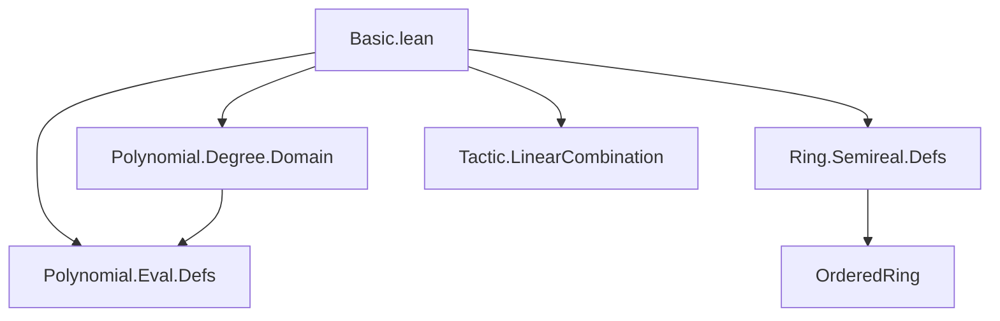
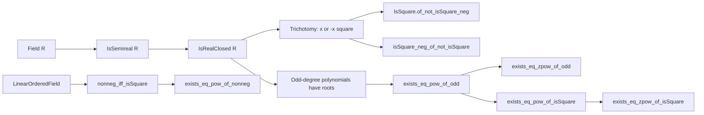

**Technical Brief: `Basic.lean` — Real Closed Fields in Lean 4**

---

### 1. **Key Definitions & Theorems**

| Name | Type / Signature | Purpose |
|------|------------------|---------|
| `IsRealClosed R` | `class IsRealClosed (R : Type*) [Field R] : Prop extends IsSemireal R` | Typeclass expressing that a field `R` is *real closed*: (i) `-1` is not a sum of squares, (ii) every element or its negation is a square, (iii) every odd-degree polynomial has a root. |
| `isSquare_or_isSquare_neg` | `∀ x, IsSquare x ∨ IsSquare (-x)` | Axiom (2) of real closed fields: trichotomy of square-ness up to sign. |
| `exists_isRoot_of_odd_natDegree` | `∀ f, Odd f.natDegree → ∃ x, f.IsRoot x` | Axiom (3): odd-degree polynomials have roots. |
| `of_linearOrderedField` | `LinearOrderedField → (isSquare_of_nonneg → exists_isRoot_of_odd_natDegree) → IsRealClosed` | Constructs a real closed field from a linearly ordered field where nonnegative elements are squares and odd-degree polynomials have roots. |
| `_root_.IsSquare.of_not_isSquare_neg` | `¬ IsSquare (-x) → IsSquare x` | Consequence of trichotomy: if `-x` is not a square, then `x` is. |
| `isSquare_neg_of_not_isSquare` | `¬ IsSquare x → IsSquare (-x)` | Dual of above. |
| `exists_eq_pow_of_odd` | `Odd n → ∃ r, x = r ^ n` | Every element has an `n`-th root for odd `n`. |
| `exists_eq_zpow_of_odd` | `Odd k → ∃ r, x = r ^ k` | Extends root existence to odd integer exponents. |
| `exists_eq_pow_of_isSquare` | `IsSquare x ∧ n ≠ 0 → ∃ r, x = r ^ n` | If `x` is a square and `n > 0`, then `x` has an `n`-th root. |
| `exists_eq_zpow_of_isSquare` | `IsSquare x ∧ k ≠ 0 → ∃ r, x = r ^ k` | Integer exponent version of above. |
| `nonneg_iff_isSquare` | `0 ≤ x ↔ IsSquare x` | In a linearly ordered real closed field, nonnegativity ⇔ squareness. |
| `exists_eq_pow_of_nonneg` | `0 ≤ x ∧ n ≠ 0 → ∃ r, x = r ^ n` | Nonnegative elements have `n`-th roots for `n ≠ 0`. |
| `exists_eq_zpow_of_nonneg` | `0 ≤ x ∧ k ≠ 0 → ∃ r, x = r ^ k` | Nonnegative elements have integer-power roots. |

---

### 2. **Naming Conventions**

- **Prefixes**:
  - `isSquare_...`: predicates about squareness (`isSquare_or_isSquare_neg`, `isSquare_neg_of_not_isSquare`).
  - `exists_eq_pow_...`, `exists_eq_zpow_...`: existence of roots for powers/integer powers.
  - `_root_` prefix for extending existing lemmas (e.g., `_root_.IsSquare.of_not_isSquare_neg`).
- **Suffixes**:
  - `_of_odd`, `_of_isSquare`, `_of_nonneg`: indicate hypotheses (odd exponent, square input, nonnegative input).
  - `_iff_`: bi-implication theorems (`nonneg_iff_isSquare`).
- **Class/Typeclass**: `IsRealClosed` — standard Lean pattern for properties of structures.

---

### 3. **Tactic Stack**

- **`aesop`**: heavily used for automated reasoning (e.g., `@[aesop 50%]`, `@[aesop 80%]`, `by aesop`).
- **`rcases`**: destructs disjunctions, existential quantifiers, and `Nat.even_or_odd`, `k.eq_nat_or_neg`.
- **`linear_combination`**: solves linear algebraic equalities (e.g., `linear_combination - (by simpa using hr)`).
- **`simp_rw`, `simpa`**: simplification with rewrite rules and target simplification.
- **`induction ... using Nat.strong_induction_on`**: strong induction on natural numbers.
- **`rcases ... with (even | odd)`**: case analysis on parity.
- **`linear_combination` + `simpa`**: for manipulating polynomial root equations.

---

### 4. **Proof Logic**

- **Structure**:  
  - Define `IsRealClosed` as a typeclass extending `IsSemireal`.  
  - Prove consequences of the axioms (e.g., trichotomy of square-ness).  
  - Use the root-existence axiom to derive existence of roots for monomials `X^n - c`, then lift to general powers.  
  - For integer exponents, reduce to natural case via `k.eq_nat_or_neg`.  
  - For square inputs, use strong induction on `n` and parity splitting (`even`/`odd`) to reduce to smaller `m < n`.  
  - In the linearly ordered setting, relate order-theoretic properties (`0 ≤ x`) to squareness via `nonneg_iff_isSquare`.

- **Typical Flow**:
  1. Use `rcases` to unpack hypotheses (e.g., parity, square/non-square).
  2. Apply `exists_isRoot_of_odd_natDegree` to `X^n - C x` to get a root.
  3. Use `linear_combination` to convert root equation into desired power equality.
  4. For induction steps, use `ih` on smaller `m` and combine with `isSquare_or_isSquare_neg`.

---

### 5. **Imports**

| Import | Purpose |
|--------|---------|
| `Mathlib.Algebra.Polynomial.Degree.Domain` | Degree theory for polynomials over domains (used for `natDegree`, `Odd`). |
| `Mathlib.Algebra.Polynomial.Eval.Defs` | Evaluation of polynomials, roots (`f.IsRoot x`). |
| `Mathlib.Algebra.Ring.Semireal.Defs` | Defines `IsSemireal` (a field where `-1` is not a sum of squares); base class for `IsRealClosed`. |
| `Mathlib.Tactic.LinearCombination` | Tactics for solving linear combinations of equations (used in root-to-power conversion). |

---

### 6. **Mermaid Diagrams**

#### **Dependency Graph (Module-Level)**

#### **Conceptual Overview (Theory Flow)**

---

### 7. **Summary**

This file formalizes the foundational theory of **real closed fields** in Lean 4, building on `IsSemireal` and leveraging polynomial root existence for odd degrees. It establishes key algebraic consequences (existence of roots for powers, equivalence of nonnegativity and squareness in ordered settings), and sets up the stage for deeper results (e.g., comparison with ℝ, real algebraic numbers). The proofs rely on case analysis, induction, and automated tactics (`aesop`, `linear_combination`), reflecting a modern Lean 4 style.

--- 

*Prepared for Domain-Specific AI Agent Training*
