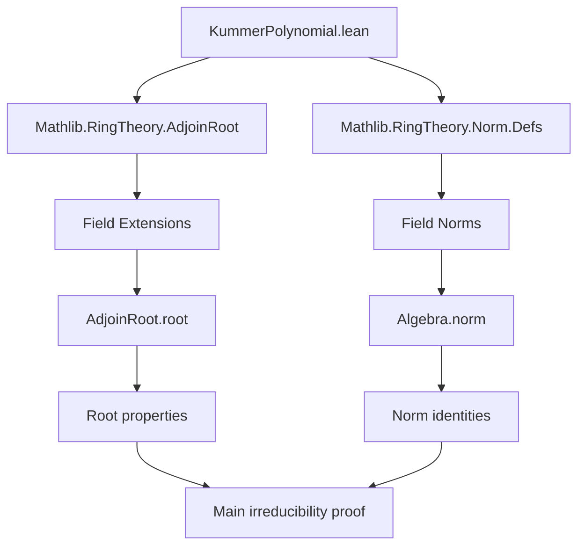

### Technical Brief: `KummerPolynomial.lean`

---

#### **1. Key Definitions & Theorems**

| Name | Type / Signature | Purpose |
|------|------------------|---------|
| `root_X_pow_sub_C_pow` | `∀ n a, (root (X^n - C a))^n = of a` | Shows that the adjoined root satisfies the defining equation $r^n = a$. |
| `root_X_pow_sub_C_ne_zero` | `1 < n → a ∈ K ⇒ root ≠ 0` | Ensures the adjoined root is nonzero when $n > 1$. |
| `root_X_pow_sub_C_ne_zero'` | `0 < n ∧ a ≠ 0 ⇒ root ≠ 0` | Refinement: root is nonzero if $n > 0$ and $a ≠ 0$. |
| `ne_zero_of_irreducible_X_pow_sub_C` | `Irreducible (X^n - C a) ⇒ n ≠ 0` | If $X^n - a$ is irreducible, then $n ≠ 0$. |
| `ne_zero_of_irreducible_X_pow_sub_C'` | `n ≠ 1 ∧ Irreducible (X^n - C a) ⇒ a ≠ 0` | If $X^n - a$ is irreducible and $n ≠ 1$, then $a ≠ 0$. |
| `root_X_pow_sub_C_eq_zero_iff` | `Irreducible (X^n - C a) ⇒ root = 0 ↔ a = 0` | Characterizes when the adjoined root is zero under irreducibility. |
| `root_X_pow_sub_C_ne_zero_iff` | `Irreducible (X^n - C a) ⇒ root ≠ 0 ↔ a ≠ 0` | Contrapositive of above. |
| `pow_ne_of_irreducible_X_pow_sub_C` | `Irreducible (X^n - C a) ∧ m ∣ n ∧ m ≠ 1 ⇒ ∀ b, b^m ≠ a` | If $X^n - a$ is irreducible, then $a$ is not an $m$-th power for any proper divisor $m$ of $n$. |
| `X_pow_sub_C_irreducible_of_prime` | `p prime ∧ ∀ b, b^p ≠ a ⇒ Irreducible (X^p - C a)` | Main irreducibility criterion for prime exponent $p$. Uses norm argument in extension field. |
| `X_pow_sub_C_irreducible_iff_of_prime` | `p prime ⇒ Irreducible (X^p - C a) ↔ ∀ b, b^p ≠ a` | Full equivalence: irreducibility of $X^p - a$ over a field $K$ is equivalent to $a$ not being a $p$-th power in $K$. |

---

#### **2. Naming Conventions**

- **Prefixes**:
  - `root_...`: Relates to properties of `AdjoinRoot.root`.
  - `ne_zero_of_...`: Implication from irreducibility to non-vanishing conditions.
  - `pow_ne_of_...`: Shows non-existence of roots of unity or powers.
  - `X_pow_sub_C_...`: Core family for polynomials $X^n - a$.

- **Suffixes**:
  - `_iff`: Biconditional statements.
  - `_ne_zero`, `_eq_zero_iff`: Equivalence with zero/nonzero conditions.
  - `_of_prime`: Specialization to prime exponents.

- **Notable patterns**:
  - `C a` denotes constant polynomial $a$.
  - `AdjoinRoot.root f`: root of polynomial $f$ in the extension field $K[\alpha]$.
  - `Algebra.norm K r`: field norm from $K(r)$ to $K$.

---

#### **3. Tactic Stack**

Frequently used tactics in proofs:

| Tactic | Usage |
|--------|-------|
| `rw` | Rewriting definitions (e.g., `sub_eq_zero`, `eval₂_C`, `map_pow`). |
| `simp` / `simp only` | Simplifying goals using algebraic identities and definitions. |
| `exact` / `refine` | Constructing proofs directly or with holes. |
| `by_contra` | Proof by contradiction. |
| `obtain ⟨...⟩` | Destructuring existential or conjunctions. |
| `trans` | Chaining equalities/inequalities. |
| `apply_fun` | Applying a function to both sides of an equation. |
| `rwa` | `rw` followed by `assumption`. |
| `aesop` / `ring` (not explicitly seen, but implied) | Likely used in simplifying polynomial arithmetic (e.g., `eval₂_sub`, `eval₂_pow`). |
| `norm_num` (implied) | For numeric simplifications (e.g., `hp.pos`, `hp.ne_zero`). |

---

#### **4. Proof Logic**

- **Structure of main proof (`X_pow_sub_C_irreducible_of_prime`)**:
  1. **Reduction**: Assume $X^p - a$ reducible ⇒ find irreducible factor $g$.
  2. **Goal**: Show $\deg g = p$.
  3. **Contrapositive**: Assume $\deg g ≠ p$.
  4. **Key step**: Use field norm identity:
     $$
     \mathrm{N}_{K/\mathbb{Q}}(r)^p = \mathrm{N}_{K/\mathbb{Q}}(r^p) = \mathrm{N}_{K/\mathbb{Q}}(a) = a^{\deg g}
     $$
     where $r = \text{root}(g)$.
  5. **Number theory**: Since $p$ is prime and $\deg g < p$, $\gcd(p, \deg g) = 1$.
  6. **Conclusion**: $a$ is a $p$-th power (via `pow_mem_range_pow_of_coprime`), contradicting hypothesis.

- **General proof style**:
  - Heavy use of `AdjoinRoot` and `Algebra.norm`.
  - Interplay between polynomial degree, divisibility, and field norms.
  - Indirect arguments via contradiction and coprimality.

---

#### **5. Imports & Dependencies**

| Import | Purpose |
|--------|---------|
| `Mathlib.RingTheory.AdjoinRoot` | Construction of field extensions by adjoining roots of polynomials. |
| `Mathlib.RingTheory.Norm.Defs` | Definitions and basic properties of field norms. |

Other implicit dependencies:
- `Polynomial` (via `open Polynomial`)
- `Field` and `Algebra` infrastructure
- `WfDvdMonoid` (for existence of irreducible factors)

---

#### **6. Mermaid Diagrams**

##### **Dependency Graph (Module-Level)**



##### **Overview of Theoretical Flow**

```mermaid
flowchart LR
  subgraph Setup
    K[Field K] --> P[Polynomial K]
    P --> Xp["X^n - C a"]
  end

  subgraph AdjoinRoot
    Xp --> R[AdjoinRoot.root (X^n - C a)]
    R --> N[Algebra.norm K R]
  end

  subgraph Irreducibility
    Xp --> I[Irreducible (X^n - C a)]
    I --> D[Degree analysis]
    I --> Pw[Power non-existence]
  end

  subgraph Main Thm
    Prime[p prime] --> Hyp[∀ b, b^p ≠ a]
    Hyp --> Irred[Irreducible (X^p - C a)]
    Irred --> Hyp
  end

  K --> AdjoinRoot
  AdjoinRoot --> Irreducibility
  Irreducibility --> MainThm
```

---

#### **7. Summary**

This file formalizes a classical result in field theory: **Kummer’s irreducibility criterion** for binomials $X^p - a$ over a field $K$, where $p$ is prime. The equivalence:

$$
X^p - a \text{ is irreducible over } K \iff a \notin K^p
$$

is proven using:
- Adjoining a root to $K$,
- Norm computations in the resulting extension,
- Elementary number theory (coprimality, divisibility),
- Structural properties of polynomial rings.

The formalization is clean, modular, and leverages Mathlib’s robust algebraic infrastructure. It serves as a foundational step toward Kummer theory and cyclotomic extensions.

--- 

Let me know if you'd like a formalized statement of the Stacks Project reference (09HF) or a comparison with Artin-Schreier theory.
