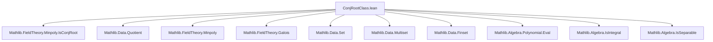
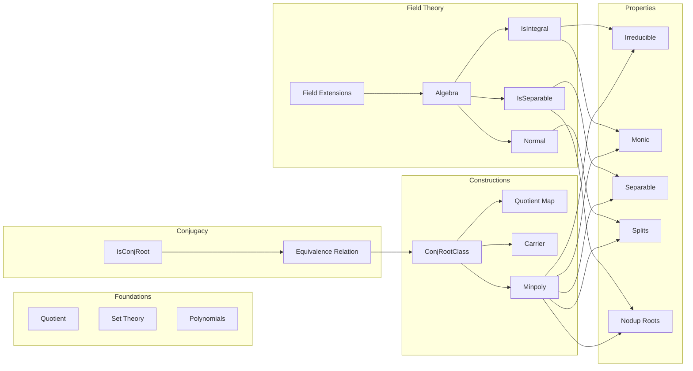

### Technical Brief: `ConjRootClass.lean`

---

#### **1. Key Definitions & Theorems**

| Name | Type / Signature | Purpose |
|------|------------------|---------|
| `ConjRootClass K L` | `Type*` | Quotient of `L` by the equivalence relation `IsConjRoot K L`. Represents conjugacy classes of elements in the field extension `L/K`. |
| `mk K x` | `L → ConjRootClass K L` | Canonical quotient map sending `x ∈ L` to its equivalence class `⟦x⟧`. |
| `carrier c` | `ConjRootClass K L → Set L` | Returns the set of representatives (i.e., conjugates) in `L` for class `c`. |
| `c.minpoly` | `ConjRootClass K L → K[X]` | Minimal polynomial over `K` of any (hence all) representatives of `c`. Well-defined via `Quotient.lift`. |
| `mk_eq_mk` | `mk K x = mk K y ↔ IsConjRoot K x y` | Characterizes equality in the quotient. |
| `aeval_minpoly_iff` | `aeval x c.minpoly = 0 ↔ mk K x = c` | Connects evaluation of minimal polynomial with membership in conjugacy class. |
| `rootSet_minpoly_eq_carrier` | `c.minpoly.rootSet L = c.carrier` | Under `IsAlgebraic`, roots of `c.minpoly` in `L` are exactly the conjugates in `c.carrier`. |
| `minpoly.map_eq_prod` | `c.minpoly.map (algebraMap K L) = ∏ x ∈ c.carrier.toFinset, (X - C x)` | Factorization of minimal polynomial over `L` as product of linear factors indexed by conjugates (under `Normal` + `IsSeparable`). |
| `separable_minpoly` | `c.minpoly.Separable` | Minimal polynomials of conjugacy classes are separable under `IsSeparable K L`. |
| `irreducible_minpoly` | `c.minpoly.Irreducible` | Minimal polynomials of conjugacy classes are irreducible over `K`. |
| `ind` | Induction principle for `ConjRootClass` | Enables proofs by lifting from representatives. |

---

#### **2. Naming Conventions**

- **Prefixes**:
  - `mk_`: canonical quotient map (`mk`, `mk_neg`, `mk_zero`, `mk_def`)
  - `carrier_`: properties of the carrier set (`carrier_zero`, `carrier_neg`, `carrier_inj`)
  - `minpoly_`: minimal polynomial constructions (`minpoly_mk`, `minpoly_inj`, `minpoly_injective`)
  - `aeval_minpoly_iff`: evaluation ↔ class membership equivalence
  - `rootSet_`, `aroots_`: root-set and multiset-of-roots operations

- **Suffixes**:
  - `_iff`: logical equivalences (`mk_eq_mk`, `mk_eq_zero_iff`, `aeval_minpoly_iff`)
  - `_def`: definitions (`mk_def`)
  - `_inj`, `_injective`: injectivity properties (`minpoly_inj`, `minpoly_injective`)
  - `_eq_`: equality lemmas (`carrier_zero`, `rootSet_minpoly_eq_carrier`)

---

#### **3. Tactic Stack**

Frequently used tactics in proofs:
- `induction c using ConjRootClass.ind` — standard induction on quotient
- `simp [*, mk_eq_mk, mem_carrier]` — simplification using quotient equality and membership
- `rw [← mk_eq_mk, isConjRoot_iff_aeval_eq_zero]` — rewriting via equivalence relation
- `ext` — extensionality for set equality
- `exact`, `apply`, `intro`, `cases` — basic proof structure
- `simp_rw` — for rewriting with simp lemmas involving `mem_`, `carrier_`, etc.
- `decidable_of_iff` — to transfer decidability via equivalence
- `Finset.ext`, `Multiset.ext`, `Set.ext` — set/multiset extensionality

---

#### **4. Proof Logic**

- **Quotient-based reasoning**: Most proofs proceed by:
  1. Inducting on `c : ConjRootClass K L` using `ind`.
  2. Reducing to statements about representatives `x : L`.
  3. Applying known facts about `IsConjRoot`, `minpoly`, and field algebra.

- **Equivalence relation handling**:
  - `mk_eq_mk` is used to translate equality in `ConjRootClass` to `IsConjRoot`.
  - `isConjRoot_iff_aeval_eq_zero` links conjugacy to minimal polynomial vanishing.

- **Structure lifting**:
  - Unary operations (`neg`) and binary operations (implicitly via `Zero`, `Neg`) are lifted via `Quotient.map` or `Quotient.lift`.
  - Proofs of properties (e.g., `neg_neg`) use induction + `rfl`.

- **Algebraic/separable/normal assumptions**:
  - Under `IsAlgebraic`: minimal polynomials are monic, irreducible, nonzero.
  - Under `IsSeparable`: minimal polynomials are separable, roots are distinct (`nodup_aroots_minpoly`).
  - Under `Normal`: minimal polynomials split over `L` (`splits_minpoly`), enabling factorization.

---

#### **5. Imports & Dependencies**

- **Core imports**:
  ```lean
  Mathlib.FieldTheory.Minpoly.IsConjRoot
  ```
  - Provides `IsConjRoot`, `IsConjRoot.setoid`, `isConjRoot_iff_aeval_eq_zero`, etc.

- **Implicit dependencies**:
  - `Mathlib.FieldTheory.Minpoly` — for `minpoly`, `aeval_minpoly`, `rootSet`, `separable`, `splits`, etc.
  - `Mathlib.FieldTheory.Galois` — for `Galois` group, `Gal(L/K)`, `Normal`, etc.
  - `Mathlib.Data.Quotient` — foundational for `Quotient`, `Quotient.ind`, `Quotient.decidableEq`.
  - `Mathlib.Data.Set.Image`, `Preimage`, `Multiset`, `Finset` — for `carrier`, `rootSet`, `aroots`, `prod`.
  - `Mathlib.Algebra.Polynomial.Eval`, `Algebra.IsIntegral`, `IsSeparable`, `IsAlgebraic`.

---

#### **6. Theory Overview & Dependency Diagram**

##### **Conceptual Flow**
```
Field Extension L/K
       ↓
IsConjRoot K L (equivalence relation on L)
       ↓
Quotient → ConjRootClass K L
       ↓
Each class c has:
   • carrier c ⊆ L (set of conjugates)
   • minpoly c ∈ K[X] (minimal polynomial)
       ↓
Properties depend on algebraic/separable/normal assumptions:
   • IsAlgebraic ⇒ minpoly irreducible, monic, nonzero
   • IsSeparable ⇒ minpoly separable, roots distinct
   • Normal ⇒ minpoly splits over L
```

##### **Mermaid Diagrams**

**Dependency Graph (Module Level)**



**Theoretical Structure Overview**



---

#### **7. Summary**

`ConjRootClass.lean` formalizes the *conjugacy class quotient* of a field extension `L/K`, leveraging `IsConjRoot` to identify elements sharing the same minimal polynomial. It builds a well-behaved structure (`Zero`, `Neg`, `DecidableEq` under assumptions) and connects it deeply to minimal polynomial theory. The module is a key stepping stone for Galois-theoretic constructions (e.g., trace, norm, discriminant) and for formalizing the primitive element theorem or Artin’s lemma in dependent type theory.

Let me know if you'd like a formalized dependency graph (e.g., `.lean` file-level), or a summary of how this module fits into a larger project (e.g., `Mathlib.FieldTheory.Galois`).
