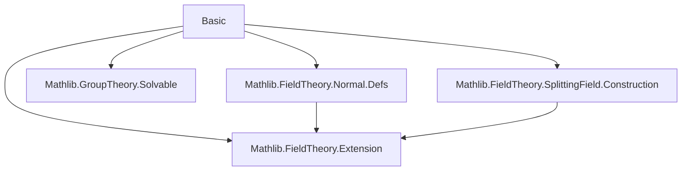

### Technical Brief: `Basic.lean` — Normal Field Extensions in Lean 4

---

#### **1. Key Definitions & Theorems**

| Name | Type / Signature | Purpose |
|------|------------------|---------|
| `Normal F K` | `Prop` | A finite extension $K/F$ is *normal* if every irreducible polynomial over $F$ with a root in $K$ splits in $K$. Formally: `∀ x : K, IsAlgebraic F x → (minpoly F x).Splits`. |
| `IsSplittingField F K p` | `Prop` | $K$ is a splitting field over $F$ for polynomial $p \in F[X]$. |
| `Normal.of_isSplittingField` | `IsSplittingField F E p → Normal F E` | Every splitting field is normal. |
| `Normal.exists_isSplittingField` | `Normal F K → FiniteDimensional F K → ∃ p, IsSplittingField F K p` | Every finite normal extension is a splitting field. |
| `Algebra.IsQuadraticExtension.normal` | `[IsQuadraticExtension F K] → Normal F K` | Any quadratic extension is normal. |
| `AlgHom.liftNormal` | `[Normal F E] → (K₁ →ₐ[F] K₂) → E →ₐ[F] E` | Lifts an $F$-algebra homomorphism between intermediate fields to an $F$-algebra endomorphism of a larger normal extension $E$. |
| `AlgEquiv.liftNormal` | `[Normal F E] → (K₁ ≃ₐ[F] K₂) → Gal(E/F)` | Lifts an $F$-algebra isomorphism to an element of the Galois group of $E/F$. |
| `AlgEquiv.restrictNormalHom_surjective` | `[Normal F K₁] → [Normal F E] → Function.Surjective (Gal(E/F) → K₁ ≃ₐ[F] K₁)` | Restriction map from Gal$(E/F)$ to Gal$(K₁/F)$ is surjective when $E/F$ and $K₁/F$ are normal. |
| `Normal.minpoly_eq_iff_mem_orbit` | `[Normal F E] → minpoly F x = minpoly F y ↔ x ∈ orbit(Gal(E/F)) y` | Minimal polynomials coincide iff elements lie in the same Galois orbit. |
| `minpoly.exists_algEquiv_of_root` | `[Normal K L] → (aeval x (minpoly K y) = 0) → ∃ σ ∈ Gal(L/K), σ x = y` | If $x$ is a root of $\mathrm{minpoly}_K(y)$, then $x$ and $y$ are Galois conjugate. |
| `normal_iSup`, `normal_iInf`, `normal_sup`, `normal_inf` | Instances | Closure of normal extensions under arbitrary suprema/infima (composita/intersections). |

---

#### **2. Naming Conventions**

- **Prefixes**:
  - `is_`: e.g., `IsSplittingField`, `IsQuadraticExtension`, `IsSolvable`
  - `normal_`: e.g., `normal_iSup`, `normal_iInf`, `normal_sup`, `normal_inf`
  - `liftNormal`, `restrictNormal`: for constructions involving normal extensions
  - `algEquiv`, `algHom`: for algebra isomorphisms/homomorphisms
- **Suffixes**:
  - `_of_`: e.g., `of_isSplittingField`, `of_root`, `of_injective`
  - `_surjective`, `_bijective`: for properties of maps
  - `_commutes`: for commutativity lemmas (e.g., `liftNormal_commutes`)
- **Notable patterns**:
  - `instNormal`: instance name for `Normal F p.SplittingField`
  - `of_algEquiv`: for transferring normality along algebra equivalences

---

#### **3. Tactic Stack**

| Tactic | Frequency | Role |
|--------|-----------|------|
| `rcases` / `obtain` | High | Case analysis on existential/universal hypotheses |
| `rw` | Very High | Rewriting using equalities, especially `minpoly.algEquiv_eq`, `minpoly.algHom_eq`, `Polynomial.map_map`, etc. |
| `simp` / `simp_rw` | Medium | Simplification using algebraic identities and `minpoly` properties |
| `exact` / `refine` | High | Constructing proofs, especially with `refine` for partial proofs |
| `convert` | Medium | When goal differs by definitional equality or injective maps |
| `aesop` / `tauto` | Low | Rarely used; mostly manual reasoning |
| `ring` | Low | For polynomial arithmetic simplifications |
| `apply` / `intro` | Medium | Standard proof steps |
| `ext` | Medium | Extensionality for functions/maps (e.g., `AlgHom.ext`) |
| `change`, `set`, `letI` | Medium | Local definitions and typeclass inference |

---

#### **4. Proof Logic**

- **Inductive/structural reasoning** on algebraic elements and their minimal polynomials.
- **Key proof strategy**:
  1. Use `normal_iff` to reduce to showing minimal polynomials split.
  2. For splitting field ⇒ normal: construct lift from splitting field to extension using universal property.
  3. For normal ⇒ splitting field: use finite basis, take product of minimal polynomials, show extension is generated by roots.
  4. For closure properties:
     - Supremum: reduce to finite suprema via `exists_finset_of_mem_supr''`, use `adjoin_rootSet_isSplittingField`.
     - Infimum: use tower laws and `splits_iff_mem`.
  5. For Galois conjugacy: use `aeval` condition to get algebra homomorphism between simple extensions, then lift to full extension via `liftNormal`.
- **Common lemmas reused**:
  - `minpoly.aeval F x = 0`
  - `minpoly.ne_zero (h.isIntegral x)`
  - `Polynomial.map_map`
  - `AlgHom.commutes`, `AlgEquiv.ext`

---

#### **5. Imports & Dependencies**

| Module | Purpose |
|--------|---------|
| `Mathlib.FieldTheory.Extension` | Basic field extension theory, algebra maps, adjoin, intermediate fields |
| `Mathlib.FieldTheory.Normal.Defs` | Definition of `Normal`, `normal_iff`, basic properties |
| `Mathlib.GroupTheory.Solvable` | Solvability of groups, used in `isSolvable_of_isScalarTower` |
| `Mathlib.FieldTheory.SplittingField.Construction` | Construction of splitting fields, `IsSplittingField`, `lift`, `adjoin_rootSet`, etc. |

---

#### **6. Mermaid Diagrams**

##### **Dependency Graph (Module-Level)**



##### **Overview of Theory Flow**

```mermaid
flowchart LR
  A[Field Extensions F ≤ K] --> B[Normal Extensions]
  B --> C[Splitting Fields]
  C -->|Normal.of_isSplitting_field| B
  B -->|Normal.exists_isSplittingField| C
  B --> D[Intermediate Fields]
  D -->|normal_iSup, normal_iInf| B
  B --> E[Galois Group Gal(E/F)]
  E -->|liftNormal, restrictNormal| B
  E -->|minpoly.exists_algEquiv_of_root| F[Galois Conjugacy]
  F -->|Normal.minpoly_eq_iff_mem_orbit| E
```

##### **Proof Structure of Core Equivalence**


---

#### **7. Summary**

This file establishes the foundational equivalence between *normal* and *splitting field* extensions in finite settings, and builds the machinery for working with normal extensions inside a fixed algebraic closure (via `IntermediateField`). It includes:

- Closure properties under sup/inf (composita/intersections),
- Lifting of algebra homomorphisms/isomorphisms to normal extensions,
- Galois-theoretic characterizations (orbits, conjugacy),
- A concrete instance for quadratic extensions.

It serves as a core module for Galois theory in Mathlib, especially for the development of the fundamental theorem of Galois theory and solvability by radicals.

--- 

Let me know if you'd like a formalized dependency graph or a proof outline for a specific theorem.
