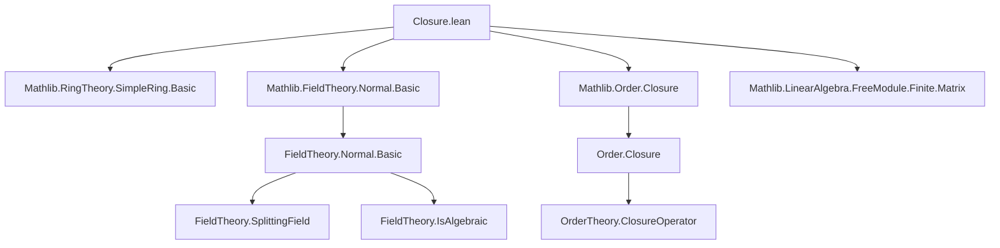
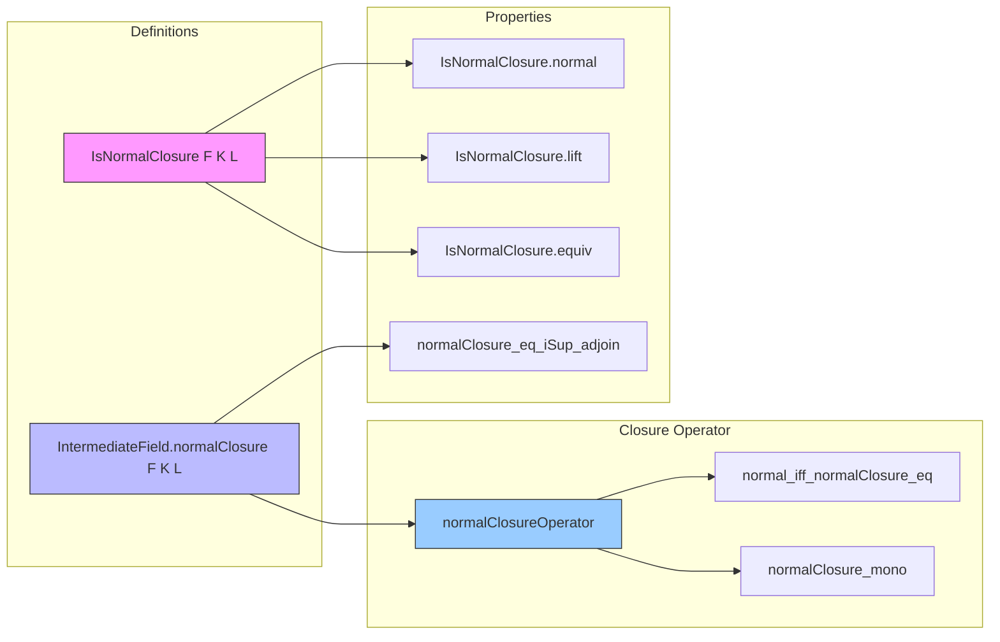
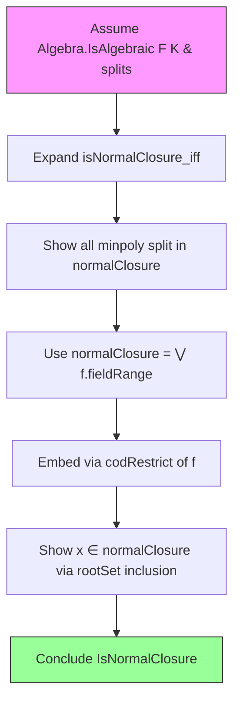

### Technical Brief: `Closure.lean` — Normal Closures in Field Extensions

---

#### **1. Key Definitions & Theorems**

| Name | Type / Signature | Purpose |
|------|------------------|---------|
| `IsNormalClosure F K L` | `Prop` | Predicate stating: (1) every minimal polynomial of $x \in K$ over $F$ splits in $L$, and (2) $L$ is generated over $F$ by all such roots. Uniquely characterizes normal closures up to $F$-algebra isomorphism. |
| `IntermediateField.normalClosure F K L` | `IntermediateField F L` | Explicit construction: the smallest intermediate field of $L/F$ containing the image of every $F$-algebra embedding $K \to_F L$. Defined as $\bigvee_{f : K \to_F L} f.\text{fieldRange}$. |
| `IsNormalClosure.normal` | `Normal F L` | Any normal closure is a normal extension. |
| `IsNormalClosure.lift` | `(splits : ∀ x, minpoly F x splits in L') ⇒ L →ₐ[F] L'` | Universal property: any normal closure embeds into any extension where minimal polynomials split. |
| `IsNormalClosure.equiv` | `L ≃ₐ[F] L'` | Uniqueness: any two normal closures of $K/F$ are $F$-algebra isomorphic. |
| `normalClosure_eq_iSup_adjoin` | `normalClosure F K L = ⨆ x, adjoin F ((minpoly F x).rootSet L)` | Equality when $L/F$ is normal and $K/F$ is algebraic (e.g., tower $L/K/F$ with $L/F$ normal). |
| `normalClosure_of_normal` | `Normal F K ⇒ normalClosure F K L = K` | If $K/F$ is normal, its normal closure in any extension is itself. |
| `normalClosureOperator` | `ClosureOperator (IntermediateField F L)` | `normalClosure` defines a closure operator on intermediate fields. |
| `normal_iff_normalClosure_eq` | `Normal F K ↔ normalClosure F K L = K` | Characterizes normal intermediate fields via fixed points of the closure operator. |
| `algHomEmbeddingOfSplits` | `(K →ₐ[F] L') ↪ (K →ₐ[F] L)` | If $L$ is a splitting field for all minimal polynomials of $K/F$, then embeddings $K \to_F L'$ inject into $K \to_F L$. |

---

#### **2. Naming Conventions**

- **Predicates**: `isNormalClosure`, `normal`, `isAlgebraic`, `isSplittingField`, `isScalarTower`
- **Constructors/Definitions**:
  - `normalClosure` — main construction
  - `fieldRange` — image of an algebra homomorphism as an intermediate field
  - `adjoin` — smallest subfield containing a set
  - `rootSet`, `minpoly` — standard polynomial/field-theoretic notation
- **Lemmas**:
  - `normalClosure_*` — properties of `normalClosure`
  - `isNormalClosure_*` — consequences of the `IsNormalClosure` predicate
  - `normal_iff_*` — characterizations of normality
  - `*_le_iff`, `*_eq_iff` — universal properties / equivalences
  - `*_map_*`, `*_restrict_*` — behavior under maps

Prefixes/suffixes:
- `normalClosure_`, `isNormalClosure_`, `normal_iff_`, `fieldRange_`, `map_`, `restrict_`, `algHom_`

---

#### **3. Tactic Stack**

Frequent tactics used in proofs:
- `rw`, `simp_rw`, `simp` — rewriting and simplification (especially with `normalClosure_def`, `minpoly.aeval`, `AlgHom.coe_toRingHom`)
- `apply`, `exact`, `refine`, `obtain`, `cases` — standard proof construction
- `iSup_le`, `le_iSup`, `antisymm` — lattice-theoretic reasoning on intermediate fields
- `apply_fun`, `ext`, `funext`, `DFunLike.ext'_iff` — extensionality and functional reasoning
- `nonempty.some`, `nonempty_of_exists`, `exists.elim` — choice-based constructions
- `field_simp`, `ring`, `aesop` — for algebraic simplifications (e.g., in `minpoly` divisibility arguments)
- `convert`, `change`, `have`, `suffices` — modular proof structuring

---

#### **4. Proof Logic**

The logical flow across most proofs follows this pattern:

1. **Reduction to algebraic case**  
   Often assume `Algebra.IsAlgebraic F K` (or deduce it from `Normal F L` + existence of embeddings).

2. **Use of `normalClosure` definition**  
   Expand `normalClosure` as $\bigvee_{f : K \to_F L} f.\text{fieldRange}$, then apply lattice-theoretic lemmas (`iSup_le_iff`, `le_iSup`, etc.).

3. **Link to minimal polynomials & roots**  
   Use:
   - `minpoly.aeval`, `aeval_algHom_apply`
   - `mem_rootSet_of_ne`, `minpoly.dvd`, `minpoly.ne_zero`
   - `splits_of_splits`, `of_dvd`, `map_dvd_map'`

4. **Leverage splitting ⇒ existence of algebra homs**  
   Key lemma: `exists_algHom_of_splits_of_aeval`, `nonempty_algHom_adjoin_of_splits`, `nonempty_algHom_of_adjoin_splits`

5. **Uniqueness via bijectivity**  
   For `equiv`, use `AlgEquiv.ofBijective` + `Normal.toIsAlgebraic.algHom_bijective₂`

6. **Closure operator properties**  
   Prove monotonicity, extensivity, idempotence using `normalClosure_mono`, `le_normalClosure`, `normalClosure_of_normal`.

7. **Normality characterizations**  
   Use equivalences like `normal_iff_forall_fieldRange_le`, `normal_iff_forall_map_le`, often via `normalClosure_le_iff`.

---

#### **5. Imports & Dependencies**

**Primary imports** (define scope and theory):
```lean
Mathlib.RingTheory.SimpleRing.Basic
Mathlib.FieldTheory.Normal.Basic
Mathlib.Order.Closure
Mathlib.LinearAlgebra.FreeModule.Finite.Matrix
```

**Key underlying theories used**:
- `IntermediateField` — subfield lattice, `adjoin`, `fieldRange`, `map`, `restrictScalars`
- `Polynomial` — `minpoly`, `Splits`, `rootSet`, `aeval`
- `FieldTheory.Normal` — `Normal`, `isSplittingField`, `algHom_bijective₂`
- `Order.Closure` — `ClosureOperator`, `gc.l_iSup`
- `Algebra.IsAlgebraic`, `IsScalarTower` — tower laws, algebra maps

---

#### **6. Mermaid Diagrams**

##### **Dependency Graph (Module-Level)**



##### **Conceptual Overview of Theory Flow**



##### **Proof Strategy Flow (Example: `isNormalClosure_normalClosure`)**



---

#### **7. Summary**

This file formalizes the theory of **normal closures** in field extensions, providing both a **predicate-based characterization** (`IsNormalClosure`) and an **explicit construction** (`normalClosure`). It establishes:
- Equivalence between “generated by roots” and “generated by embeddings” under algebraicity.
- Universal property and uniqueness up to $F$-algebra isomorphism.
- Normal closure as a **closure operator** on intermediate fields.
- Characterizations of normal intermediate fields via stability under embeddings or Galois group actions.

It serves as a foundational module for further development in Galois theory, especially in contexts involving normal and Galois extensions, separability, and fixed fields.

--- 

Let me know if you'd like a **dependency graph of lemmas**, a **proof outline for a specific theorem**, or **export of this metadata as JSON/YAML**.
