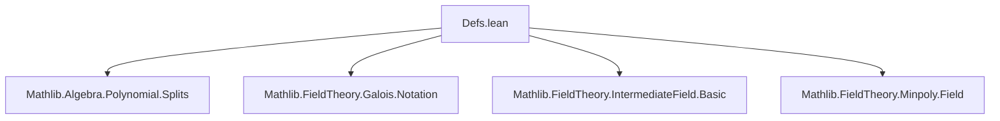

### Technical Brief: `Defs.lean` — Normal Field Extensions in Lean 4

---

#### **1. Key Definitions & Theorems**

| Name | Type / Signature | Purpose |
|------|------------------|---------|
| `Normal F K` | `class Normal : Prop extends Algebra.IsAlgebraic F K` | Typeclass asserting that every element of `K` has a minimal polynomial over `F` that splits in `K`. |
| `Normal.splits'` | `∀ x : K, Splits ((minpoly F x).map (algebraMap F K))` | Core condition: minimal polynomials split in the extension. |
| `Normal.isIntegral` | `Normal F K → ∀ x : K, IsIntegral F x` | Every element of `K` is integral over `F`. |
| `normal_iff` | `Normal F K ↔ ∀ x : K, IsIntegral F x ∧ Splits ((minpoly F x).map (algebraMap F K))` | Equivalence characterizing normality as integrality + splitting. |
| `Normal.out` | `Normal F K → ∀ x : K, IsIntegral F x ∧ Splits ((minpoly F x).map (algebraMap F K))` | Projection from the class to the conjunction in `normal_iff`. |
| `Normal.normal_self` | `instance : Normal F F` | The base field is trivially normal over itself. |
| `Normal.tower_top_of_normal` | `Normal F E → Normal K E` (under `IsScalarTower F K E`) | If `E/F` is normal, then `E/K` is normal for intermediate `K`. |
| `Normal.of_algEquiv` | `Normal F E → (E ≃ₐ[F] E') → Normal F E'` | Normality is preserved under `F`-algebra isomorphism. |
| `AlgEquiv.transfer_normal` | `E ≃ₐ[F] E' → Normal F E ↔ Normal F E'` | Transfer of normality along algebra isomorphisms. |
| `Normal.of_equiv_equiv` | Under equivariant compatibility, transfers normality along ring isomorphisms of base and total fields. |
| `AlgHom.restrictNormalAux` | `[Normal F E] ⇒ (range (algebraMap F E K₁)) →ₐ[F] (range (algebraMap F E K₂))` | Auxiliary map used to restrict algebra homomorphisms to normal subfields. |
| `AlgHom.restrictNormal` | `[Normal F E] ⇒ E →ₐ[F] E` | Restriction of an `F`-algebra homomorphism to a normal subfield. |
| `AlgHom.restrictNormal'` | `[Normal F E] ⇒ Gal(E/F)` | Induced automorphism on the normal subfield (i.e., element of Galois group). |
| `AlgEquiv.restrictNormal` | `[Normal F E] ⇒ Gal(E/F)` | Restriction of an algebra automorphism to a normal subfield. |
| `AlgEquiv.restrictNormalHom` | `[Normal F E] ⇒ Gal(K₁/F) →* Gal(E/F)` | Group homomorphism induced by restriction to a normal subfield. |
| `Normal.algHomEquivAut` | `[Normal F E] ⇒ (E →ₐ[F] K₁) ≃ Gal(E/F)` | Equivalence between algebra homomorphisms and automorphisms when domain is normal. |
| `AlgEquiv.restrictNormalHom_id` | `AlgEquiv.restrictNormalHom K = MonoidHom.id Gal(K/F)` | When `K/F` is normal, restriction to `K` is identity on `Gal(K/F)`. |
| `AlgEquiv.restrictNormalHom_comp` | `AlgEquiv.restrictNormalHom K₁ = ...` | Compatibility of restriction maps in towers of normal extensions. |

---

#### **2. Naming Conventions**

- **Prefixes**:
  - `normal_`: for properties/instances of normal extensions (`normal_self`, `normal_iff`, `normal_of_algEquiv`).
  - `restrictNormal`: for maps/operations that restrict algebra homomorphisms/automorphisms to normal subfields.
  - `transfer_normal`: for equivalence results about normality under isomorphisms.
- **Suffixes**:
  - `_aux`: auxiliary constructions (`restrictNormalAux`).
  - `_hom`: group homomorphisms (`restrictNormalHom`).
  - `_comp`: composition laws (`restrictNormal_comp`, `restrictNormalHom_comp`).
- **`[Normal F E]`**: common hypothesis pattern indicating normality of `E/F`.

---

#### **3. Tactic Stack**

Frequent tactics used in proofs:
- `rw [normal_iff]` — to unfold or apply the characterization of normality.
- `obtain ⟨hx, hhx⟩ := h.out x` — destructuring integral + splitting data.
- `simp only [...]` — especially for algebra maps, compositions, and `AlgEquiv`/`AlgHom` coercions.
- `apply minpoly.mem_range_of_degree_eq_one` — key lemma for degree arguments.
- `exact ...` / `refine ⟨..., ...⟩` — for constructing pairs (integrality + splitting).
- `apply (h.splits z).of_dvd ...` — splitting implies divisibility of minimal polynomials.
- `ext` + `simp` — for extensionality proofs of homomorphisms/automorphisms.
- `apply (algebraMap ...).injective` — to reduce equalities in extensions to base field.

---

#### **4. Proof Logic**

The logical flow in most proofs follows this pattern:

1. **Unfold normality** using `normal_iff` or `Normal.out`.
2. **Decompose** into integrality and splitting components.
3. **Lift or descend** along algebra maps using:
   - `map_map`, `map_dvd_map'`, `minpoly.dvd_map_of_isScalarTower`, etc.
   - `minpoly.algEquiv_eq`, `minpoly.map_eq_of_equiv_equiv`.
4. **Use degree arguments** (e.g., `degree_eq_one_of_irreducible`) to deduce injectivity/surjectivity.
5. **Apply extensionality** (`AlgHom.ext`, `AlgEquiv.ext`) and simplify using `simp` lemmas like `restrictNormal_commutes`.

Induction is not used; instead, the proofs rely heavily on:
- Properties of minimal polynomials (`minpoly.irreducible`, `minpoly.ne_zero`, `minpoly.dvd`).
- Behavior under scalar towers (`IsScalarTower` lemmas).
- Equivariance under algebra isomorphisms.

---

#### **5. Imports**

Core dependencies defining the scope:

```lean
Mathlib.Algebra.Polynomial.Splits
Mathlib.FieldTheory.Galois.Notation
Mathlib.FieldTheory.IntermediateField.Basic
Mathlib.FieldTheory.Minpoly.Field
```

These provide:
- `Splits`: splitting of polynomials.
- Galois group notation (`Gal(E/F)`, `AlgEquiv`, `AlgHom`).
- Intermediate fields and restriction of scalars.
- Minimal polynomials over fields.

---

#### **6. Mermaid Diagrams**

##### **Dependency Graph (Module-Level)**



##### **Conceptual Overview of Theory**

```mermaid
graph LR
  subgraph Definitions
    N[Normal F K] -->|def| S[Splits minpoly]
    N -->|def| I[IsIntegral]
  end

  subgraph Properties
    N -->|normal_self| Self[Normal F F]
    N -->|tower_top_of_normal| Tower[Normal K E]
    N -->|of_algEquiv| Iso[Normal F E']
  end

  subgraph Restriction
    R1[AlgHom.restrictNormal] -->|def| R2[AlgHom.restrictNormal']
    R2 -->|def| G[Gal(E/F)]
    R3[AlgEquiv.restrictNormalHom] -->|def| M[MonoidHom Gal(K₁/F) → Gal(E/F)]
  end

  subgraph Equivalences
    E1[Normal.algHomEquivAut] -->|equiv| H[(E →ₐ[F] K₁) ≃ Gal(E/F)]
  end

  N -->|normal_iff| I & S
  R1 -->|restrictNormal_comp| M
  R3 -->|restrictNormalHom_id| Id[MonoidHom.id]
  R3 -->|restrictNormalHom_comp| Comp[Chain of restrictions]
```

##### **Tower of Fields & Restriction Maps**

```mermaid
graph TD
  F[Field F] -->|algebra| K[Field K]
  F -->|algebra| E[Field E]
  K -->|algebra| E
  E -->|algebra| K₁[Field K₁]
  E -->|algebra| K₂[Field K₂]
  K₁ -->|algebra| K₃
  K₂ -->|algebra| K₃

  E -.->|Normal F E| Restr1[AlgHom.restrictNormal]
  K₁ -.->|Gal(K₁/F)| Restr2[AlgEquiv.restrictNormalHom K₁]
  K₂ -.->|Gal(K₂/F)| Restr3[AlgEquiv.restrictNormalHom K₂]
  K₃ -.->|Gal(K₃/F)| Restr4[AlgEquiv.restrictNormalHom K₃]

  Restr2 -.->|comp| Restr3
  Restr3 -.->|comp| Restr4
  Restr2 -.->|factor| Restr4
```

---

#### **7. Summary**

This file formalizes the foundational theory of **normal field extensions** in Lean 4, building on minimal polynomials, splitting, and Galois theory. It introduces the `Normal` typeclass, proves stability under towers, isomorphisms, and intermediate fields, and constructs canonical restriction maps from automorphism groups of extensions down to automorphism groups of normal subextensions. The proofs are largely algebraic, leveraging properties of minimal polynomials and scalar towers, with heavy use of `simp`-friendly lemmas and extensionality principles.

The module serves as a prerequisite for further development in Galois theory (e.g., fundamental theorem of Galois theory), where normality ensures that restriction maps are well-defined group homomorphisms.
