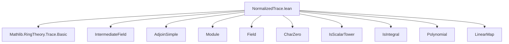
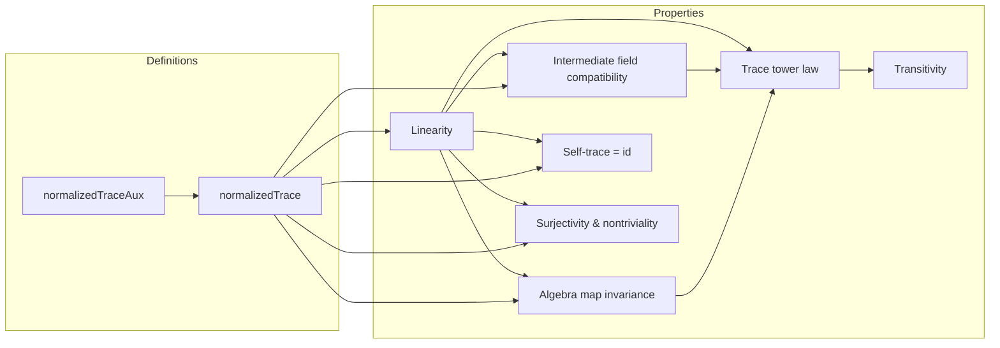

**Technical Brief: `NormalizedTrace.lean`**

---

### 1. **Key Definitions & Theorems**

| Name | Type / Signature | Purpose |
|------|------------------|---------|
| `normalizedTraceAux` | `K → F` | Preliminary definition of normalized trace using simple adjoin: $\frac{1}{[F(a):F]} \cdot \mathrm{tr}_{F(a)/F}(\mathrm{gen})$ |
| `normalizedTrace` | `K →ₗ[F] F` | Final `F`-linear normalized trace map, defined for algebraic extensions |
| `normalizedTrace_def` | `∀ a, normalizedTrace a = ...` | Explicit formula for `normalizedTrace` |
| `normalizedTrace_minpoly` | `∀ a, normalizedTrace a = ...` | Alternative expression via minimal polynomial: $-\frac{1}{\deg m_a} \cdot \text{nextCoeff}(m_a)$ |
| `normalizedTrace_self` | `normalizedTrace F F = LinearMap.id` | Normalized trace over trivial extension is identity |
| `normalizedTrace_self_apply` | `∀ a, normalizedTrace F F a = a` | Pointwise version of above |
| `normalizedTrace_intermediateField` | `∀ (E : IntermediateField F K) (a : E), normalizedTrace F K a = normalizedTrace F E a` | Compatibility with intermediate fields |
| `normalizedTrace_map` | `∀ f : E →ₐ[F] K, normalizedTrace F K ∘ f = normalizedTrace F E` | Invariance under algebra maps |
| `normalizedTrace_trans` | `normalizedTrace F E ∘ₗ normalizedTrace E K = normalizedTrace F K` | Transitivity (trace tower law) |
| `normalizedTrace_trans_apply` | `∀ a, normalizedTrace F E (normalizedTrace E K a) = normalizedTrace F K a` | Pointwise transitivity |
| `normalizedTrace_algebraMap` | `normalizedTrace F K ∘ₗ algebraMap = normalizedTrace F E` | Compatibility with algebra maps in towers |
| `normalizedTrace_surjective` | `Function.Surjective (normalizedTrace F K)` | Surjectivity of normalized trace |
| `normalizedTrace_ne_zero` | `normalizedTrace F K ≠ 0` | Non-triviality |

---

### 2. **Naming Conventions**

- **Prefixes**:
  - `normalizedTrace`: main prefix for all definitions and results about normalized trace.
  - `normalizedTraceAux`: internal auxiliary definition (before linearity is established).
- **Suffixes**:
  - `_def`: definition lemmas (e.g., `normalizedTrace_def`, `normalizedTraceAux_def`).
  - `_apply`: pointwise version of a map equality (e.g., `normalizedTrace_trans_apply`).
  - `_map`: behavior under algebra homomorphisms (e.g., `normalizedTrace_map`).
  - `_intermediateField`: behavior under intermediate fields.
  - `_self`: trivial extension case (`F → F`).
  - `_trans`: transitivity/tower law.
  - `_algebraMap`: behavior under `algebraMap` in towers.

---

### 3. **Tactic Stack**

Frequent tactics used in proofs:

- `rw`, `simp_rw`: rewriting using definitions and lemmas.
- `congr`: congruence reasoning (especially for equality of linear maps).
- `have`, `let`: local assumptions and definitions.
- `exact`, `apply`: direct proof steps.
- `linarith`, `ring`: arithmetic simplifications (especially for field operations).
- `aesop`: automated reasoning for simple goals (e.g., membership, algebra axioms).
- `ext`: extensionality for linear maps (`LinearMap.ext`).
- `set_option backward.privateInPublic true`: to allow private definitions in public contexts (used for internal lemmas).
- `div_eq_mul_inv`, `mul_div_mul_right`, `inv_mul_cancel`, etc.: field arithmetic rewrites.

---

### 4. **Proof Logic**

- **Structure**:
  1. **Auxiliary definition** (`normalizedTraceAux`) is first defined pointwise.
  2. **Linearity** is proven by:
     - Reducing to a finite-dimensional intermediate extension $E = F(a,b)$ or $F(a)$,
     - Using `normalizedTraceAux_eq_of_finiteDimensional` to rewrite in terms of full trace,
     - Applying known properties of trace (additivity, scalar compatibility).
  3. **Main properties** are proven via:
     - **Intermediate field reduction**: reduce to subextensions where finite-dimensionality holds.
     - **Trace tower law** (`trace_trace`) for transitivity.
     - **Minimal polynomial expressions** for alternative characterizations.
     - **Algebra map compatibility** via `normalizedTrace_map` and `normalizedTrace_intermediateField`.

- **Induction / Cases**: Not used directly; instead, proofs rely on:
  - Finite-dimensionality of simple adjoins (from integrality),
  - Properties of `IntermediateField` (suprema, membership),
  - Equivalences of finite-dimensional modules (`finrank_eq`, `equivMap`).

---

### 5. **Imports**

- `Mathlib.RingTheory.Trace.Basic`: core trace theory (trace of linear maps, trace of adjoin, etc.).
- `Algebra`, `IntermediateField`, `AdjoinSimple`, `Module`, `Field`, `CharZero`, `IsScalarTower`, `IsIntegral`, `Polynomial`, `LinearMap`, `DFunLike`.

---

### 6. **Mermaid Diagrams**

#### **Dependency Graph (Top-Level)**



#### **Overview of Theory Flow**



#### **Tower Law Diagram**

```mermaid
graph LR
  K -->|normalizedTrace E K| E
  E -->|normalizedTrace F E| F
  K -.->|normalizedTrace F K| F
  style K fill:#f9f,stroke:#333
  style E fill:#bbf,stroke:#333
  style F fill:#9f9,stroke:#333
  K -- normalizedTrace F K --> F
  K -- normalizedTrace E K --> E -- normalizedTrace F E --> F
  style K--normalizedTrace F K-->F stroke:#f00,stroke-width:2px
```

---

### 7. **Key Mathematical Insight**

- The normalized trace is a canonical $F$-linear functional on algebraic extensions, generalizing the usual trace scaled by degree.
- It satisfies a *functorial* behavior: it commutes with algebra maps and respects towers.
- It is surjective and nontrivial, and restricts to identity on the base field.
- It can be computed via minimal polynomials, making it accessible for explicit calculations.

--- 

Let me know if you'd like a formalized dependency graph (e.g., for `leanproject`), or a summary of proof automation patterns.
