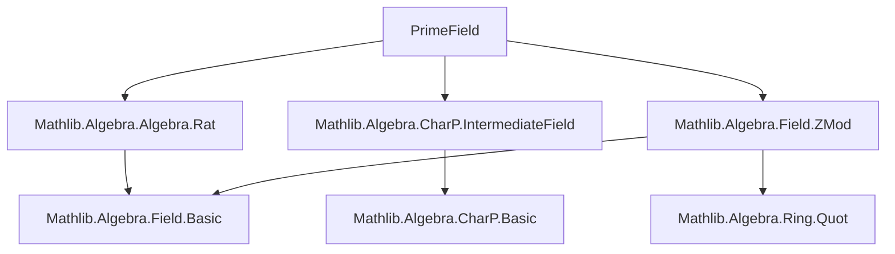
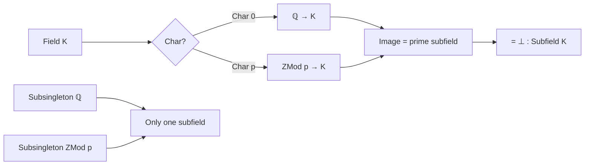

**Technical Brief: `PrimeField.lean`**

---

### 1. **Key Definitions & Theorems**

| Name | Type | Purpose |
|------|------|---------|
| `Subsingleton (Subfield ℚ)` | `Prop` | Instance asserting that `ℚ` has no nontrivial subfields — i.e., its only subfield is itself. |
| `Subsingleton (Subfield (ZMod p))` | `Prop` | Instance asserting that for prime `p`, `ℤ/pℤ` has no nontrivial subfields. |
| `Subfield.bot_eq_of_charZero` | `∀ {K : Field} [CharZero K], (⊥ : Subfield K) = (algebraMap ℚ K).fieldRange` | Shows that the prime subfield (i.e., the bottom subfield) of a characteristic-0 field `K` is the image of `ℚ` under the unique algebra map. |
| `Subfield.bot_eq_of_zMod_algebra` | `∀ {K : Field} {p : ℕ} [Fact (Nat.Prime p)] [Algebra (ZMod p) K], (⊥ : Subfield K) = (algebraMap (ZMod p) K).fieldRange` | Shows that the prime subfield of a field `K` of characteristic `p` (i.e., with a `ZMod p`-algebra structure) is the image of `ZMod p`. |

---

### 2. **Naming Conventions**

- **Prefixes**:
  - `bot_`: refers to the smallest subfield (i.e., the `⊥` subfield).
  - `fieldRange`: used for the range of a ring homomorphism viewed as a subfield.
- **Suffixes**:
  - `_eq_of_...`: indicates an equality characterizing the prime subfield under a condition (e.g., `charZero`, `zMod_algebra`).
- **Pattern**:
  - `Subsingleton (Subfield _)`: used to assert uniqueness of subfield structure.
  - `algebraMap ... .fieldRange`: standard way to denote the prime subfield as the image of the structure map.

---

### 3. **Tactic Stack**

- `rw [...]`: repeated use of rewriting with lemmas like `eq_comm`, `eq_bot_iff`, `Subfield.map_bot`, `subsingleton_iff_bot_eq_top.mpr`, `RingHom.fieldRange_eq_map`.
- `inferInstance`: to synthesize `Subsingleton` instances.
- `congr(...)`: to convert equality of homomorphisms into pointwise equality.
- `have h := ...`: local proof construction using `Subsingleton.elim`.
- `▸ Subtype.prop _`: to use propositional equality of subtype elements.

No heavy automation (e.g., `aesop`, `ring`, `simp`) is used — the proofs are mostly *algebraic rewriting* and *uniqueness via subsingleton*.

---

### 4. **Proof Logic**

- **Core idea**: Show that any subfield of a prime field (`ℚ` or `ZMod p`) must be the whole field, by proving that the top and bottom subfields are equal — i.e., `⊤ ≤ ⊥`, which implies `⊤ = ⊥`, and hence `Subfield K` is a subsingleton.
- For `ℚ` and `ZMod p`, the proof uses:
  - `Subsingleton.elim` to equate two ring homomorphisms from the prime field to itself.
  - Then `congr` to lift this to pointwise equality, and `Subtype.prop` to conclude identity.
- For general fields `K`:
  - Use that the prime subfield is the image of the unique algebra map from the prime field (`ℚ` or `ZMod p`) into `K`.
  - Apply `eq_bot_iff` to reduce to showing the map’s image is the smallest subfield.
  - Use `Subfield.map_bot` and `subsingleton_iff_bot_eq_top.mpr inferInstance` to conclude equality.

---

### 5. **Imports**

| Import | Role |
|--------|------|
| `Mathlib.Algebra.Algebra.Rat` | Provides `ℚ`-algebra structure and `CharZero` machinery. |
| `Mathlib.Algebra.CharP.IntermediateField` | Provides `CharP`, `Algebra (ZMod p)`, and intermediate field theory. |
| `Mathlib.Algebra.Field.ZMod` | Provides `ZMod p` as a field when `p` is prime, and its algebra structure. |

These imports define the algebraic context: fields, characteristic, subfields, and algebra maps.

---

### 6. **Mermaid Diagrams**

#### **Dependency Graph (Module-Level)**



#### **Theoretical Overview (Conceptual Flow)**



#### **Proof Structure (High-Level)**

```mermaid
flowchart LR
  Subsingleton ℚ -->|use Subsingleton.elim + congr| Top ≤ Bot
  Subsingleton ZMod p -->|same| Top ≤ Bot

  Top ≤ Bot -->|subsingleton_iff_bot_eq_top| Subfield K is subsingleton

  Bot = fieldRange(algebraMap) -->|eq_bot_iff + map_bot| uniqueness of prime subfield
```

---

### 7. **Summary**

This module formalizes the foundational result that every field `K` contains a *unique* smallest subfield — its **prime subfield** — which is isomorphic to `ℚ` in characteristic 0 and to `ℤ/pℤ` in characteristic `p` (for prime `p`). The key insight is that `ℚ` and `ZMod p` are *rigid* (have no nontrivial subfields), and this rigidity propagates to any field via the algebra map. The proofs rely on elementary properties of subfields, ring homomorphisms, and the interaction between algebra maps and field ranges.
