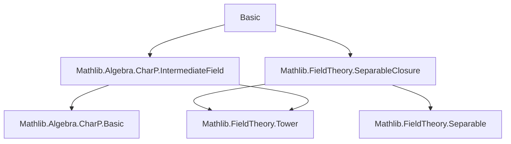
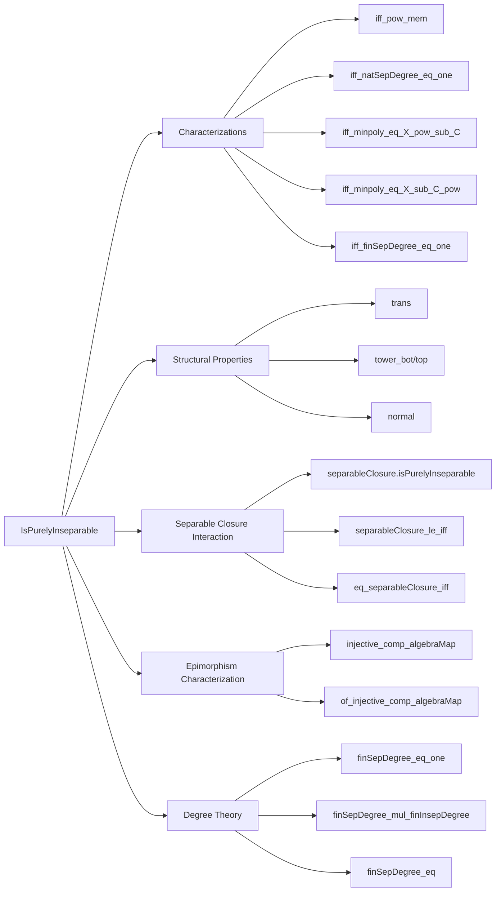

Here is the **technical metadata** extracted from the provided Lean 4 file `Basic.lean`, structured as requested:

---

### **1. Key Definitions & Theorems**

| Name | Type / Signature | Purpose |
|------|------------------|---------|
| `IsPurelyInseparable` | `class IsPurelyInseparable : Prop` | Typeclass for purely inseparable algebraic extensions: every separable element lies in the base field. |
| `isPurelyInseparable_iff` | `IsPurelyInseparable F E ↔ ∀ x, IsIntegral F x ∧ (IsSeparable F x → x ∈ range (algebraMap F E))` | Characterization of purely inseparable extensions via integrality and separability. |
| `isPurelyInseparable_iff_pow_mem` | `IsPurelyInseparable F E ↔ ∀ x, ∃ n, x ^ q ^ n ∈ range (algebraMap F E)` | Pure inseparability ⇔ all elements become base-field elements after Frobenius iteration (exp. char `q`). |
| `isPurelyInseparable_iff_natSepDegree_eq_one` | `IsPurelyInseparable F E ↔ ∀ x, (minpoly F x).natSepDegree = 1` | Pure inseparability ⇔ all minimal polynomials have separable degree 1. |
| `isPurelyInseparable_iff_minpoly_eq_X_pow_sub_C` | `IsPurelyInseparable F E ↔ ∀ x, ∃ n y, minpoly F x = X ^ q ^ n - C y` | Minimal polynomials are binomials $X^{q^n} - y$. |
| `isPurelyInseparable_iff_minpoly_eq_X_sub_C_pow` | `IsPurelyInseparable F E ↔ ∀ x, ∃ n, minpoly F x = (X - x)^{q^n}` | Minimal polynomials split as pure powers of linear factors over the extension. |
| `isPurelyInseparable_iff_finSepDegree_eq_one` | `IsPurelyInseparable F E ↔ finSepDegree F E = 1` | Pure inseparability ⇔ finite separable degree is 1. |
| `IsPurelyInseparable.surjective_algebraMap_of_isSeparable` | `[IsPurelyInseparable F E] → [IsSeparable F E] → Function.Surjective (algebraMap F E)` | If extension is both separable and purely inseparable, the structure map is surjective. |
| `IsPurelyInseparable.bijective_algebraMap_of_isSeparable` | `[Nontrivial E] → [IsDomain F] → [IsTorsionFree F E] → ... → Function.Bijective (algebraMap F E)` | Under mild conditions, bijectivity follows. |
| `IntermediateField.eq_bot_of_isPurelyInseparable_of_isSeparable` | `[IsPurelyInseparable F L] → [IsSeparable F L] → L = ⊥` | Any intermediate field that is both separable and purely inseparable is trivial. |
| `separableClosure.isPurelyInseparable` | `[Algebra.IsAlgebraic F E] → IsPurelyInseparable (separableClosure F E) E` | Over its separable closure, any algebraic extension is purely inseparable. |
| `IsPurelyInseparable.normal` | `[IsPurelyInseparable F E] → Normal F E` | Purely inseparable extensions are normal. |
| `IsPurelyInseparable.injective_comp_algebraMap` | `[CommRing L] → [IsReduced L] → Function.Injective (comp (algebraMap F E))` | Purely inseparable maps induce injective precomposition on reduced rings; hence epimorphisms in **Fields**. |
| `IsPurelyInseparable.of_injective_comp_algebraMap` | `[Field L] → [IsAlgClosed L] → Injective comp ⇒ IsPurelyInseparable F E` | Epimorphisms in **Fields** are precisely purely inseparable extensions. |
| `Field.finSepDegree_eq` | `[Algebra.IsAlgebraic F E] → finSepDegree F E = Cardinal.toNat (sepDegree F E)` | Finite separable degree equals separable degree as natural numbers. |
| `Field.finSepDegree_mul_finInsepDegree` | `finSepDegree * finInsepDegree = finrank` | Fundamental degree formula. |

---

### **2. Naming Conventions**

- **Prefixes**:
  - `isPurelyInseparable_`: lemmas about the predicate `IsPurelyInseparable`.
  - `separableClosure_`: properties of `separableClosure`.
  - `FinSepDegree`, `sepDegree`, `insepDegree`, `finInsepDegree`: standard degree-related prefixes.
  - `AlgEquiv.`, `IntermediateField.`, `Subalgebra.`: module-specific qualifiers.
- **Suffixes**:
  - `_iff`: equivalence characterizations.
  - `_eq_one`: characterizations where a degree equals 1.
  - `_pow_mem`: Frobenius power membership conditions.
  - `_eq_X_pow_sub_C`, `_eq_X_sub_C_pow`: minimal polynomial forms.
  - `_of_`, `_le_`, `_eq_`: implication/containment/equality lemmas.
- **Class names**:
  - `IsPurelyInseparable`, `IsSeparable`, `IsIntegral`, `IsAlgebraic`, `IsSepClosed`, `IsReduced`, `IsAlgClosed`, `Normal`, `PerfectField`.

---

### **3. Tactic Stack**

Frequently used tactics in proofs:
- `rw`, `simp`, `simp_rw`: rewriting and simplification (especially with `minpoly`, `algebraMap`, `aeval`, `expand_aeval`).
- `exact`, `refine`, `intro`, `cases`, `obtain`: core proof construction.
- `ext`: extensionality for ring homomorphisms.
- `nontriviality`, `by_contra`, `contradiction`: classical reasoning.
- `lift`, `cast`, `congr_arg`, `congrFun`: equality reasoning.
- `have`, `suffices`: intermediate claims.
- `apply`, `assumption`, `assumption'`: goal-directed tactics.
- `ring`, `linarith`: arithmetic simplifications.
- `aesop`: automation for algebraic reasoning (e.g., in `isPurelyInseparable_self`).
- `induction ... using Nat.strongRecOn`: strong induction for degree arguments.
- `lift`, `change`, `convert`: type coercion and equality manipulation.

---

### **4. Proof Logic**

- **Inductive/structural reasoning**:
  - Many proofs proceed by reducing to minimal polynomials and using properties of separable/inseparable degree.
  - Frobenius powers (`x ^ q ^ n`) are central; proofs often use `isPurelyInseparable_iff_pow_mem`.
- **Case analysis**:
  - On whether an extension is algebraic (`by_cases halg : Algebra.IsAlgebraic F E`).
  - On equality of intermediate fields (`by_cases h : L = ⊤`).
- **Tower arguments**:
  - `tower_bot`, `tower_top`, `trans`: used repeatedly to reduce to subextensions.
- **Equivalence proofs**:
  - Most main theorems are `↔` statements; proofs split into two directions, often using known equivalences like `minpoly.natSepDegree_eq_one_iff_pow_mem`.
- **Category-theoretic reasoning**:
  - Epimorphism characterization via injectivity of `comp (algebraMap F E)` on reduced/algebraically closed targets.

---

### **5. Imports**

- `Mathlib.Algebra.CharP.IntermediateField`
- `Mathlib.FieldTheory.SeparableClosure`

These imports define:
- Exponential characteristic and Frobenius behavior in intermediate fields.
- Separable closure, separable degree, inseparable degree, and their basic properties.

---

### **6. Mermaid Diagrams**

#### **Dependency Graph (Top-Level Modules)**

#### **Overview of `Basic.lean` Theory Flow**

---

Let me know if you'd like a formalized dependency graph of *all* theorems or a visualization of the `separableClosure` lattice interactions.
