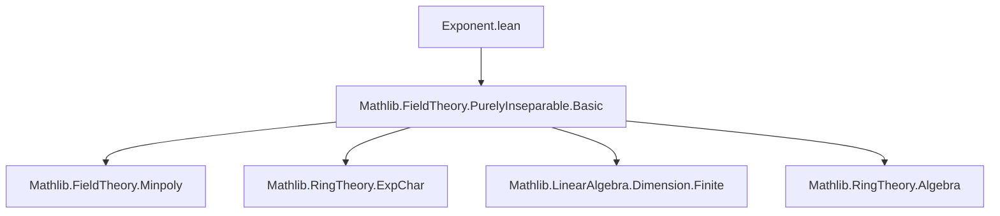
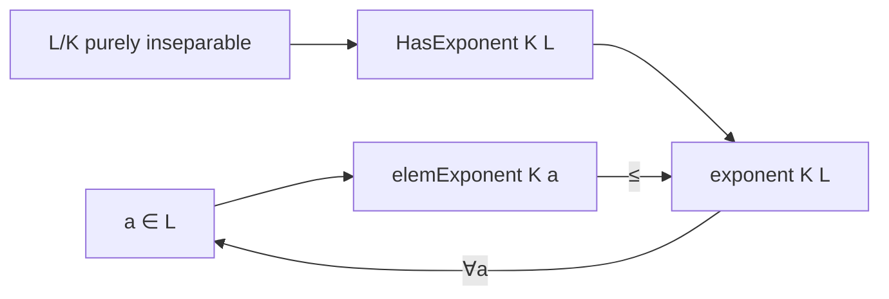

### Technical Brief: `Exponent.lean` — Exponent of Purely Inseparable Extensions

---

#### **1. Key Definitions & Theorems**

| Name | Type / Signature | Purpose |
|------|------------------|---------|
| `HasExponent` | `class HasExponent : Prop` | Asserts existence of a uniform exponent $e \in \mathbb{N}$ such that $\forall a \in L,\ a^{p^e} \in K$, where $p = \text{ringExpChar}\ K$. |
| `exponent` | `def exponent [HasExponent K L] : ℕ` | Minimal such $e$, defined via `Nat.find`. |
| `elemExponent` | `def elemExponent (a : L) : ℕ` | Minimal $e$ such that $a^{p^e} \in K$, defined via minimal polynomial structure. |
| `elemReduct` | `def elemReduct (a : L) : K` | The unique $y \in K$ with $a^{p^e} = y$, where $e = \text{elemExponent}\ a$. |
| `iterateFrobenius` | `def iterateFrobenius {n} (hn : exponent K L ≤ n) : L →+* K` | Ring homomorphism $L \to K$ acting as $x \mapsto x^{p^n}$ for $n \geq \text{exponent}\ K\ L$. |
| `iterateFrobeniusₛₗ` | `def iterateFrobeniusₛₗ {n} (hn : exponent K L ≤ n) : L →ₛₗ[_root_.iterateFrobenius F p n] K` | Semilinear version over subfield $F \subseteq K$, w.r.t. iterated Frobenius on $F$. |
| `minpoly_eq` | `minpoly K a = X^{p^{e}} - C y` | Minimal polynomial of $a$ over $K$ is binomial, where $e = \text{elemExponent}\ a$, $y = \text{elemReduct}\ a$. |
| `elemExponent_le_exponent` | `elemExponent K a ≤ exponent K L` | Element exponent is bounded by extension exponent. |
| `hasExponent_of_finiteDimensional` | `instance [IsPurelyInseparable K L] [FiniteDimensional K L] : HasExponent K L` | Finite-dimensional purely inseparable extensions always have an exponent. |

**Key Theorems (API lemmas):**
- `exponent_def`, `exponent_min`, `elemExponent_def`, `elemExponent_le_of_pow_mem`, `elemExponent_min`
- `algebraMap_elemReduct_eq`, `minpoly_natDegree_eq`, `algebraMap_iterateFrobenius`, `iterateFrobenius_algebraMap`
- `algebraMap_iterateFrobeniusₛₗ`, `iterateFrobeniusₛₗ_algebraMap_base`

All have variants using `ExpChar K p` (e.g., `exponent_def'`, `elemExponent_def'`, etc.), enabled via `ringExpChar.eq K p`.

---

#### **2. Naming Conventions**

- **Predicates / classes**: `HasExponent`, `IsPurelyInseparable`
- **Main objects**: `exponent`, `elemExponent`, `elemReduct`, `iterateFrobenius`, `iterateFrobeniusₛₗ`
- **Auxiliary / internal**: `iterateFrobeniusAux`
- **Properties / lemmas**:
  - `_*_def`: definition lemmas (e.g., `exponent_def`, `elemExponent_def`)
  - `_*_eq`: equality lemmas (e.g., `minpoly_eq`, `algebraMap_elemReduct_eq`)
  - `_*_le_*`: inequality lemmas (e.g., `elemExponent_le_exponent`, `elemExponent_le_of_pow_mem`)
  - `_*_min`: minimality lemmas (e.g., `exponent_min`, `elemExponent_min`)
  - `_*_algebraMap_*`: behavior under inclusion $K \hookrightarrow L$
  - `_*_base`: behavior over base field $F$ in semilinear context
- **Variants with `ExpChar`**: suffixed with `'` (e.g., `exponent_def'`, `elemExponent_min'`)

---

#### **3. Tactic Stack**

Frequent tactics used:
- `rw`, `rwa`, `simp`, `simp_rw`
- `apply`, `exact`, `intro`, `cases`
- `ring`, `linarith`, `natarith`
- `apply_fun`, `congr`, `ext`
- `have`, `suffices`, `by_cases`
- `exact_mod_cast`, `change`, `convert`
- `apply (algebraMap K L).injective` — repeated pattern for lifting equalities from $L$ to $K$
- `Nat.find_spec`, `Nat.find_min`, `Nat.find_eq_zero` — for reasoning about `exponent`/`elemExponent`
- `expChar_pow_pos`, `minpoly.min`, `monic_X_pow_sub_C` — algebraic facts from `Mathlib`

---

#### **4. Proof Logic**

- **Inductive / minimality-based reasoning**:
  - Definitions use `Nat.find` → proofs rely on `Nat.find_spec` and `Nat.find_min`.
  - Minimality arguments: assume $e < \text{exponent}$, derive contradiction via existence of $a$ with $a^{p^e} \notin K$.
- **Minimal polynomial approach**:
  - For `elemExponent`, leverages structure of minimal polynomials in purely inseparable extensions: $m_a(X) = X^{p^e} - c$.
  - Uses `minpoly_eq_X_pow_sub_C` (from `PurelyInseparable.Basic`) to connect element behavior to polynomial form.
- **Frobenius iteration**:
  - `iterateFrobeniusAux` defined via `elemReduct` and exponent difference.
  - Ring homomorphism properties verified by embedding into $L$ and using injectivity of `algebraMap`.
  - Semilinearity uses `IsScalarTower` and compatibility of Frobenius with scalar multiplication.
- **Finite-dimensional case**:
  - Uses bound on `elemExponent` via $\log_p(\text{finrank})$, then constructs exponent via exponent difference.

---

#### **5. Imports & Dependencies**

- **Core dependency**:
  ```lean
  import Mathlib.FieldTheory.PurelyInseparable.Basic
  ```
  Provides:
  - `IsPurelyInseparable`
  - `ringExpChar`
  - `minpoly_eq_X_pow_sub_C`
  - `expChar_of_injective_ringHom`, `surjective_algebraMap_of_isSeparable`, etc.

- **Implicit dependencies** (via `Mathlib`):
  - `Mathlib.RingTheory.ExpChar`
  - `Mathlib.FieldTheory.Minpoly`
  - `Mathlib.LinearAlgebra.Dimension.Finite`
  - `Mathlib.RingTheory.Algebra`
  - `Mathlib.RingTheory.Polynomial.Basic` (for `monic_X_pow_sub_C`, `natDegree_*` lemmas)

---

#### **6. Mermaid Diagrams**

##### **Dependency Graph (Module Level)**



##### **Overview of Theory Flow**

```mermaid
flowchart LR
  A[IsPurelyInseparable K L] --> B{Finite-dimensional?}
  B -->|Yes| C[HasExponent K L]
  B -->|No| D[May lack exponent]

  C --> E[exponent K L : ℕ]
  A --> F[elemExponent a : ℕ]
  E --> G[iterateFrobenius : L →+* K]
  F --> H[iterateFrobeniusₛₗ : L →ₛₗ K]

  G --> I[algebraMap K L ∘ iterateFrobenius = x ↦ x^{p^n}]
  H --> J[semilinear over F ⊆ K]
```

##### **Structure of `elemExponent` & `exponent` Relationship**



---

#### **7. Summary**

This file formalizes the *exponent* of a purely inseparable field extension — a fundamental invariant in positive characteristic. It connects:
- **Element-wise behavior** (`elemExponent`, `elemReduct`, minimal polynomials),
- **Global structure** (`exponent`, `HasExponent`),
- **Constructive maps** (`iterateFrobenius`, `iterateFrobeniusₛₗ`).

The design prioritizes API flexibility via `ringExpChar` and `ExpChar` substitution, enabling clean reasoning in both abstract and concrete characteristic settings. The proofs rely heavily on minimality, injectivity of `algebraMap`, and structural properties of minimal polynomials in purely inseparable extensions.
