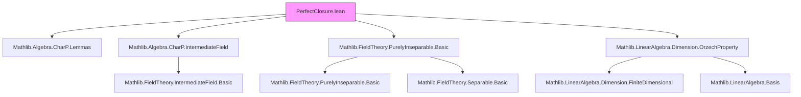

### Technical Brief: `PerfectClosure.lean`

---

#### **1. Key Definitions & Theorems**

| Name | Type / Signature | Purpose |
|------|------------------|---------|
| `perfectClosure F E` | `IntermediateField F E` | Relative perfect closure: elements $x \in E$ such that $x^{q^n} \in F$ for some $n$, where $q = \text{ringExpChar } F$. It is the maximal purely inseparable subextension of $E/F$. |
| `mem_perfectClosure_iff` | $x \in \text{perfectClosure } F E \iff \exists n,\ x^{q^n} \in \text{range}(\mathcal{A})$ | Membership criterion via exponential characteristic power. |
| `mem_perfectClosure_iff_pow_mem` | Same as above, specialized to `ExpChar F q`. | Refinement using explicit exponential characteristic $q$. |
| `mem_perfectClosure_iff_natSepDegree_eq_one` | $x \in \text{perfectClosure } F E \iff \deg_{\text{sep}}(\mu_x) = 1$ | Characterization via separable degree of minimal polynomial. |
| `isPurelyInseparable_iff_perfectClosure_eq_top` | $E/F$ purely inseparable $\iff \text{perfectClosure } F E = \top$ | Equivalence between global purely inseparability and equality with top. |
| `le_perfectClosure_iff` | $L \le \text{perfectClosure } F E \iff L/F$ purely inseparable | Universal property: perfect closure is the largest purely inseparable subextension. |
| `perfectClosure.perfectRing`, `perfectClosure.perfectField` | Instances | If $E$ is perfect, then $\text{perfectClosure } F E$ is perfect. |
| `isPurelyInseparable_adjoin_iff_pow_mem` | $F(S)/F$ purely inseparable $\iff \forall x \in S,\ \exists n,\ x^{q^n} \in F$ | Pure inseparability of finitely generated extensions. |
| `map_mem_perfectClosure_iff`, `perfectClosure.comap_eq_of_algHom`, `perfectClosure.map_le_of_algHom`, `perfectClosure.map_eq_of_algEquiv` | Lemmas about behavior under algebra maps/isomorphisms | Functoriality of perfect closure. |
| `adjoin_eq_adjoin_pow_expChar_pow_of_isSeparable` | Under separability, $F(S) = F(S^{q^n})$ | Frobenius powers generate same extension when separable. |
| `LinearIndependent.map_pow_expChar_pow_of_isSeparable` | Under separability, Frobenius powers preserve linear independence. | Key step in proving basis invariance under Frobenius. |
| `minpoly.iterateFrobenius_of_isSeparable` | $\mu_{a^{q^n}} = \mu_a^{(q^n)}$ under separability | Compatibility of minimal polynomials with Frobenius iteration. |
| `perfectField_of_perfectClosure_eq_bot` | If $E$ perfect and $\text{perfectClosure } F E = \bot$, then $F$ perfect. | Converse direction: perfectness descends under trivial perfect closure. |
| `perfectField_iff_isSeparable_algebraicClosure` | $F$ perfect $\iff$ algebraic closure $E/F$ separable. | Characterization of perfect fields via algebraic closures. |

---

#### **2. Naming Conventions**

- **Prefixes**:
  - `perfectClosure.`: Module-level definitions and lemmas.
  - `isPurelyInseparable_`: Properties of purely inseparable extensions.
  - `adjoin_`: Adjoin constructions (simple or arbitrary sets).
  - `map_`, `comap_`: Behavior under algebra homomorphisms.
  - `le_`: Subfield inclusion lemmas.
  - `eq_`: Equality results (e.g., `eq_bot`, `eq_top`, `eq_of_algEquiv`).
  - `mem_`: Membership criteria.

- **Suffixes**:
  - `_iff`: Biconditional characterizations.
  - `_of_`: Conditions or assumptions (e.g., `of_isSeparable`, `of_algEquiv`).
  - `_pow_expChar`: Frobenius power-related statements.
  - `_simple`: For simple extensions $F(a)$.
  - `_adjoin`: For general adjoin constructions.

---

#### **3. Tactic Stack**

Frequently used tactics in proofs:

| Tactic | Usage |
|--------|-------|
| `rw` / `simp_rw` | Rewriting definitions (e.g., `mem_perfectClosure_iff`, `ringExpChar.eq`). |
| `exact`, `apply`, `intro`, `cases` | Standard proof structure. |
| `ext` | Extensionality for sets/subfields. |
| `convert` / `congr_arg` | Proving equality of structures via underlying components. |
| `aesop` / `linarith` | Automated reasoning for algebraic identities and inequalities. |
| `ring` / `abel` | Simplifying polynomial/ring expressions (e.g., powers, Frobenius). |
| `apply_fun` | Applying functions to equalities (e.g., injectivity arguments). |
| `monoid_hom`, `linear_map`, `submodule` tactics | For module/submodule reasoning. |
| `equivOfEq`, `intermediateFieldMap`, `equiv.trans` | For constructing isomorphisms between intermediate fields. |
| `finite_dimensional` / `finiteDimensional_adjoin` | For finite-dimensional arguments. |

---

#### **4. Proof Logic**

- **Inductive/constructive style**: Most proofs are direct constructions using the definition of `perfectClosure` as elements whose Frobenius powers land in $F$.
- **Case analysis on exponential characteristic**: Many results are parameterized by `ExpChar F q`, allowing specialization.
- **Use of universal properties**: `le_perfectClosure_iff` is central — many proofs reduce to showing pure inseparability or applying the universal property.
- **Functoriality via algebra maps**: Proofs about `map`, `comap`, and `algEquiv` rely on commutativity of Frobenius with algebra maps and injectivity.
- **Separability + Frobenius interplay**: Key lemmas like `adjoin_eq_adjoin_pow_expChar_pow_of_isSeparable` combine separability with Frobenius surjectivity/injectivity.
- **Linear independence preservation**: Proofs use finite-dimensional reduction (`adjoin` + `finiteDimensional_adjoin`) and basis arguments.
- **Minimal polynomial analysis**: Use of `natSepDegree`, `minpoly.dvd`, and `map` to relate separability and Frobenius.

---

#### **5. Imports**

| Module | Purpose |
|--------|---------|
| `Mathlib.Algebra.CharP.Lemmas` | Exponential characteristic, Frobenius, basic lemmas. |
| `Mathlib.Algebra.CharP.IntermediateField` | Interaction of characteristic with intermediate fields. |
| `Mathlib.FieldTheory.PurelyInseparable.Basic` | Definitions and basic properties of purely inseparable extensions. |
| `Mathlib.LinearAlgebra.Dimension.OrzechProperty` | Used for finite-dimensional linear algebra (e.g., basis arguments). |

---

#### **6. Mermaid Diagrams**

##### **Dependency Graph (High-Level)**



##### **Overview of Theory Flow**

```mermaid
flowchart LR
  A[Exponential Char q] --> B[Frobenius map x ↦ x^q]
  B --> C[Iterates x ↦ x^{q^n}]
  C --> D[Definition of perfectClosure]
  D --> E[Characterizations]
  E --> F[mem_perfectClosure_iff]
  E --> G[sepDegree = 1]
  E --> H[purely inseparable ⇔ ≤ perfectClosure]
  D --> I[Functoriality]
  I --> J[map/comap under algebra maps]
  I --> K[algEquiv induces iso]
  D --> L[Perfectness]
  L --> M[If E perfect ⇒ perfectClosure perfect]
  D --> N[Applications]
  N --> O[adjoin = adjoin of Frobenius powers under separability]
  N --> P[Linear independence preserved]
  N --> Q[Minimal polynomials commute with Frobenius]
  N --> R[Perfect field characterization]
```

---

#### **7. Summary**

This file formalizes the theory of **relative perfect closures** in field extensions, especially in positive (exponential) characteristic. It establishes:

- A clean definition of the relative perfect closure as the maximal purely inseparable subextension.
- Multiple equivalent characterizations (via Frobenius powers, separable degree, minimal polynomials).
- Functorial behavior under algebra maps and isomorphisms.
- Preservation of perfectness and separability properties.
- Applications to linear independence, basis behavior, and minimal polynomials under Frobenius.
- A characterization of perfect fields via algebraic closures.

The formalization is highly structured, leveraging Lean’s `IntermediateField`, `Algebra`, and `FieldTheory` infrastructure, and integrates cleanly with existing separability and purely inseparable theory.

--- 

Let me know if you'd like a **dependency tree** of definitions or a **proof sketch** of a specific theorem.
