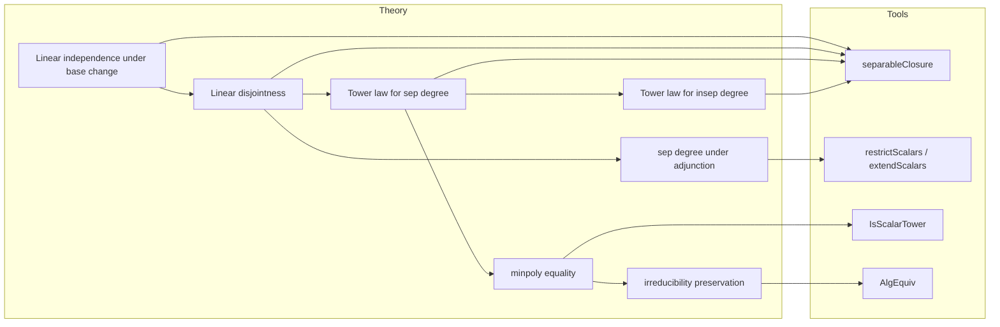

### Technical Brief: Tower.lean — Tower Law for Purely Inseparable Extensions

---

#### **1. Key Definitions & Theorems**

| Name | Type / Signature | Purpose |
|------|------------------|---------|
| `sepDegree F K` | ` Cardinal` | Separable degree $[K:F]_s = \# \text{F-embeddings } K \hookrightarrow \overline{F}$ |
| `insepDegree F K` | ` Cardinal` | Inseparable degree $[K:F]_i = [K:F]/[K:F]_s$ (when algebraic) |
| `finInsepDegree F K` | `ℕ` | Inseparable degree as natural number (when finite) |
| `isPurelyInseparable F E` | `Prop` | $E/F$ is purely inseparable: $\forall a \in E$, $\exists n, a^{p^n} \in F$ |
| `isSeparable F x` | `Prop` | $x$ is separable over $F$: its minpoly over $F$ is separable |
| `LinearIndependent.map_of_isPurelyInseparable_of_isSeparable` | `LinearIndependent F v → LinearIndependent E v` | Separable $F$-lin. ind. families remain $E$-lin. ind. if $E/F$ purely inseparable |
| `IntermediateField.linearDisjoint_of_isPurelyInseparable_of_isSeparable` | `S.LinearDisjoint E` | Separable intermediate field $S/F$ is linearly disjoint from $E$ over $F$ if $E/F$ purely inseparable |
| `sepDegree_eq_of_isPurelyInseparable_of_isSeparable` | `sepDegree F K = Module.rank E K` | If $E/F$ purely inseparable and $K/E$ separable, then $[K:F]_s = [K:E]$ |
| `lift_sepDegree_mul_lift_sepDegree_of_isAlgebraic` | `sepDegree F E * sepDegree E K = sepDegree F K` | Tower law for separable degrees (cardinal version) |
| `sepDegree_mul_sepDegree_of_isAlgebraic` | `sepDegree F E * sepDegree E K = sepDegree F K` | Same-universe version of above |
| `lift_insepDegree_mul_lift_insepDegree_of_isAlgebraic` | `insepDegree F E * insepDegree E K = insepDegree F K` | Tower law for inseparable degrees (cardinal) |
| `insepDegree_mul_insepDegree_of_isAlgebraic` | `insepDegree F E * insepDegree E K = insepDegree F K` | Same-universe version |
| `finInsepDegree_mul_finInsepDegree_of_isAlgebraic` | `finInsepDegree F E * finInsepDegree E K = finInsepDegree F K` | Tower law for *finite* inseparable degrees (natural numbers) |
| `sepDegree_adjoin_eq_of_isAlgebraic_of_isPurelyInseparable` | `sepDegree E (adjoin E S) = sepDegree F (adjoin F S)` | Adjoining algebraic elements to a purely inseparable base does not change separable degree |
| `sepDegree_adjoin_eq_of_isAlgebraic_of_isPurelyInseparable'` | `sepDegree E (adjoin E S) = sepDegree F S` | Special case for intermediate fields $S$ |
| `minpoly.map_eq_of_isSeparable_of_isPurelyInseparable` | `(minpoly F x).map = minpoly E x` | Separable elements have same minpoly over $F$ and $E$ if $E/F$ purely inseparable |
| `Polynomial.Separable.map_irreducible_of_isPurelyInseparable` | `Irreducible (f.map)` | Separable irreducible polynomials stay irreducible over purely inseparable extensions |

---

#### **2. Naming Conventions**

- **Prefixes**:
  - `lift_`: Cardinal versions (for possibly infinite degrees).
  - `fin_`: Natural-number versions (finite degrees).
  - `sepDegree`, `insepDegree`: Standard notation for separable/inseparable degree.
  - `map_`: Refers to polynomial/map ring homomorphism.
  - `adjoin_`: Refers to adjunction of sets/fields.

- **Suffixes**:
  - `_of_isAlgebraic`: Hypothesis that the middle extension is algebraic.
  - `_of_isSeparable`, `_of_isPurelyInseparable`: Hypothesis on the nature of the extension.
  - `_eq`: Equality result (often special case or intermediate step).
  - `_mul_`: Tower law (multiplicative behavior).

- **Other patterns**:
  - `LinearIndependent.map_...`: Behavior of linear independence under base change.
  - `IntermediateField.sepDegree_adjoin_...`: Behavior of separable degree under adjunction.

---

#### **3. Tactic Stack**

| Tactic | Usage Frequency | Purpose |
|--------|-----------------|---------|
| `rw` | Very High | Rewriting definitions (e.g., `sepDegree`, `insepDegree`, `adjoin`, `restrictScalars`) |
| `simp_rw` | High | Simplified rewriting with `simp`-like behavior |
| `convert` | High | Matching goals modulo definitional equality (e.g., `convert h using n`) |
| `have` / `obtain` | Very High | Introducing intermediate lemmas or witnesses |
| `rwa` | High | `rw` + `assumption` (often after `have`) |
| `exact` / `refine` | High | Finishing proofs or constructing terms with holes |
| `congr` | Medium | Congruence reasoning (e.g., `congr($h)`) |
| `change` | Medium | Changing goal to definitionally equal form |
| `convert ... using 1` | Medium | Fine-grained control over conversion |
| `aesop` / `linarith` / `ring` | Low | Not used in this file — heavy reliance on algebraic reasoning |
| `cases` | Low | Rare; mostly used implicitly via `obtain` |

---

#### **4. Proof Logic**

- **Inductive / structural reasoning** is minimal; proofs are largely *algebraic* and *categorical*.
- **Common proof patterns**:
  1. **Reduction to known cases**:
     - Reduce tower law for general algebraic extensions to cases where one step is separable or purely inseparable.
     - Use `separableClosure` to decompose extensions: $F \subseteq \mathrm{SepCl}_F(K) \subseteq K$.
  2. **Linear disjointness arguments**:
     - Prove linear disjointness via linear independence of separable bases (e.g., `linearDisjoint_of_isPurelyInseparable_of_isSeparable`).
  3. **Base change via scalar restriction / extension**:
     - Use `restrictScalars`, `extendScalars`, `AlgEquiv.ofInjectiveField`, and `IsScalarTower` to manipulate towers.
  4. **Minpoly & separability interplay**:
     - Use `minpoly.map_eq_of_isSeparable_of_isPurelyInseparable` to equate minpolys over $F$ and $E$.
     - Use `minpoly.irreducible`, `minpoly.monic`, `natDegree_map`, etc., to compare degrees.
  5. **Cardinal arithmetic**:
     - Use `lift_rank`, `lift_sepDegree`, `lift_insepDegree`, and `Cardinal.lift_id` to switch between universe levels.
     - `Cardinal.toNat_lift` for finite-degree versions.

- **Typical flow**:
  > Introduce separable closure → apply known tower law for separable/purely inseparable steps → rewrite using lemmas like `sepDegree_eq_of_isPurelyInseparable` → simplify cardinal arithmetic.

---

#### **5. Imports**

| Module | Purpose |
|--------|---------|
| `Mathlib.FieldTheory.LinearDisjoint` | Linear disjointness, base change, rank formulas |
| `Mathlib.FieldTheory.PurelyInseparable.PerfectClosure` | Purely inseparable extensions, perfect closure, exponential characteristic |
| `Mathlib.FieldTheory.SeparableClosure` (implicit via `separableClosure`) | Separable closure, its properties (e.g., `separableClosure_eq_bot`, `map_eq`) |
| `Mathlib.FieldTheory.Finite` (implicit via `finInsepDegree`, `finSepDegree`) | Finite-dimensional field extensions |
| `Mathlib.RingTheory.Polynomial.Minpoly` (implicit via `minpoly`) | Minimal polynomials, separability, integrality |
| `Mathlib.Module.Rank` (implicit via `Module.rank`, `finrank`) | Rank of modules, especially vector spaces |
| `Mathlib.Algebra.Algebra.Tower` (implicit via `IsScalarTower`) | Tower laws for algebras |

---

#### **6. Mermaid Diagrams**

##### **Dependency Graph (Theorems)**

```mermaid
graph TD
  A[sepDegree_eq_of_isPurelyInseparable_of_isSeparable] --> B[sepDegree_eq_of_isPurelyInseparable]
  A --> C[sepDegree_mul_sepDegree_of_isAlgebraic]
  D[sepDegree_eq_of_isSeparable] --> C
  E[lift_sepDegree_mul_lift_sepDegree_of_isAlgebraic] --> C
  F[sepDegree_adjoin_eq_of_isAlgebraic_of_isPurelyInseparable] --> G[sepDegree_adjoin_eq_of_isAlgebraic_of_isPurelyInseparable']
  H[minpoly.map_eq_of_isSeparable_of_isPurelyInseparable] --> I[Polynomial.Separable.map_irreducible_of_isPurelyInseparable]
  J[LinearIndependent.map_of_isPurelyInseparable_of_isSeparable] --> F
  K[IntermediateField.linearDisjoint_of_isPurelyInseparable_of_isSeparable] --> F
  L[sepDegree_eq_of_isPurelyInseparable] --> E
  M[lift_rank_mul_lift_sepDegree_of_isSeparable] --> E
  N[lift_rank_mul_lift_insepDegree_of_isPurelyInseparable] --> O[insepDegree_mul_insepDegree_of_isAlgebraic]
  P[insepDegree_eq_of_isSeparable] --> O
```

##### **Overview of File Structure**

---

#### **7. Theory Context**

- **Main goal**: Establish the *tower law* for both separable and inseparable degrees in arbitrary (possibly infinite) field extensions, especially when one step is purely inseparable.
- **Key insight**: Purely inseparable extensions do not affect separable degrees — they only contribute to inseparable degrees.
- **Bridge tools**:
  - `separableClosure` decomposes any algebraic extension into a separable and a purely inseparable part.
  - Linear disjointness allows decomposition of tensor products and ranks.
  - Minpoly behavior under base change links separability and irreducibility.

---

#### **8. Tags & References**

- **Tags**: `separable degree`, `degree`, `separable closure`, `purely inseparable`, `tower law`, `linear disjointness`, `minimal polynomial`
- **Stacks Project Tags**:
  - `09HK` (Part 1 & 2): Tower law for separable and inseparable degrees.
- **Mathlib module**: `FieldTheory.Tower`

--- 

Let me know if you'd like a formalized dependency graph in `.lean` format or a visualization of the proof DAG.
