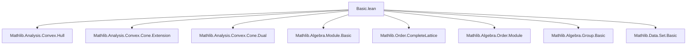
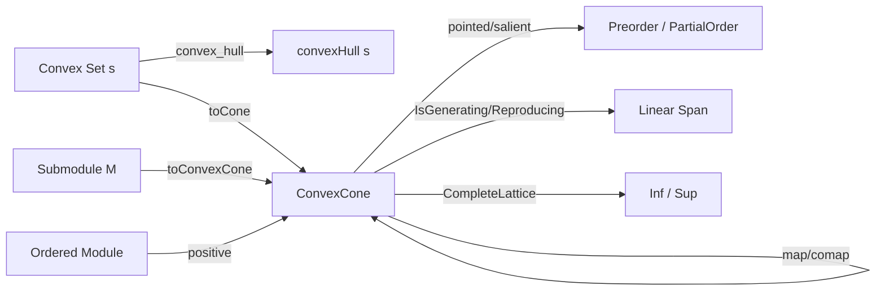
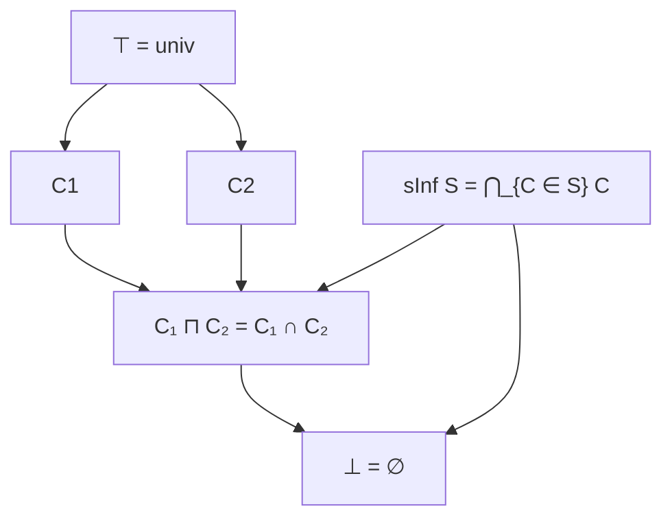

**Technical Brief: `Basic.lean` — Convex Cones in Lean 4 / Mathlib**

---

### 1. Key Definitions & Theorems

| Name | Type / Signature | Purpose |
|------|------------------|---------|
| `ConvexCone R M` | `Structure` | A *bundled* convex cone: a subset `carrier ⊆ M` closed under positive scalar multiplication and addition. |
| `smul_mem'`, `add_mem'` | `∀ c > 0, x ∈ C → c • x ∈ C`, `x, y ∈ C → x + y ∈ C` | Defining closure properties of convex cones. |
| `ext` | `∀ x, x ∈ C₁ ↔ x ∈ C₂ → C₁ = C₂` | Extensionality for convex cones. |
| `hull R s` | `ConvexCone R M` | Smallest convex cone containing a set `s`. |
| `map f C` | `ConvexCone R N` | Image of cone `C` under linear map `f : M →ₗ N`. |
| `comap f C` | `ConvexCone R M` | Preimage of cone `C` under linear map `f`. |
| `Pointed C` | `0 ∈ C` | Cone contains zero. |
| `Blunt C` | `0 ∉ C` | Cone excludes zero. |
| `Flat C` | `∃ x ≠ 0, x ∈ C ∧ -x ∈ C` | Cone contains a line through origin. |
| `Salient C` | `x ∈ C ∧ x ≠ 0 → -x ∉ C` | Cone contains no lines (i.e., is pointed and salient). |
| `toPreorder C h₁` | `Preorder G` | Preorder induced by a *pointed* cone. |
| `toPartialOrder C h₁ h₂` | `PartialOrder G` | Partial order induced by a *pointed & salient* cone. |
| `positive R M` | `ConvexCone R M` | Positive cone of an ordered module: `{x | 0 ≤ x}`. |
| `strictlyPositive R M` | `ConvexCone R M` | Strictly positive cone: `{x | 0 < x}`. |
| `toCone hs s` | `ConvexCone 𝕜 M` | Cone generated by a convex set `s` (via positive scaling). |
| `IsGenerating C` | `Submodule.span (C : Set M) = ⊤` | Cone spans the whole module. |
| `IsReproducing C` | `(C - C) = univ` | Every element is a difference of two cone elements. |
| `isGenerating_iff_isReproducing` | `C.IsGenerating ↔ C.IsReproducing` | Equivalence under ordered field assumptions. |
| `toConvexCone C` | `Submodule R M → ConvexCone R M` | Embedding of submodules into convex cones. |

**Key Theorems:**
- `ConvexCone.instCompleteLattice`: Convex cones form a complete lattice.
- `mem_hull_of_convex`: For convex `s`, `x ∈ hull s ↔ ∃ r > 0, x ∈ r • s`.
- `toCone_isLeast`: `toCone s` is the least cone containing `s`.
- `salient_positive`, `blunt_strictlyPositive`: Structural properties of standard cones.
- `IsGenerating.isReproducing` / `IsReproducing.isGenerating`: Equivalence of generating and reproducing under ordered field assumptions.

---

### 2. Naming Conventions

| Pattern | Meaning | Examples |
|--------|---------|----------|
| `is_` / `inst_` / `to_` | Predicate / instance / conversion | `isGenerating`, `instCompleteLattice`, `toPreorder`, `toConvexCone` |
| `mem_` / `coe_` | Membership / coercion lemmas | `mem_zero`, `coe_map`, `coe_positive` |
| `hull`, `map`, `comap` | Standard constructions | `hull`, `map`, `comap` |
| `pointed`, `blunt`, `flat`, `salient` | Qualifiers on cones | `Pointed`, `Blunt`, `Flat`, `Salient` |
| `positive`, `strictlyPositive` | Canonical cones in ordered modules | `positive`, `strictlyPositive` |
| `toCone`, `toConvexCone` | Constructions from other structures | `toCone`, `toConvexCone` |

---

### 3. Tactic Stack

| Tactic | Frequency | Purpose |
|--------|-----------|---------|
| `simp` / `simp_rw` | Very high | Simplify goals using definitional equalities, especially `coe_` lemmas. |
| `rw` | High | Rewrite using lemmas like `mem_map`, `mem_comap`, `coe_add`, etc. |
| `exact` / `intro` / `cases` | High | Standard proof structure. |
| `aesop` | Medium | Automated reasoning for set-theoretic properties (e.g., `SetLike` class). |
| `norm_cast` | Medium | Normalize coercions (e.g., `↑(C₁ ⊓ C₂) = C₁ ∩ C₂`). |
| `ext` | Medium | Prove equality of cones via extensionality. |
| `rwa`, `rintro`, `rcases` | Medium | Advanced intro/case tactics for structured hypotheses. |
| `convert` | Low | For equational reasoning with definitional equality gaps. |

---

### 4. Proof Logic

**Typical proof structure:**
1. **Structure introduction**: Use `intro`, `cases`, or `ext` to unpack bundled objects.
2. **Set-theoretic reasoning**: Reduce to membership in carrier sets via `coe_` lemmas.
3. **Closure properties**: Apply `smul_mem'`, `add_mem'`, or their derived lemmas (`smul_mem`, `add_mem`).
4. **Induction / case analysis**: For properties like `Pointed`, `Blunt`, `Salient`, often use `by_cases` or `by_contra`.
5. **Lattice-theoretic reasoning**: Use `sInf_le`, `le_sInf`, `subset_hull`, etc., for hull/minimality arguments.
6. **Field-specific scaling**: In `LinearOrderedField`, use `smul_mem_iff` and `inv_smul_smul₀` to invert scaling.

**Common patterns:**
- Prove `C₁ = C₂` by `ext` + `mem_` lemmas.
- Prove `C₁ ≤ C₂` by showing `x ∈ C₁ → x ∈ C₂`.
- Use `hull_min` / `toCone_isLeast` to show minimality of constructions.
- For ordered modules, reduce algebraic properties (e.g., `IsOrderedAddMonoid`) to cone properties.

---

### 5. Imports & Dependencies

| Import | Role |
|--------|------|
| `Mathlib.Analysis.Convex.Hull` | Provides `convexHull`, `convex_convexHull`, foundational convexity. |
| `Set`, `LinearMap`, `Pointwise` | Core utilities for sets, linear maps, and pointwise operations. |
| `PartialOrder`, `Semiring`, `Module`, `AddCommMonoid`, `AddCommGroup` | Algebraic typeclass infrastructure. |
| `GaloisInsertion`, `CompleteLattice`, `Preorder`, `IsOrderedAddMonoid` | Order-theoretic infrastructure. |
| `Field`, `LinearOrder`, `IsStrictOrderedRing`, `PosSMulMono`, `PosSMulStrictMono` | For ordered field and module theory. |

---

### 6. Mermaid Diagrams

#### Dependency Graph (Module-Level)

#### Overview of Theory Flow

#### Lattice Structure of Convex Cones

---

### 7. Summary

This file formalizes the foundational theory of **convex cones** in the context of modules over ordered semirings/fields. It introduces:
- Bundled convex cones (`ConvexCone R M`) with closure under positive linear combinations.
- A complete lattice structure, with `hull` as the left adjoint to coercion.
- Image/preimage constructions under linear maps (`map`, `comap`).
- Qualifiers (`Pointed`, `Blunt`, `Flat`, `Salient`) and their logical relations.
- Correspondence between cones and ordered algebraic structures (`toPreorder`, `toPartialOrder`).
- Generating/reproducing cones and their equivalence over ordered fields.
- Embedding of submodules and construction of cones from convex sets (`toCone`).

It serves as the core module for subsequent developments in convex analysis (e.g., Hahn–Banach, Riesz extension) and duality theory.

--- 

*End of Technical Brief.*
