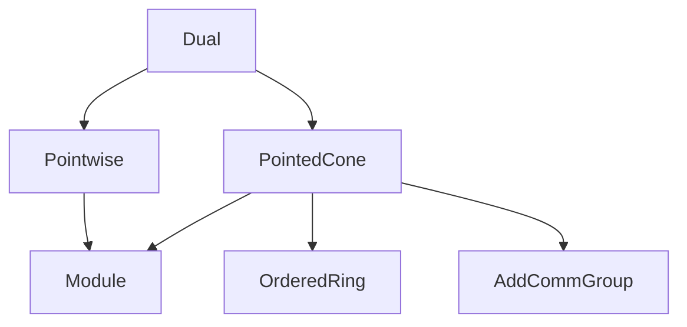

**Technical Brief: `Dual.lean` — Algebraic Dual of a Cone**

---

### 1. **Key Definitions & Theorems**

| Name | Type / Signature | Purpose |
|------|------------------|---------|
| `dual p s` | `PointedCone R N` | Defines the *dual cone* of a set `s ⊆ M` w.r.t. bilinear pairing `p : M →ₗ[R] N →ₗ[R] R`: all `y ∈ N` s.t. `∀ x ∈ s, 0 ≤ p x y`. |
| `mem_dual` | `y ∈ dual p s ↔ ∀ ⦃x⦄, x ∈ s → 0 ≤ p x y` | Membership characterization (definitional). |
| `dual_empty`, `dual_zero` | `dual p ∅ = ⊤`, `dual p 0 = ⊤` | Dual of empty or zero set is the full pointed cone. |
| `dual_univ` | `Injective p.flip ⇒ dual p univ = 0` | If pairing is injective in second argument, dual of whole space is `{0}`. |
| `dual_le_dual` | `t ⊆ s ⇒ dual p s ≤ dual p t` | Monotonicity: larger primal set ⇒ smaller dual cone. |
| `dual_singleton` | `dual p {x} = (positive R R).comap (p x)` | Dual of singleton = preimage of nonnegative reals under linear map `p x`. |
| `dual_union`, `dual_insert`, `dual_iUnion`, `dual_sUnion` | Various union/intersection laws | Dual distributes over unions as intersection of duals (contravariant). |
| `dual_eq_iInter_dual_singleton` | `dual p s = ⋂ i : s, dual p {i.val}` | Dual of arbitrary set = intersection of duals of its points. |
| `subset_dual_dual` | `s ⊆ dual p.flip (dual p s)` | Primal ⊆ double dual (canonical embedding). |
| `dual_dual_flip_dual` | `dual p (dual p.flip (dual p s)) = dual p s` | Triple dual retracts to primal dual (idempotent closure). |
| `dual_flip_dual_dual_flip` | `dual p.flip (dual p (dual p.flip s)) = dual p.flip s` | Symmetric version for dual of dual of dual. |
| `dual_span` | `dual p (span R s) = dual p s` | Dual depends only on span (i.e., linear hull), not on set itself. |

---

### 2. **Naming Conventions**

- **Prefixes**:
  - `dual_`: all functions/lemmas about dual cone construction.
  - `mem_`: membership lemmas (`mem_dual`).
  - `subset_`, `dual_le_`: inclusion/monotonicity lemmas.
- **Suffixes**:
  - `_flip`: indicates use of flipped pairing `p.flip : N →ₗ[R] M →ₗ[R] R`.
  - `_dual`, `_dual_flip`: denote dual w.r.t. `p` or `p.flip`.
  - `_singleton`, `_union`, `_insert`, `_iUnion`, `_sUnion`, `_span`: indicate structural argument (e.g., singleton, union, span).
- **Notation**:
  - `R≥0` abbreviates `{c : R // 0 ≤ c}` (nonnegative elements).
  - `positive R R` is the pointed cone of nonnegative elements in `R`.

---

### 3. **Tactic Stack**

Frequently used tactics in proofs:

| Tactic | Role |
|--------|------|
| `simp` | Simplify goals using definitional equalities and lemmas (e.g., `mem_dual`, `dual_empty`). |
| `aesop` | Automated reasoning for order-theoretic and lattice-theoretic goals (e.g., `dual_union`). |
| `ext` | Extensionality for sets/cones (proving equality by membership). |
| `rw` | Rewriting using lemmas (e.g., `map_add`, `map_smul`, `Nonneg.coe_smul`). |
| `exact`, `apply`, `intro`, `intro x hx`, `intro y hy` | Standard intro/apply for implications and universal quantifiers. |
| `induction ... using Submodule.span_induction` | Structural induction on submodule span (used in `dual_span`). |
| `antisymm'`, `le_antisymm` | Prove equality of cones/sets via mutual inclusion. |
| `simpa using` | Simplify and discharge using a hypothesis (e.g., `simpa using hy <| mem_univ (-x)`). |

---

### 4. **Proof Logic**

- **Structure**: Most proofs follow a *two-step inclusion* pattern:
  1. Show `A ⊆ B` via `intro y hy x hx` and apply assumptions.
  2. Show `B ⊆ A` similarly, or use monotonicity (`dual_le_dual`) and `subset_dual_dual`.
- **Induction**: Used only in `dual_span`, where one inducts on the construction of `span R s` (zero, add, scalar mult).
- **Symmetry**: Lemmas like `dual_dual_flip_dual` and `dual_flip_dual_dual_flip` exploit symmetry between `p` and `p.flip`, often via `dual_dual_flip_dual _`.
- **Lattice-theoretic reasoning**: Duals turn unions into intersections (`dual_union`, `dual_iUnion`, etc.), reflecting contravariance.

---

### 5. **Imports**

| Module | Purpose |
|--------|---------|
| `Mathlib.Algebra.Module.Submodule.Pointwise` | Provides `Pointwise.smul_mem`, `span`, and related module-theoretic tools. |
| `Mathlib.Geometry.Convex.Cone.Pointed` | Defines `PointedCone`, `positive R R`, `comap`, and order structure on cones. |

> **Note**: No topological assumptions (e.g., continuity) are made here — this is strictly *algebraic* duality.

---

### 6. **Mermaid Diagrams**

#### **Dependency Graph (Module-Level)**



#### **Conceptual Overview of `dual` Construction**

```mermaid
graph LR
  s:Set M -->|dual p| dual_p_s:PointedCone R N
  p:M →ₗ N →ₗ R -->|pairing| dual_p_s
  s -->|subset| t -->|dual_le_dual| dual_p_s ≤ dual_p_t
  s -->|span| span s -->|dual_span| dual p s = dual p (span s)
  s -->|double dual| dual_flip (dual p s) -->|subset_dual_dual| s ⊆ ...
  dual_flip (dual p s) -->|triple dual| dual p (dual_flip (dual p s)) = dual p s
```

#### **Lattice-Theoretic Behavior**

```mermaid
graph LR
  s ∪ t -->|dual| dual p s ∩ dual p t
  ⋃ᵢ sᵢ -->|dual| ⋂ᵢ dual p sᵢ
  ⋃₀ S -->|dual| ⋂ C ∈ image dual p S, C
```

---

### 7. **Domain-Specific AI Agent Guidance**

- **Focus areas for reasoning**:  
  - Contravariance (`dual_le_dual`) and idempotence (`dual_dual_flip_dual`).  
  - Span invariance (`dual_span`) — key for reducing to finite sets.  
  - Singleton decomposition (`dual_eq_iInter_dual_singleton`) — useful for finite-dimensional cases.
- **Common proof patterns**:  
  - Use `subset_dual_dual` + `dual_le_dual` to prove equality of double/triple duals.  
  - Use `dual_span` to replace arbitrary `s` by `span s` when needed.  
  - Use `dual_singleton` + `comap` to reduce to linear preimage of `R≥0`.
- **Potential extensions**:  
  - Polyhedral cones: use `dual_flip_dual_dual_flip` to show invariance under double dual.  
  - Topological dual: lift to `Analysis.Convex.Cone.Dual` with continuity assumptions.

--- 

Let me know if you'd like a formalized tactic trace or a proof assistant-ready summary for automation.
