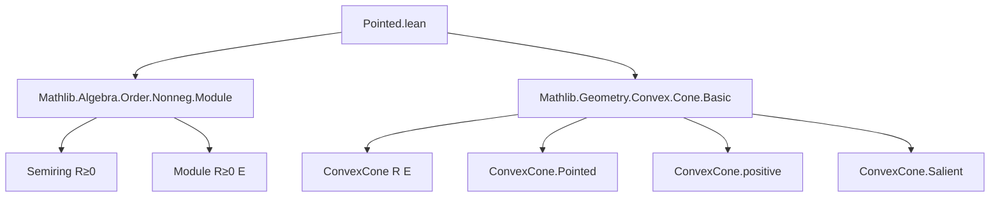

**Technical Brief: `Pointed.lean` Module**

---

### 1. Key Definitions & Theorems

| Name | Type / Signature | Purpose |
|------|------------------|---------|
| `PointedCone R E` | `abbrev PointedCone (R E) [Semiring R] [PartialOrder R] [IsOrderedRing R] [AddCommMonoid E] [Module R E] := Submodule {c : R // 0 ≤ c} E` | Bundled definition of a *pointed cone* as a submodule over the semiring of nonnegative scalars `R≥0`. |
| `toConvexCone` | `def toConvexCone (C : PointedCone R E) : ConvexCone R E` | Forgets the `R≥0`-module structure and views `C` as a convex cone over `R`. |
| `ConvexCone.toPointedCone` | `def ConvexCone.toPointedCone (C : ConvexCone R E) (hC : C.Pointed) : PointedCone R E` | Converts a *pointed* convex cone into a pointed cone (i.e., `R≥0`-submodule). |
| `span` | `abbrev span (s : Set E) : PointedCone R E := Submodule.span R≥0 s` | The smallest pointed cone containing a set `s`, i.e., conical combinations with nonnegative coefficients. |
| `mem_span_set` | `x ∈ span R s ↔ ∃ c : E →₀ R, ...` | Characterizes membership in the span as finite nonnegative linear combinations. |
| `map` | `def map (f : E →ₗ[R] F) (C : PointedCone R E) : PointedCone R F` | Pushforward of a pointed cone along an `R`-linear map. |
| `comap` | `def comap (f : E →ₗ[R] F) (C : PointedCone R F) : PointedCone R E` | Pullback of a pointed cone along an `R`-linear map. |
| `positive` | `def positive R E : PointedCone R E` | The *positive cone* in an ordered module: all `x` with `0 ≤ x`. |
| `salient_iff_inter_neg_eq_singleton` | `lemma salient_iff_inter_neg_eq_singleton (C : PointedCone R E)` | Relates saliency of a convex cone (as a pointed cone) to `C ∩ -C = {0}`. |
| `canLift` | `instance canLift : CanLift (ConvexCone R E) (PointedCone R E) (↑) ConvexCone.Pointed` | Shows every pointed convex cone lifts uniquely to a pointed cone. |

**Theorems (selected):**
- `toConvexCone_injective`: The coercion `PointedCone → ConvexCone` is injective.
- `pointed_toConvexCone`: Every `C.toConvexCone` is pointed.
- `mem_toConvexCone`: Membership is preserved under coercion.
- `map_map`, `map_id`, `comap_comap`, `comap_id`: Functoriality of `map`/`comap`.
- `to_isOrderedModule`: Constructs an ordered module structure from a pointed cone defining the order.

---

### 2. Naming Conventions

- **Prefixes:**
  - `to_`: Coercion/conversion (e.g., `toConvexCone`, `toPointedCone`).
  - `mem_`: Membership characterizations (e.g., `mem_map`, `mem_comap`, `mem_positive`).
  - `coe_`: Coercion lemmas (e.g., `coe_map`, `coe_comap`, `coe_toPointedCone`).
  - `of_`: Construction from a more primitive notion (e.g., `ofConeComb`).
- **Suffixes:**
  - `_iff`: Biconditional characterizations (e.g., `salient_iff_inter_neg_eq_singleton`).
  - `_set`: Set-theoretic membership or description (e.g., `mem_span_set`).
- **Notation:**
  - `R≥0`: Local notation for `{c : R // 0 ≤ c}`.
  - `↑C`: Coercion to `ConvexCone R E`.

---

### 3. Tactic Stack

Frequent tactics used in proofs:
- `simp` / `simp_rw`: Simplification, especially with `SetLike` lemmas and coercion.
- `rfl`: Reflexivity for definitional equalities (e.g., coercion lemmas).
- `convert`: To match goals up to definitional equality (e.g., in `toPointedCone`).
- `rcases` / `cases`: Case analysis on `eq_or_lt_of_le`, existential quantifiers.
- `SetLike.coe_injective`: To prove equality of submodules/cones by extensionality.
- `aesop`: Likely used in routine goals (not explicitly shown, but standard in modern Mathlib).
- `unfold`, `convert`, `simp +contextual`: For structured rewriting in ordered algebra contexts.

---

### 4. Proof Logic

- **Structure:** Most proofs follow a *definitional + extensionality* pattern:
  1. Unfold definitions (e.g., `toConvexCone`, `mem_map`).
  2. Use `SetLike.ext` or `Subtype.ext` to reduce to element-wise reasoning.
  3. Apply module axioms (`smul_mem`, `add_mem`, `zero_mem`) or convexity properties.
- **Key reasoning patterns:**
  - *Induction on finite support* for `mem_span_set`.
  - *Case split on `0 ≤ r` vs `0 < r`* in `toPointedCone`.
  - *Equational reasoning* for functoriality (`map_map`, `comap_comap`).
  - *Order-theoretic equivalence* (`x ≤ y ↔ y - x ∈ C`) in `to_isOrderedModule`.

---

### 5. Imports

| Import | Purpose |
|--------|---------|
| `Mathlib.Algebra.Order.Nonneg.Module` | Defines `R≥0`, its semiring structure, and module theory over it. |
| `Mathlib.Geometry.Convex.Cone.Basic` | Provides `ConvexCone`, `ConvexCone.Pointed`, `ConvexCone.positive`, saliency, etc. |

These imports define the ambient algebraic and convex-geometric context.

---

### 6. Mermaid Diagrams

#### Dependency Graph (Module-Level)



#### Overview of Theory Flow

```mermaid
flowchart LR
  ConvexCone -- pointed --> PointedCone
  PointedCone -- coercion --> ConvexCone
  PointedCone -- span --> Submodule.span over R≥0
  PointedCone -- map/comap --> LinearMap
  PointedCone -- positive --> OrderedModule
  PointedCone -- to_isOrderedModule --> IsOrderedModule
  ConvexCone -- salient --> Intersect with neg = {0}
```

---

### 7. Summary

This module formalizes *pointed cones* as `R≥0`-submodules of an `R`-module `E`, where `R` is an ordered semiring. It bridges convex geometry (via `ConvexCone`) and module theory, enabling use of the rich `Submodule` API for convex-cone reasoning. Key features include:
- Equivalence between pointed convex cones and pointed cones.
- Functorial image/preimage along linear maps.
- Explicit description of spans via nonnegative finite combinations.
- Construction of ordered modules from cones.

The design prioritizes *bundled* structures for modularity and reuse of existing algebraic infrastructure.
