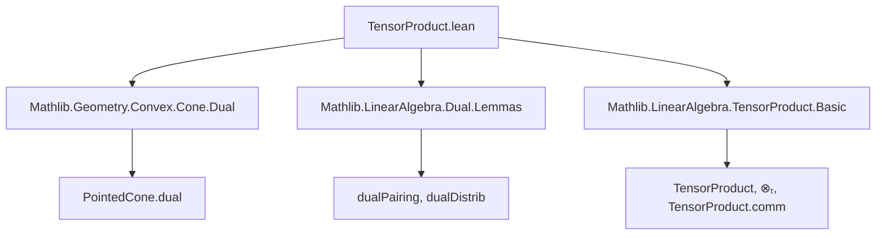
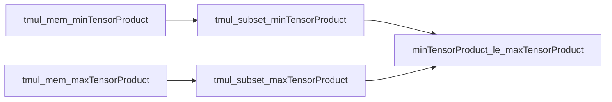

### Technical Brief: `TensorProduct.lean`

---

#### **1. Key Definitions & Theorems**

| Name | Type / Signature | Purpose |
|------|------------------|---------|
| `minTensorProduct` | `PointedCone R G → PointedCone R H → PointedCone R (G ⊗[R] H)` | Constructs the *minimal* cone on the tensor product: conical hull of elementary tensors $x \otimes_\mathbb{R} y$ with $x \in C_1, y \in C_2$. |
| `maxTensorProduct` | `PointedCone R G → PointedCone R H → PointedCone R (G ⊗[R] H)` | Constructs the *maximal* cone: dual of the minimal tensor product of dual cones. |
| `mem_maxTensorProduct` | `z ∈ maxTensorProduct C₁ C₂ ↔ ∀ φ ∈ C₁*, ∀ ψ ∈ C₂*, 0 ≤ ⟨φ ⊗ ψ, z⟩` | Characterizes membership in the maximal tensor product via nonnegativity of pairings with elementary dual tensors. |
| `tmul_mem_minTensorProduct` | `x ∈ C₁ → y ∈ C₂ → x ⊗ₜ y ∈ minTensorProduct C₁ C₂` | Elementary tensors lie in the minimal tensor product. |
| `tmul_mem_maxTensorProduct` | `x ∈ C₁ → y ∈ C₂ → x ⊗ₜ y ∈ maxTensorProduct C₁ C₂` | Elementary tensors lie in the maximal tensor product. |
| `minTensorProduct_le_maxTensorProduct` | `minTensorProduct C₁ C₂ ≤ maxTensorProduct C₁ C₂` | Fundamental inequality: minimal ≤ maximal. |
| `minTensorProduct_comm` | `(minTensorProduct C₁ C₂).map comm = minTensorProduct C₂ C₁` | Commutativity of minimal tensor product up to the tensor swap isomorphism. |
| `maxTensorProduct_comm` | `(maxTensorProduct C₁ C₂).map comm = maxTensorProduct C₂ C₁` | Commutativity of maximal tensor product up to the tensor swap isomorphism. |

---

#### **2. Naming Conventions**

- **Prefixes**:
  - `minTensorProduct`, `maxTensorProduct`: indicate construction type.
  - `tmul_...`: refers to elementary tensor (`tensor mul`) properties.
- **Suffixes**:
  - `_le_`: inequality between cones (e.g., `minTensorProduct_le_maxTensorProduct`).
  - `_comm`: commutativity under tensor swap.
- **Variables**:
  - `x, y, z`: elements of original cones or tensor product.
  - `φ, ψ`: elements of dual cones.

---

#### **3. Tactic Stack**

Frequently used tactics in proofs:
- `simp only [...]`: heavily used to unfold definitions and simplify goals.
- `exact`, `intro`, `refine`: standard proof construction.
- `ext`: extensionality for cones (as sets/submodules).
- `rw`, `simpa`: rewriting and simplifying using lemmas.
- `map`, `span`, `Submodule.span_le`: for reasoning about submodules and cones.

No heavy automation (e.g., `aesop`, `ring`, `linarith`) is used—proofs are mostly structural and rely on algebraic properties of tensor products and dual pairings.

---

#### **4. Proof Logic**

- **Structure**: Proofs are largely *definition-driven* and *elementary*:
  - Definitions of `minTensorProduct` and `maxTensorProduct` are in terms of spans and duals.
  - Membership lemmas (`mem_maxTensorProduct`) reduce to universal quantification over dual elements.
  - Inclusion proofs (`tmul_subset_...`) use `Submodule.span_le` and element-wise reasoning.
  - Inequality `minTensorProduct_le_maxTensorProduct` follows from subset inclusion of generators.
  - Commutativity proofs use `TensorProduct.comm` and properties of `dualDistrib`.

- **Induction**: Not used directly; instead, reasoning is based on:
  - Submodule span properties,
  - Duality,
  - Tensor product universal properties.

---

#### **5. Imports & Dependencies**

| Module | Role |
|--------|------|
| `Mathlib.Geometry.Convex.Cone.Dual` | Provides `PointedCone.dual`, dual cone construction. |
| `Mathlib.LinearAlgebra.Dual.Lemmas` | Tools for dual modules, pairings, `dualPairing`, `dualDistrib`. |
| `Mathlib.LinearAlgebra.TensorProduct.Basic` | Tensor product module, `⊗ₜ`, `TensorProduct.comm`, `TensorProduct.map`. |

**Key auxiliary constructs used**:
- `PointedCone`: cones as submodules (pointed subsemimodules of additive monoids).
- `dualPairing`, `dualDistrib`: canonical isomorphisms between duals and tensor duals.
- `TensorProduct.comm`: symmetry isomorphism $G \otimes H \cong H \otimes G$.

---

#### **6. Mermaid Diagrams**

##### **Dependency Graph (Module Level)**



##### **Conceptual Overview of Cone Constructions**

```mermaid
graph LR
  C1[PointedCone R G] -->|⊗ₜ| C1C2[Elementary tensors x⊗y]
  C2[PointedCone R H] -->|⊗ₜ| C1C2
  C1C2 -->|span| min[minTensorProduct C₁ C₂]
  
  C1 -->|dual| C1*[(C₁)*]
  C2 -->|dual| C2*[(C₂)*]
  C1* -->|⊗ₜ| C1*C2*[Elementary dual tensors φ⊗ψ]
  C2* -->|⊗ₜ| C1*C2*
  C1*C2* -->|span| minDual[minTensorProduct C₁* C₂*]
  minDual -->|dual| max[maxTensorProduct C₁ C₂]
  
  min -->|⊆| max
```

##### **Proof Flow for `minTensorProduct_le_maxTensorProduct`**



---

#### **7. Summary**

This file formalizes the theory of *tensor products of pointed cones* over a strictly ordered commutative ring $R$. It defines two canonical cone structures on the tensor product module $G \otimes_R H$, establishes their basic properties (elementary tensor inclusion, duality characterization), and proves the foundational inequality `min ≤ max`. The development is clean, modular, and leverages Lean’s `PointedCone` and tensor product infrastructure from Mathlib. It serves as a foundation for further work on entanglement and separability in ordered algebraic contexts, as referenced in Aubrun et al. (2021).
