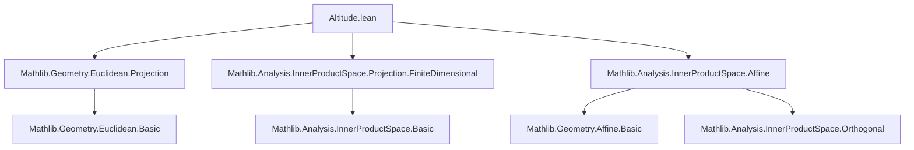

### Technical Brief: `Altitude.lean` — Altitudes of a Simplex in Euclidean Geometry

---

#### **1. Key Definitions & Theorems**

| Name | Type / Signature | Purpose |
|------|------------------|---------|
| `altitude` | `Simplex ℝ P n → Fin (n+1) → AffineSubspace ℝ P` | Defines the altitude line through vertex `i`, orthogonal to opposite face and passing through the affine hull of the simplex. |
| `altitudeFoot` | `[NeZero n] → Simplex ℝ P n → Fin (n+1) → P` | Orthogonal projection of vertex `i` onto the opposite face (`faceOpposite i`). |
| `height` | `[NeZero n] → Simplex ℝ P n → Fin (n+1) → ℝ` | Distance from vertex to its altitude foot: `dist (s.points i) (s.altitudeFoot i)`. |
| `altitude_def` | `s.altitude i = mk' ...` | Explicit definition of `altitude`. |
| `mem_altitude` | `s.points i ∈ s.altitude i` | Vertex lies on its altitude. |
| `direction_altitude` | `(s.altitude i).direction = ...` | Direction of altitude = orthogonal complement of vector span of opposite face ∧ vector span of full simplex. |
| `vectorSpan_isOrtho_altitude_direction` | `vectorSpan ℝ (s.points '' {i}ᶜ) ⟂ (s.altitude i).direction` | Opposite face’s vector span is orthogonal to altitude direction. |
| `affineSpan_pair_altitudeFoot_eq_altitude` | `line[ℝ, s.altitudeFoot i, s.points i] = s.altitude i` | Altitude is exactly the line through vertex and its foot. |
| `inner_vsub_vsub_altitudeFoot_eq_height_sq` | `⟪s.points i -ᵥ s.points j, s.points i -ᵥ s.altitudeFoot i⟫ = height i ^ 2` | Key inner product identity linking edge vectors and height. |
| `abs_inner_vsub_altitudeFoot_lt_mul` | `|⟪v_i, v_j⟫| < height i * height j` | Strict inequality for inner product of distinct altitude direction vectors (angle not 0 or π). |
| `neg_mul_lt_inner_vsub_altitudeFoot` | `-(h_i * h_j) < ⟪v_i, v_j⟫` | Lower bound on inner product of altitude direction vectors. |
| `finrank_direction_altitude` | `[NeZero n] ⇒ finrank = 1` | Altitude is a line (1-dimensional affine subspace). |
| `height_pos` | `0 < height i` | Height is strictly positive (non-degenerate simplex). |

---

#### **2. Naming Conventions**

- **Prefixes**:
  - `altitude_`: for altitude-related definitions/lemmas (`altitude`, `altitudeFoot`, `altitude_def`, `direction_altitude`, etc.)
  - `height_`: for height-related properties (`height_pos`, `height_map`, `height_restrict`, etc.)
  - `mem_`: membership lemmas (`mem_altitude`, `altitudeFoot_mem_...`)
  - `inner_vsub_...`: inner product lemmas involving vsub of points/feet.

- **Suffixes**:
  - `_def`: definition lemmas (`altitude_def`)
  - `_reindex`, `_map`, `_restrict`: behavior under affine isomorphisms / restrictions.
  - `_eq_altitude`, `_eq_height_sq`: characterizations or equalities.
  - `_orthogonal`, `_isOrtho`: orthogonality properties.

- **Special**:
  - `ne_altitudeFoot`: inequality (`≠`) lemmas.
  - `abs_inner_vsub_altitudeFoot_lt_mul`: inequality with absolute value.

---

#### **3. Tactic Stack**

Frequently used tactics in proofs:

| Tactic | Usage |
|--------|-------|
| `simp_rw` / `simp only` | Rewriting with lemmas like `altitude_def`, `direction_altitude`, `orthogonalProjectionSpan`, etc. |
| `rw [eq_iff_direction_eq_of_mem ...]` | Proving equality of affine subspaces via direction + membership. |
| `exact`, `refine`, `convert` | Constructing proofs using known lemmas (e.g., `orthogonalProjection_mem`, `vsub_mem_vectorSpan`). |
| `haveI := Nonempty.map ... inferInstance` | Introducing instance for restriction maps. |
| `linarith`, `lia` | Arithmetic reasoning (e.g., cardinalities, `n - 1 + 1 = n`). |
| `positivity` | Custom tactic for `height_pos`; enabled via `@[positivity]`. |
| `apply lt_of_le_of_ne`, `rw [abs_neg]`, `rw [abs_div]` | Handling inequalities and absolute values. |
| `apply inner_right_of_mem_orthogonal` | Leveraging orthogonality in inner product proofs. |
| `ext`, `funext` | Extensionality for functions/affine subspaces. |

---

#### **4. Proof Logic**

- **Structure**: Most proofs follow a pattern:
  1. **Unfold definitions** (`altitude`, `altitudeFoot`, `height`, `direction`).
  2. **Reduce to vector/submodule level** using `direction_*`, `vsub_mem_*`, `orthogonalProjection_*`.
  3. **Apply orthogonality lemmas** (e.g., `vsub_orthogonalProjection_mem_direction_orthogonal`).
  4. **Use finite-dimensionality** (`finrank_*`) to conclude equality via `Submodule.eq_of_le_of_finrank_eq`.
  5. **Handle inequalities** via Cauchy–Schwarz (`abs_real_inner_le_norm`) and strictness via non-degeneracy (`ne_altitudeFoot`, `AtLeastTwo`).

- **Induction**: Not used directly; instead, proofs rely on:
  - Cardinality arithmetic (`card_compl`, `Fintype.card_fin`)
  - Properties of `faceOpposite`, `reindex`, `restrict`, `map`
  - Orthogonal projection properties (existence, uniqueness, minimality)

- **Key logical steps**:
  - `line = altitude` ⇔ vertex + foot + orthogonality.
  - Height positivity follows from `ne_altitudeFoot`.
  - Inner product bounds follow from strict inequality in Cauchy–Schwarz, enabled by non-collinearity (`AtLeastTwo n`, `i ≠ j`).

---

#### **5. Imports & Dependencies**

| Module | Role |
|--------|------|
| `Mathlib.Geometry.Euclidean.Projection` | Orthogonal projections, affine subspaces, directions. |
| `Mathlib.Analysis.InnerProductSpace.Projection.FiniteDimensional` | Finite-dimensional orthogonal projections, `orthogonalProjectionSpan`. |
| `Mathlib.Analysis.InnerProductSpace.Affine` | Affine geometry over inner product spaces (vsub, direction, vector span). |
| `Finset`, `AffineSubspace`, `EuclideanGeometry` | Supporting infrastructure for finite sets, affine subspaces, and Euclidean structure. |

---

#### **6. Mermaid Diagrams**

##### **Dependency Graph (Module-Level)**



##### **Overview of Theory Flow**

```mermaid
flowchart LR
  A[Simplex ℝ P n] --> B[Altitude i]
  A --> C[AltitudeFoot i]
  A --> D[Height i]
  B --> E[Direction: (vectorSpan ⊥) ⊓ vectorSpan]
  C --> F[OrthogonalProjection onto faceOpposite]
  D --> G[dist(vertex, foot)]
  B --> H[Line through vertex & foot]
  C --> I[∈ opposite face & full affine hull]
  G --> J[0 < height]
  H --> K[Perpendicular to face]
  I --> L[Inner product identities]
  L --> M[|⟨v_i, v_j⟩| < h_i h_j]
```

---

#### **7. Summary**

This file formalizes the classical notion of altitudes, feet, and heights in Euclidean simplices, building on:
- Affine geometry over inner product spaces,
- Orthogonal projections in finite dimensions,
- Vector span and orthogonality in submodules.

It establishes foundational properties (e.g., altitude is a line, vertex lies on it, height > 0), and proves key inner product inequalities that underlie geometric non-degeneracy (e.g., altitudes are not parallel, angles strictly between 0 and π). The formalization is highly structured, with lemmas for stability under affine isometries (`map`, `restrict`, `reindex`), and supports automation via `positivity` tactic for `height_pos`.

--- 

Let me know if you'd like a **dependency graph of definitions** (e.g., `altitudeFoot` → `orthogonalProjectionSpan`) or a **proof sketch for `abs_inner_vsub_altitudeFoot_lt_mul`**.
