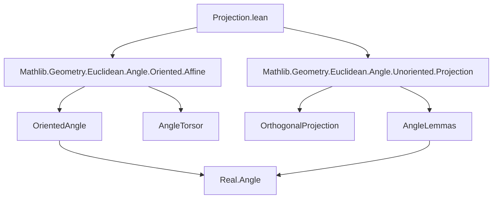
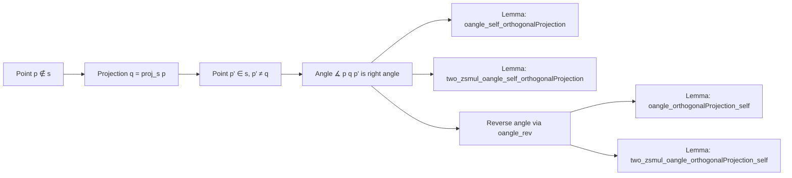

### Technical Brief: `Projection.lean`

---

#### **1. Key Definitions & Theorems**

| Name | Type / Signature | Purpose |
|------|------------------|---------|
| `oangle_self_orthogonalProjection` | `∡ p (orthogonalProjection s p) p' = π / 2 ∨ ... = -π / 2` | Shows that the oriented angle from `p` to its orthogonal projection onto an affine subspace `s`, then to a point `p' ∈ s` (distinct from the projection), is a right angle (±π/2). |
| `oangle_orthogonalProjection_self` | `∡ p' (orthogonalProjection s p) p = π / 2 ∨ ... = -π / 2` | Same as above but with reversed endpoints; follows from `oangle_self_orthogonalProjection` via symmetry (`oangle_rev`). |
| `two_zsmul_oangle_self_orthogonalProjection` | `(2 : ℤ) • ∡ p (orthogonalProjection s p) p' = π` | Doubles the oriented angle to yield π (i.e., straight angle), using `Real.Angle.two_zsmul_eq_pi_iff`. |
| `two_zsmul_oangle_orthogonalProjection_self` | `(2 : ℤ) • ∡ p' (orthogonalProjection s p) p = π` | Same as previous, for reversed angle. |

All lemmas assume:
- `p ∉ s` (point not in subspace),
- `p' ∈ s` (point in subspace),
- `p' ≠ orthogonalProjection s p` (to avoid degenerate angle),
- `s.direction.HasOrthogonalProjection` (direction of `s` admits orthogonal projections),
- `finrank ℝ V = 2`, and `V` is oriented over `ℝ` (for `∡` to be well-defined as an *oriented* angle).

---

#### **2. Naming Conventions**

- **Prefixes**:
  - `oangle_`: for lemmas about *oriented* angles (`∡`).
  - `orthogonalProjection`: used in arguments involving projection onto affine subspaces.
- **Suffixes**:
  - `_self`: indicates one endpoint of the angle is the point itself (`p`) and the vertex is its projection.
  - `_orthogonalProjection_self`: reversed order (projection as vertex, `p'` and `p` as arms).
- **Quantifier style**: Implicit `haveI : Nonempty s := ⟨p', h⟩` used to supply instance needed for projection existence.

---

#### **3. Tactic Stack**

- `haveI`: to introduce nonemptiness instance for `s`.
- `rw [...]`: repeated use of rewrites, especially:
  - `oangle_rev`, `neg_eq_iff_eq_neg`, `neg_div`, `Real.Angle.coe_neg`, `two_zsmul_eq_pi_iff`.
- `rwa [...]`: rewrite + assumption (used in first lemma).
- `exact`: final step to apply a previously proven lemma.

No heavy automation (e.g., `aesop`, `linarith`, `ring`) — proofs are mostly algebraic angle manipulations.

---

#### **4. Proof Logic**

- **Core idea**: Use geometric fact that the segment from a point to its orthogonal projection is perpendicular to the subspace; thus, any vector from the projection to a point in the subspace is orthogonal → angle is ±π/2.
- **Structure**:
  1. Prove non-degeneracy (`p ≠ orthogonalProjection s p`) using `orthogonalProjection_eq_self_iff`.
  2. Reduce to unoriented angle case via `oangle_eq_angle_or_eq_neg_angle`.
  3. Apply known lemma `angle_self_orthogonalProjection`.
  4. Simplify using algebraic properties of real division and negation.
- For reversed angles: apply symmetry (`oangle_rev`) and algebraic simplifications.
- For doubled angles: use characterization of angles whose double is π.

Induction or case analysis not used — purely algebraic and geometric rewriting.

---

#### **5. Imports**

- `Mathlib.Geometry.Euclidean.Angle.Oriented.Affine`: provides `∡`, `oangle_rev`, `oangle_eq_angle_or_eq_neg_angle`, etc.
- `Mathlib.Geometry.Euclidean.Angle.Unoriented.Projection`: provides `angle_self_orthogonalProjection`, and foundational projection lemmas.

These imports define:
- Oriented angles in 2D Euclidean geometry,
- Orthogonal projection onto affine subspaces,
- Relationship between oriented/unoriented angles.

---

#### **6. Mermaid Diagrams**

##### **Dependency Graph (Module-Level)**

##### **Overview of File Logic Flow**

---

#### **7. Theory Context**

This file sits in the **Euclidean geometry hierarchy**, specifically bridging:
- **Oriented angles** (which require 2D orientation and are valued in `Real.Angle`),
- **Orthogonal projection** (a metric construction in inner product spaces),
- **Affine subspaces** (as geometric constraints).

It contributes to a larger effort to formalize classical Euclidean geometry results in Lean, especially those involving perpendicularity, right angles, and angle arithmetic — foundational for triangle geometry, circle theorems, and transformations.

---

Let me know if you'd like a formalized summary in `leanpkg` format or a dependency graph for the entire `Mathlib.Geometry.Euclidean.Angle.*` module tree.
