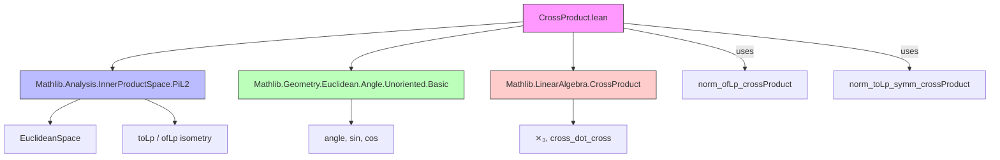

**Technical Brief: `CrossProduct.lean`**

---

### 1. KEY DEFINITIONS & THEOREMS

| Name | Type | Purpose |
|------|------|---------|
| `EuclideanSpace ℝ (Fin 3)` | Type | The 3-dimensional real Euclidean space, identified with `Fin 3 → ℝ` equipped with the standard inner product. |
| `toLp 2` / `ofLp` | `EuclideanSpace ℝ (Fin 3) ↔ (Fin 3 → ℝ)` | Canonical linear isometry between the abstract Euclidean space and the concrete function space `Fin 3 → ℝ`, preserving the $L^2$ (Hilbert) structure. |
| `⨯₃` | `(Fin 3 → ℝ) → (Fin 3 → ℝ) → (Fin 3 → ℝ)` | The standard cross product on `Fin 3 → ℝ`, implemented via `LinearAlgebra.CrossProduct`. |
| `angle a b` | `ℝ` | The unoriented angle between vectors `a`, `b` in a real inner product space, taking values in $[0, \pi]$. |
| `norm_ofLp_crossProduct` | `∀ a b, ‖toLp 2 (ofLp a ⨯₃ ofLp b)‖ = ‖a‖ * ‖b‖ * sin (angle a b)` | Relates the norm of the cross product in the abstract Euclidean space to the geometric formula involving norms and sine of the angle. |
| `norm_toLp_symm_crossProduct` | `∀ a b, ‖toLp 2 (a ⨯₃ b)‖ = ‖toLp 2 a‖ * ‖toLp 2 b‖ * sin (angle (toLp 2 a) (toLp 2 b))` | The same identity specialized to the concrete representation `Fin 3 → ℝ`, using `toLp 2` as the embedding. |

---

### 2. NAMING CONVENTIONS

- **`norm_*`**: Norm-related lemmas (e.g., `norm_ofLp_crossProduct`, `norm_toLp_symm_crossProduct`).
- **`ofLp` / `toLp`**: Standard notation for the equivalence between `EuclideanSpace` and function space in `Mathlib.Analysis.InnerProductSpace.PiL2`.
- **`⨯₃`**: Infix notation for the 3D cross product (from `LinearAlgebra.CrossProduct`).
- **`angle`**: From `Geometry.Euclidean.Angle.Unoriented.Basic`, used for angle between vectors.
- **`sin_angle_nonneg`, `cos_angle_mul_norm_mul_norm`, `sin_sq_add_cos_sq`**: Lemmas from trigonometric identities in `Real` analysis.

---

### 3. TACTIC STACK

- `simp_rw`: Rewriting with simplification rules (e.g., inner product → dot product, star → identity).
- `linear_combination`: To combine algebraic identities (e.g., using `sin² + cos² = 1`).
- `congrArg (· ^ 2)`: To apply squaring to both sides of an equality.
- `refine ... |>.mp ?_`: To reduce equality of nonnegative reals to equality of squares.
- ` positivity`: To discharge goals of the form `0 ≤ t`.
- `simp [← ...]`: To push forward or backward equivalences via `toLp 2`.

---

### 4. PROOF LOGIC

The core proof of `norm_ofLp_crossProduct` proceeds as follows:

1. **Reduction to squares**: Since both sides are nonnegative, it suffices to prove equality of squares (`sq_eq_sq₀`).
2. **Algebraic expansion**: The squared norm of the cross product is rewritten using:
   - `norm_sq_eq_re_inner`: $ \|x\|^2 = \langle x, x \rangle $
   - `cross_dot_cross`: identity $ \|a \times b\|^2 = \|a\|^2 \|b\|^2 - \langle a, b \rangle^2 $
   - `dotProduct_comm`, `sq`, and simplifications of inner products in `EuclideanSpace`.
3. **Trigonometric substitution**: Use the fundamental identity $\sin^2\theta + \cos^2\theta = 1$ and the known formula $\cos(\angle a b) = \frac{\langle a, b \rangle}{\|a\| \|b\|}$ (`cos_angle_mul_norm_mul_norm`) to rewrite the RHS.
4. **Algebraic completion**: A `linear_combination` step combines the two expressions to conclude equality.

The second lemma `norm_toLp_symm_crossProduct` follows immediately by rewriting with the first lemma and the fact that `toLp 2` is an isometry.

---

### 5. IMPORTS

| Import | Role |
|--------|------|
| `Mathlib.Analysis.InnerProductSpace.PiL2` | Provides `EuclideanSpace`, `toLp`, `ofLp`, and $L^p$-norm equivalence for finite products. |
| `Mathlib.Geometry.Euclidean.Angle.Unoriented.Basic` | Defines `angle`, `sin_angle_nonneg`, `cos_angle_mul_norm_mul_norm`, and related trigonometric lemmas. |
| `Mathlib.LinearAlgebra.CrossProduct` | Defines the cross product `⨯₃` and key identities like `cross_dot_cross`. |

---

### 6. DEPENDENCY & OVERVIEW DIAGRAM

#### Overview of Theory Flow

- **Abstract setting** (`EuclideanSpace ℝ (Fin 3)`) is connected to **concrete functions** (`Fin 3 → ℝ`) via `toLp 2`/`ofLp`.
- The **cross product** is defined on the concrete side, but its norm behavior is expressed in the abstract setting.
- The **angle** and **trigonometric identities** bridge algebraic and geometric perspectives.
- The final result confirms the classical geometric identity:
  $$
  \|a \times b\| = \|a\| \cdot \|b\| \cdot \sin(\angle(a,b))
  $$
  in both abstract and concrete representations.

--- 

Let me know if you'd like a formalized dependency graph or a summary of related lemmas in `Mathlib.LinearAlgebra.CrossProduct`.
