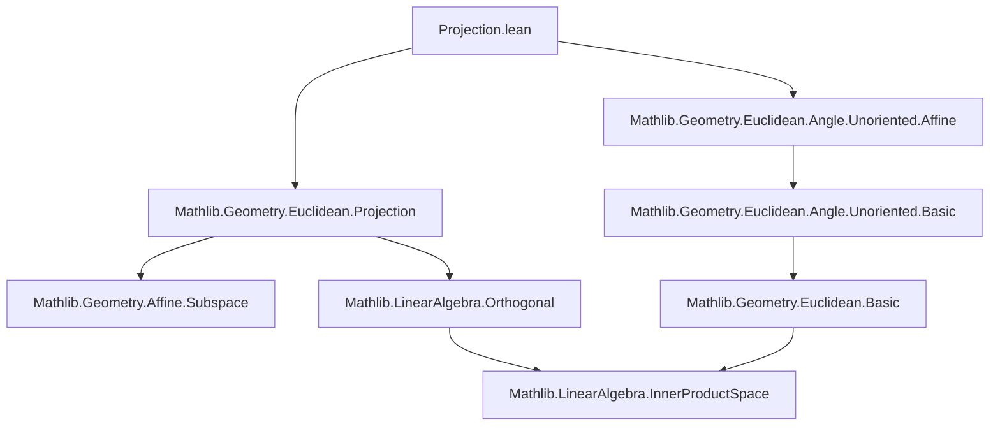
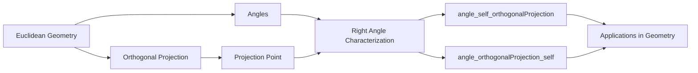

**Technical Brief: `Projection.lean` (Lean 4 Formalization)**  
*Domain: Euclidean Geometry — Angles and Orthogonal Projection*

---

### 1. **Key Definitions & Theorems**

| Name | Type / Signature | Purpose |
|------|------------------|---------|
| `angle_self_orthogonalProjection` | `∠ p (orthogonalProjection s p) p' = π / 2` | Proves that the angle formed at the orthogonal projection of `p` onto an affine subspace `s`, between `p` and any point `p' ∈ s`, is a right angle (`π/2`). |
| `angle_orthogonalProjection_self` | `∠ p' (orthogonalProjection s p) p = π / 2` | Symmetric variant: angle at the projection point between any `p' ∈ s` and `p` is also `π/2`. Uses `angle_comm` to reduce to the previous lemma. |

Both lemmas rely on:
- `orthogonalProjection s p`: the orthogonal projection of point `p` onto affine subspace `s`.
- `vsub_mem_direction_orthogonal`, `Submodule.inner_left_of_mem_orthogonal`: properties of orthogonal complements in inner product spaces.
- `angle`, `InnerProductGeometry.inner_eq_zero_iff_angle_eq_pi_div_two`: characterization of right angles via vanishing inner product.

---

### 2. **Naming Conventions**

- **Prefixes**:
  - `angle_...`: indicates lemmas about Euclidean angles (`∠`).
  - `orthogonalProjection`: standard name for projection map.
- **Suffixes**:
  - `_self`: used when one argument to `∠` is the projection point itself (e.g., `angle_self_orthogonalProjection`).
- **Pattern**: `angle_[arg1]_[arg2]` — reflects the order of points in `∠ a b c`.

---

### 3. **Tactic Stack**

Frequent tactics used in proofs:
- `rw`: rewriting using lemmas like `angle`, `angle_comm`, and inner-product characterizations.
- `exact`: applying known lemmas (e.g., `Submodule.inner_left_of_mem_orthogonal`).
- `haveI : Nonempty s := ⟨p', h⟩`: introducing instance for nonemptiness (required by `HasOrthogonalProjection`).
- Implicit use of `simp`-like simplification via `rw` and `exact`.

No heavy automation (e.g., `aesop`, `ring`, `norm_cast`) — proofs are mostly *algebraic-geometric* and rely on structured rewriting.

---

### 4. **Proof Logic**

- **Structure**:
  1. Introduce `Nonempty s` (needed for `HasOrthogonalProjection` to be usable).
  2. Rewrite `∠` using `angle` definition (to inner product form).
  3. Apply `inner_eq_zero_iff_angle_eq_pi_div_two` to reduce to showing inner product = 0.
  4. Use geometric facts:
     - `vsub_orthogonalProjection_mem_direction_orthogonal`: vector from `p` to its projection is orthogonal to `s.direction`.
     - `vsub_mem_direction h (orthogonalProjection_mem _)`: vector from projection to `p' ∈ s` lies in `s.direction`.
     - Conclude inner product vanishes via `Submodule.inner_left_of_mem_orthogonal`.

- **Symmetry**: Second lemma (`angle_orthogonalProjection_self`) uses `angle_comm` to swap arguments and reuse first lemma.

---

### 5. **Imports & Dependencies**

**Primary imports**:
```lean
Mathlib.Geometry.Euclidean.Angle.Unoriented.Affine
Mathlib.Geometry.Euclidean.Projection
```

**Implicit dependencies** (via imports):
- `Mathlib.MeasureTheory.Measure.HaarInner` (for `InnerProductSpace`, `NormedAddCommGroup`, etc.)
- `Mathlib.Geometry.Affine.Segment` (for `orthogonalProjection_mem`, `vsub_mem_direction`)
- `Mathlib.LinearAlgebra.Orthogonal` (for `Submodule.orthogonal`, `inner_left_of_mem_orthogonal`)
- `Mathlib.Geometry.Euclidean.Basic` (for `EuclideanGeometry`, `angle`, `orthogonalProjection`)

---

### 6. **Mermaid Diagrams**

#### **Dependency Graph (Module-Level)**



#### **Overview of File Content**



---

### 7. **Theoretical Scope**

This file contributes to the formalization of *metric geometry* in Euclidean space, specifically:
- Rigorous treatment of perpendicularity via angles.
- Interplay between affine subspaces, orthogonal complements, and projections.
- Foundation for later results on reflections, symmetry, and Euclidean transformations.

It assumes:
- `V` is a real inner product space (Hilbert structure).
- `P` is a Euclidean affine space over `V`.
- Subspaces considered have orthogonal projections (`HasOrthogonalProjection`).

---

*End of Technical Brief.*
