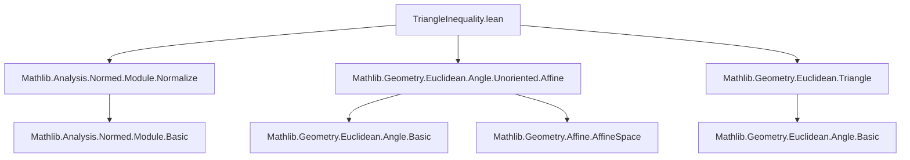

### Technical Brief: Triangle Inequality for Angles in Euclidean Geometry (Lean 4)

---

#### **1. Key Definitions & Theorems**

| Name | Type / Signature | Purpose |
|------|------------------|---------|
| `ortho (x y : V)` | `V → V → V` | Computes the component of `y` orthogonal to `x`, i.e., $ y - \operatorname{proj}_x y $. |
| `ortho_eq_sub_inner` | `‖y‖ = 1 ⇒ ortho y x = x - ⟨y, x⟩ • y` | Simplifies `ortho` under unit norm assumption. |
| `inner_ortho_nonneg` | `‖x‖ = 1 ∧ ‖y‖ = 1 ⇒ ⟨x, ortho y x⟩ ≥ 0` | Positivity of inner product between `x` and its orthogonal component relative to `y`. |
| `inner_normalize_ortho` | `⟨y, normalize (ortho y x)⟩ = 0` | Orthogonality of `y` and normalized `ortho y x`. |
| `inner_normalized_ortho_sq_add_inner_sq_eq_one` | `⟨x, normalize (ortho y x)⟩² + ⟨x, y⟩² = 1` | Pythagorean identity for angle decomposition (unit vectors). |
| `inner_ortho_right_eq_sin_angle` | `⟨x, normalize (ortho y x)⟩ = sin(angle x y)` | Relates orthogonal component to sine of angle. |
| `angle_le_angle_add_angle_aux` | `x = cos(θ) • y + sin(θ) • normalize(ortho y x)` | Decomposition of unit vector `x` in orthonormal basis `{y, normalize(ortho y x)}`. |
| `angle_le_angle_add_angle_of_norm_eq_one` | `‖x‖ = ‖y‖ = ‖z‖ = 1 ⇒ angle x z ≤ angle x y + angle y z` | Core triangle inequality for angles, under unit norm. |
| `angle_le_angle_add_angle` | `angle x z ≤ angle x y + angle y z` | General triangle inequality for angles (arbitrary nonzero vectors). |
| `angle_eq_angle_add_angle_iff` | `y ≠ 0 ⇒ angle x z = angle x y + angle y z ↔ angle x z = π ∨ y ∈ span_{ℝ≥0}{x, z}` | Equality characterization: equality holds iff collinear with nonnegative combination or angle = π. |
| `angle_eq_angle_add_add_angle_add_of_mem_span` | `y ≠ 0 ∧ y ∈ span_{ℝ≥0}{x, z} ⇒ angle x z = angle x y + angle y z` | Sufficient condition for equality (nonnegative linear combination). |
| `angle_expression_of_angle_eq_angle_sum` | `angle x z ≠ π ∧ angle x z = angle x y + angle y z ⇒ sin(θₓz) • y = sin(θᵧz) • x + sin(θₓy) • z` | Linear relation among vectors when equality holds and angle ≠ π. |

---

#### **2. Naming Conventions**

- **Prefixes**:
  - `ortho_`: properties of the `ortho` function.
  - `inner_`: inner product identities.
  - `angle_`: angle-related lemmas and theorems.
  - `mem_span_`: membership in nonnegative spans.
- **Suffixes**:
  - `_eq_one`, `_eq_zero`, `_ne_zero`: norm/angle/inner product conditions.
  - `_sq`: squared expressions.
  - `_aux`: auxiliary lemmas used in main proofs.
  - `_iff`: biconditional characterizations.
- **Special**:
  - `normalize`, `starProjection`, `span ℝ≥0`: reflect use of normalization and semilinear algebra.

---

#### **3. Tactic Stack**

Frequently used tactics:
- `rw`, `simp`, `field_simp`, `norm_num`, `ring`, `grind` (custom tactic for grind-style reasoning).
- `by_cases` / `rcases` / `match_scalars`: case analysis and destructuring.
- `linarith`, `grw` (graded rewrite), `grind`: for inequalities and algebraic simplifications.
- `exact`, `apply`, `intro`, `have`, `suffices`: standard proof structuring.
- `norm_cast`, `lift ... to ℝ≥0`: for lifting to nonnegative reals.

---

#### **4. Proof Logic**

**High-level proof strategy**:

1. **Unit vector reduction**:
   - Reduce general case to unit vectors via normalization (`norm_normalize_eq_one_iff`).
   - Prove triangle inequality for unit vectors using geometric decomposition.

2. **Angle decomposition**:
   - Use `angle_le_angle_add_angle_aux` to express `x` in terms of `y` and its orthogonal component.
   - Derive cosine and sine expressions via inner products.

3. **Cosine monotonicity**:
   - Reduce inequality to `cos(θₓz) ≤ cos(θₓy + θᵧz)`.
   - Use `Real.strictAntiOn_cos` on `[0, π]` to convert to inequality on cosines.

4. **Equality cases**:
   - For equality, analyze when `⟪normalize(ortho y x), normalize(ortho y z)⟫ = -1`, implying collinearity with opposite direction (angle = π).
   - Otherwise, derive linear combination condition using sine-weighted vector identity.

5. **Euclidean geometry lift**:
   - Translate vector inequality to point-based angles via `∠ p₁ p p₃`.

---

#### **5. Imports & Dependencies**

**Core imports**:
```lean
Mathlib.Analysis.Normed.Module.Normalize
Mathlib.Geometry.Euclidean.Angle.Unoriented.Affine
Mathlib.Geometry.Euclidean.Triangle
```

**Key dependencies**:
- `InnerProductSpace ℝ V`: real inner product structure.
- `NormedAddCommGroup V`, `NormedSpace ℝ V`: normed vector space structure.
- `EuclideanGeometry` infrastructure: `MetricSpace P`, `NormedAddTorsor V P`.
- `Real`, `NNReal`, `angle`, `normalize`, `Submodule.span`, `starProjection`.

---

#### **6. Mermaid Diagrams**

##### **Dependency Graph (Module-Level)**



##### **Overview of Theory Flow**

```mermaid
flowchart LR
  A[Unit Vectors] --> B[Orthogonal Decomposition]
  B --> C[Pythagorean Identity]
  C --> D[cos/sin Angle Representation]
  D --> E[Triangle Inequality Proof]
  E --> F[Equality Cases]
  F --> G[Nonnegative Span Characterization]
  G --> H[Euclidean Geometry Lift]
  H --> I[angle_le_angle_add_angle (point version)]
```

---

#### **7. Summary**

This file formalizes the **triangle inequality for angles** in real inner product spaces and Euclidean geometry, including a full characterization of equality cases. It leverages geometric decomposition via orthogonal projection, inner product identities, and monotonicity of cosine on $[0, \pi]$. The proof is structured in two layers: first for unit vectors (via algebraic geometry), then extended to arbitrary nonzero vectors via normalization. Equality cases are tied to collinearity and nonnegative linear combinations, formalized using `Submodule.span ℝ≥0`. The result is lifted to point-based Euclidean angles via the torsor structure.

--- 

Let me know if you'd like a formalized dependency graph (e.g., `leanproject graph`) or a proof sketch in natural language.
